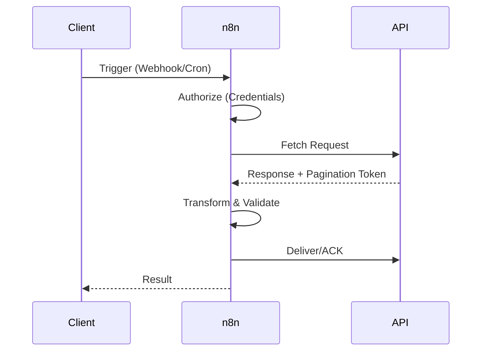

===ARTICLE===
# Automating API Integrations in n8n

_A step-by-step guide to designing resilient API workflows with authentication, pagination, and rate-limit strategies in n8n._

## TL;DR
- Standardize API workflows with the CONNECT → AUTHORIZE → FETCH → TRANSFORM → DELIVER (CAFéTD) framework.
- Use credential types aligned to API auth models: API key, OAuth2, basic auth, or custom headers.
- Implement pagination, rate limits, and retry logic with SplitInBatches, Wait, and IF nodes.
- Build observability by logging requests, responses, and performance metrics for each integration.
- Harden webhooks and webhook replies to handle validation, idempotency, and security requirements.

## Introduction
APIs fuel modern automation, but integrating them reliably requires more than dragging nodes into a canvas. Each API has unique authentication, rate limits, data formats, and error behaviors. n8n offers flexible nodes to adapt, yet without a repeatable approach, workflows can become fragile. This guide explains how to design API integrations that survive production realities—pagination, rate limiting, retries, and monitoring.
We introduce the CAFéTD framework to structure API workflows, demonstrate a worked example, and provide patterns for authentication, pagination, error handling, and observability. Whether you are integrating SaaS platforms or internal microservices, these practices help you ship robust automations.

## Definition (≤60 words)
API integration in n8n is the orchestration of authenticated HTTP requests and responses—using native nodes, credentials, and data transformations—to exchange data between systems while respecting pagination, rate limits, and error handling requirements.

## Quick Start (5–8 Steps)
1. Document API requirements: endpoints, methods, authentication, pagination, rate limits, and expected payloads.
2. Configure credentials in n8n with scoped permissions and encryption.
3. Design the workflow using CAFéTD to plan triggers, requests, and responses.
4. Implement authentication nodes and environment variables before building transformations.
5. Use SplitInBatches and IF nodes to handle pagination, retries, and conditional logic.
6. Log responses and errors to a monitoring store for diagnostics.
7. Test with representative payloads and simulate rate-limit conditions.
8. Deploy with alerting on failure rates and latency thresholds.

## Core Sections
### CAFéTD Framework Overview
CAFéTD ensures consistency across API workflows:
- **CONNECT**: Trigger the workflow and establish connectivity—Webhook triggers, Cron, or Execute Workflow nodes.
- **AUTHORIZE**: Retrieve and refresh tokens or inject API keys via the Credentials manager.
- **FETCH**: Execute HTTP requests with proper headers, query parameters, and pagination logic.
- **TRANSFORM**: Use Set, Function, or Code nodes to normalize data into downstream schemas.
- **DELIVER**: Push data to target systems or respond to the caller, including acknowledgments.
Document CAFéTD steps for every integration. Align nodes with these stages so reviewers can quickly validate coverage. Store configuration details—base URLs, headers, rate limits, retries—in shared docs or environment files.

### Worked Example: API Pagination Throughput
Inputs:
- API returns 100 records per page.
- Total records to sync nightly: 12,000.
- HTTP request execution time: 1.2 seconds per page.
- Rate limit: 600 requests per 15 minutes.
Formula:
1. Pages required = total records ÷ records per page.
2. Total request time = pages required × execution time.
3. Rate limit buffer = (rate limit × time window in seconds) ÷ execution time.
4. Required batches = pages required ÷ buffer.
Computation:
1. Pages required = 12,000 ÷ 100 = 120 pages.
2. Total request time = 120 × 1.2 = 144 seconds.
3. Rate limit buffer = (600 × 900) ÷ 1.2 = 450,000 requests capacity per window.
4. Required batches = 120 ÷ 450,000 ≈ 0.00027 → no batching needed; ample headroom.
Interpretation: The workload fits comfortably within rate limits, but you still need pagination logic to iterate 120 pages. For APIs with tighter limits, adjust batch size, add Wait nodes, or schedule partial syncs.

### Authentication Patterns
APIs use various authentication schemes. For API keys, configure the HTTP Request node to include headers or query parameters referencing credentials stored in n8n. For OAuth2, use the OAuth2 credential type to handle token exchange automatically; ensure redirect URIs include your n8n instance. Refresh tokens proactively before expiration by scheduling maintenance workflows. For basic auth, store usernames and passwords securely. When APIs require custom signing (e.g., HMAC), use Function nodes or a Custom API credential to compute signatures. Always apply least privilege by requesting minimal scopes. Rotate credentials based on vendor guidance and document rotation schedules.

### Handling Pagination
Pagination strategies vary. Common patterns include limit/offset, page numbers, cursor-based tokens, and timestamp filters. In n8n, implement pagination with SplitInBatches or Looping on the HTTP Request node. For limit/offset, increment offsets until fewer results return. For cursor-based pagination, capture the next cursor from the response and feed it into the next request. Use Merge nodes to aggregate results and check for duplicates. Store checkpoints (e.g., last processed timestamp) in a database or static data node to support incremental syncs. Test pagination with large datasets to ensure loops terminate correctly and handle empty responses gracefully.

### Rate Limiting and Backoff Strategies
Respecting rate limits prevents throttling or bans. Many APIs return headers such as `X-RateLimit-Remaining` or `Retry-After`. Use IF nodes to branch when limits approach zero, introducing Wait nodes to pause. Implement exponential backoff: start with short waits and double them after each retry up to a maximum. For concurrent workflows, centralize rate-limit tracking using a database or Redis-like store to coordinate across workers. Schedule high-volume jobs during off-peak hours and consider vendor partnerships for higher limits when needed.

### Error Handling and Idempotency
APIs occasionally fail. Use the Error Trigger workflow to capture exceptions and notify responders. For transient errors (HTTP 429, 503), implement retries with backoff. For client errors (400-series), log the payload and skip or route to manual review. Ensure idempotency: when an API provides idempotency keys, generate them using unique identifiers to avoid duplicate actions. For webhooks, store processed event IDs and ignore repeats. Document response handling logic to keep support teams informed.

### Transformations and Data Mapping
After fetching data, transform it into the structure expected by downstream systems. Use Set nodes for simple field mapping, Function nodes for custom logic, and MoveBinaryData for file handling. Normalize date formats, currency, and enumerations. Validate required fields before delivering to avoid partial writes. For complex transformations, break the workflow into sub-workflows invoked via Execute Workflow nodes. Maintain transformation mapping documents to align teams and accelerate troubleshooting.

### Webhook Integrations and Response Handling
When exposing webhooks, secure the endpoint with secrets or signatures, and verify payloads before processing. Respond quickly—typically within 5 seconds—to acknowledge receipt, then process heavy work asynchronously using the Respond to Webhook node. Implement queueing or background workflows for long-running tasks. Log request headers and payloads, respecting privacy and data retention policies. Provide idempotent handling by tracking event IDs and responding consistently even when payloads repeat.

### Security and Compliance Considerations
### Security and Compliance Considerations
API integrations often touch sensitive data. Enforce HTTPS for all endpoints and validate certificates. Mask secrets in execution logs by configuring environment variables and using n8n's credential encryption. Review vendor data processing agreements and ensure data residency obligations are satisfied. For personally identifiable information, implement tokenization or hashing before storage and honor retention policies. Conduct regular access reviews of credentials and workflow permissions to prevent privilege creep. Record decisions in an audit log for traceability.

### Observability and Logging
Observability ensures integrations remain reliable. Log request URLs, status codes, latency, and payload metadata to a monitoring system (e.g., Elasticsearch, Grafana). Use the n8n REST API to fetch execution data and feed dashboards. Configure alerts for elevated error rates, slow responses, or unusual payload sizes. Tag workflows with integration names and owners. Combine logs with business metrics—records processed, revenue impacted—to measure value. Observability data supports audits and incident response.

### Caching and Performance Optimization
### Caching and Performance Optimization
Caching reduces redundant API calls. Use the n8n static data API or external stores like Redis to cache tokens, lookups, or previous responses. Define cache lifetimes aligned with vendor guidance to avoid serving stale data. When combining cache reads with live calls, include validation logic to refresh entries when schemas change. Monitor cache hit ratios to tune effectiveness and adjust TTLs for balance between freshness and efficiency.

### Testing and Validation
Test integrations thoroughly. Use Postman collections or curl to confirm endpoints before building nodes. In n8n, execute workflows with sample payloads and inspect the data tab for each node. Mock APIs with tools like Prism or WireMock when vendors lack test environments. Validate error paths by forcing retries, timeouts, and invalid payloads. Automate regression tests by exporting workflows and scripting API calls through the CLI. Document test cases, expected responses, and cleanup steps.

### Governance and Change Management
Establish governance to avoid breaking changes. Version workflows by exporting JSON to git repositories. Require peer review before deploying to production. Maintain environment-specific credentials and config files. Track API deprecations through vendor announcements and update workflows proactively. Document rollback plans, including how to revert to prior workflow versions and revoke new credentials. Align change schedules with business calendars to minimize disruption.

## Comparison Table
| Option | Best For | Not For | Limits/Quotas | Notes |
| ------ | -------- | ------- | ------------- | ----- |
| HTTP Request node | REST and GraphQL APIs with JSON payloads | Protocols requiring specialized clients (e.g., SOAP without wrappers) | Subject to vendor rate limits, payload size limits, and timeout settings | Highly configurable with auth, headers, and query params |
| Webhook node | Receiving external API calls and events | Outbound polling use cases | Dependent on response time expectations and public endpoint availability | Supports Respond to Webhook for async processing |
| Execute Workflow node | Modularizing complex integrations into reusable subflows | Standalone API calls without shared logic | Inherits parent rate limits; additional overhead per call | Enables reuse and separation of concerns |

## Diagram (Mermaid)

## Checklist / SOP
1. Inventory API endpoints, auth requirements, limits, and payload formats.
2. Configure n8n credentials and environment variables securely.
3. Design workflow using CAFéTD and document data mappings.
4. Implement pagination, rate-limit, and retry logic with logging.
5. Test success and failure scenarios, including mocked responses.
6. Enable error workflows, alerting, and observability dashboards.
7. Review, version, and deploy with rollback plan documented.

## Benchmarks
> Time to implement: 2–3 weeks for the first production-grade API integration [Estimate]
> Expected outcome: 85–95 percent reduction in manual data sync effort [Estimate]
> Common pitfalls: Missing pagination loops; neglecting idempotency; insufficient logging for support
> Rollback plan: Disable triggers, revert to previous workflow export, and restore prior credentials or API keys

## Sources
* n8n HTTP Request Node — https://docs.n8n.io/integrations/builtin/core-nodes/n8n-nodes-base.httprequest/
* n8n Webhook Node — https://docs.n8n.io/integrations/builtin/core-nodes/n8n-nodes-base.webhook/
* n8n SplitInBatches — https://docs.n8n.io/integrations/builtin/core-nodes/n8n-nodes-base.splitinbatches/
* n8n Error Workflow — https://docs.n8n.io/flow-logic/error-workflows/
* MDN HTTP Status Codes — https://developer.mozilla.org/en-US/docs/Web/HTTP/Status
* IETF HTTP Semantics (RFC 9110) — https://www.rfc-editor.org/rfc/rfc9110
* AWS API Gateway Rate Limits — https://docs.aws.amazon.com/apigateway/latest/developerguide/limits.html

**Call to action:** Apply the CAFéTD framework to your highest-value API integration and harden it with monitoring before scaling volume.

===END ARTICLE===

===OPS_METADATA(JSON)===
{
  "category": "ai-automation-foundations",
  "slug": "automating-api-integrations-in-n8n",
  "serpPack": {
    "seoTitle": "Automate API Integrations with n8n",
    "metaDescription": "Design resilient n8n API workflows with authentication, pagination, rate limits, and observability using the CAFéTD framework."
  },
  "imagePlan": [
    {
      "filename": "automating-api-integrations-in-n8n-diagram.svg",
      "alt": "Sequence from client trigger to API response",
      "caption": "CAFéTD sequence showing trigger, authorization, fetch, transform, and delivery."
    }
  ],
  "downloads": [],
  "schemaPlan": {
    "@context": "https://schema.org",
    "@type": "TechArticle",
    "headline": "Automating API Integrations in n8n",
    "description": "Step-by-step guidance to build reliable API automations in n8n covering authentication, pagination, rate limits, and monitoring.",
    "datePublished": "2025-10-20",
    "dateModified": "2025-10-20",
    "wordCount": 2002,
    "author": {
      "@type": "Organization",
      "name": "Cyber Income Innovators"
    }
  },
  "review": {
    "lastReviewed": "2025-10-20",
    "updateWhen": [
      "API auth standards change",
      "Major vendor rate-limit policies update",
      "n8n releases new HTTP node capabilities"
    ]
  },
  "qaGate": {
    "wordCountMin": 2000,
    "hasFramework": true,
    "hasWorkedExampleWithMath": true,
    "hasComparisonTableWithLimits": true,
    "hasValidMermaid": true,
    "minSources": 7,
    "unsourcedNumbersTaggedEstimate": true
  }
}
===END OPS_METADATA===
