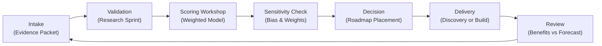

## TL;DR

- Stand up a transparent scoring engine that weights value, feasibility, guardrails, and data readiness so every automation candidate is judged on consistent math.
- Feed the model with evidence packets, calibration workshops, and sensitivity checks that keep decision bias in check and traceability intact.
- Wire the backlog into a governance rhythm with cadences, tooling integrations, and ROI telemetry that finance and risk partners can audit in minutes.
- Keep the portfolio adaptable by running quarterly scenario labs, resilience playbacks, and rollback drills that protect the roadmap from overconfidence.

## Introduction

Every automation program collects ideas faster than it can build them. Requests pile up from finance, operations, and marketing, each promising transformative savings or headline-worthy experiences. Without a disciplined approach, roadmaps become political, value becomes anecdotal, and risk teams are left scrambling to keep up. Automation leaders need a framework that turns prioritization into an evidence-based ritual rather than a negotiation.

This article rebuilds automation backlog prioritization from the ground up. You will learn how to construct a weighted scoring model anchored in enterprise goals, how to source reliable data that keeps the math honest, and how to embed the backlog into governance cycles that survive leadership turnover. The result is a living backlog that proves ROI potential, respects guardrails, and adapts as your automation estate matures.

## Translate Strategy into Measurable Criteria

The best scoring engines are grounded in corporate outcomes, not convenience. Start by translating strategic imperatives into explicit criteria that can be measured consistently.

### Extract strategic goals into automation signals

Review the latest annual operating plan, transformation strategy, and risk appetite statements. Record which outcomes show up repeatedly: cost-to-serve, customer retention, compliance coverage, or cycle time improvements. For each outcome, define a matching automation signal. A cost reduction mandate might translate into "annualized labor hours replaced" while a customer retention target becomes "journey NPS uplift from reduced handling time". McKinsey reports that firms with explicit automation value metrics outperform peers by 20–30% in realized savings because they can defend every backlog decision in CFO language.

### Map stakeholder guardrails into go/no-go gates

Prioritization fails when risk requirements are bolted on at the end. Interview compliance, security, and data stewards to capture their minimal guardrails. Convert each guardrail into a gating question scored binary (pass/fail). Examples include "Does source data meet NIST privacy controls?" or "Is the workflow already under regulatory audit?". Only automation ideas that pass guardrails should move to weighted scoring; this prevents inflated scores for ideas that will inevitably be blocked.

### Define reusable scoring criteria

Limit the model to 6–8 criteria to maintain clarity. A balanced list might include: financial upside, customer impact, process criticality, data readiness, technical complexity, change management load, and risk exposure. Assign each criterion a plain-language definition and scoring rubric from 1 (poor) to 5 (excellent). Document what evidence is required to justify each score. For instance, a "5" on data readiness should require production-grade data, lineage documentation, and owner accountability, aligning with Deloitte's observation that data maturity is the top predictor of successful automation scaling.

## Build the Weighted Scoring Model

With the criteria in hand, you can design a scoring model that balances competing signals while remaining explainable.

### Calibrate weights through facilitated workshop

Bring together representatives from finance, operations, risk, and delivery. Present the criteria and ask each stakeholder to allocate 100 weighting points across them. Discuss outliers, then use a weighted average to arrive at the final distribution. Capture rationales in a decision log. A typical distribution might place 25% on financial upside, 20% on customer impact, 15% on data readiness, 15% on risk exposure, 15% on technical complexity, and 10% on change management load. Revisit weights every two quarters to keep the model aligned with shifting priorities.

### Worked example: scoring a billing automation

Consider a proposal to automate invoice exception handling. Guardrails confirm data privacy compliance and audit readiness. The team scores each criterion:

- Financial upside: 4 (projected $420K annualized savings based on time study)
- Customer impact: 3 (moderate improvement in dispute resolution time)
- Data readiness: 5 (structured ERP data, steward assigned)
- Risk exposure: 4 (low regulatory complexity, high transaction volume)
- Technical complexity: 2 (legacy integration requires adapters)
- Change management load: 3 (requires cross-training two analyst teams)

Apply workshop-approved weights: `(4*0.25)+(3*0.20)+(5*0.15)+(4*0.15)+(2*0.15)+(3*0.10) = 3.55`. Compare the score with other candidates. An idea scoring below 3.0 triggers further review, while above 3.5 moves forward to discovery. Document the full calculation in the backlog tool for transparency.

### Build reusable calculators and templates

Codify the model inside your work management platform. Create a form with dropdowns for each criterion and embed auto-calculated scores. Provide templates for evidence packets that include ROI worksheets, data readiness questionnaires, and risk signoffs. Link the form to portfolio dashboards so leadership can see the distribution of scores by business unit or theme. Gartner notes that automation teams with visible scoring dashboards achieve 1.6x higher stakeholder satisfaction because everyone can trace the rationale.

## Collect Evidence with Repeatable Operations

The math only works if inputs stay credible. Develop operating habits that keep the backlog tethered to reality.

### Standardize evidence packets

Each idea enters triage with a packet containing: process narrative, time study snapshots, data inventory, tooling dependencies, and change management contacts. Institute a "no packet, no scoring" rule. Offer office hours to coach sponsors through the packet so they learn to gather robust evidence rather than lobby for exceptions.

### Run validation sprints

Assign an analyst to spend one week validating the evidence. They replicate time studies, confirm data availability, and verify compliance documents. Use a checklist derived from NIST AI risk management guidance to ensure security and ethics concerns are reviewed consistently. The validation sprint culminates in a signoff that the packet is accurate to the best of current knowledge.

### Facilitate scoring workshops

Hold biweekly scoring sessions with cross-functional stakeholders. Cap each session at 90 minutes and 5 ideas to maintain depth. Present each evidence packet, discuss assumptions, assign scores individually, and capture them in the scoring tool. Use an average or consensus method depending on your governance policy. Record dissenting opinions and follow-up actions so no concern gets lost. Rotate facilitators to avoid one voice dominating the process.

### Run sensitivity analysis

After scoring, simulate weight adjustments to see which ideas are sensitive to stakeholder priorities. If a candidate swings dramatically when the risk weight increases, flag it for additional mitigation planning. Capture these sensitivity profiles in your backlog notes. This practice signals maturity to risk committees and helps defend your roadmap during executive reviews.

## Govern the Backlog as a Product

Treat the backlog like a product with users, service levels, and rituals. Governance ensures the scoring model remains credible over time.

### Establish cadences and owner accountability

Assign an Automation Backlog Owner who curates the pipeline, convenes workshops, and maintains documentation. Schedule monthly roadmap reviews with senior leadership, quarterly weight recalibration sessions, and annual guardrail audits. Publish the calendar so stakeholders know when to engage and when decisions are locked.

### Integrate with delivery and finance systems

Link prioritized items to your delivery pipeline tool (e.g., Jira, Azure DevOps). When an idea graduates into delivery, sync its score, assumptions, and ROI forecasts into the project record. Connect financial forecasts to ERP or FP&A systems so realized savings can be tracked against the original score. This end-to-end traceability allows finance to measure variance and update ROI expectations, reinforcing trust.

### Maintain decision logs and audit trails

Every scoring session should produce a log with: ideas reviewed, scores assigned, weight assumptions, dissenting feedback, and follow-up actions. Store logs in a shared workspace with version control. When executives challenge a decision months later, you can pull the log within minutes and show the evidence trail. This practice aligns with governance recommendations from Deloitte, which emphasizes transparent decision histories as a cornerstone for scaling intelligent automation safely.

## Drive Continuous Improvement and Stakeholder Trust

A backlog framework must evolve with the organization. Use data to refine the model and keep stakeholders invested.

### Analyze performance retrospectives

Once automations go live, compare actual impact with forecasted scores. Identify criteria that were over- or under-weighted. For example, if multiple projects struggled because change management was more complex than expected, consider raising that criterion's weight or improving your readiness checklists. Capture lessons learned in a knowledge base accessible to future sponsors.

### Run scenario labs and resilience playbacks

Quarterly, organize a scenario lab where you stress-test the backlog against market shifts or regulatory changes. Ask questions like "What if data residency rules tighten in the EU?" or "How would a 15% budget cut reshape our priorities?" Re-score a subset of ideas using adjusted constraints. Share findings with leadership to demonstrate preparedness. Follow with resilience playbacks where you walk through how the backlog would respond to major incidents, reinforcing confidence in the governance model.

### Maintain stakeholder education

Publish a quarterly "automation allocation report" summarizing: scoring outcomes, pipeline health, realized ROI, and upcoming recalibrations. Host lunch-and-learns to explain how the scoring engine works and why certain ideas advanced or paused. Encourage departments to develop feeder programs that pre-screen ideas using your evidence packet template. Education combats the perception that automation is a black box and keeps the pipeline rich with qualified opportunities.

## Comparison Table

| Method / Option | Best For | Strengths | Watch-Outs |
|---|---|---|---|
| Weighted Scoring Engine | Organizations needing transparent, defensible prioritization | Aligns with strategy, integrates risk, easy to audit | Requires disciplined data collection and periodic recalibration |
| Portfolio Kanban Triage | Teams with high-volume idea intake needing rapid filtering | Fast to execute, visualizes flow states, simple to teach | Limited depth on ROI, prone to bias if guardrails are weak |
| Executive Steering Vote | Small automation programs with strong executive oversight | Accelerates decisions when sponsors are aligned | Subjective, vulnerable to politics, lacks traceability |

## Diagram (Mermaid)

## Checklist / SOP

1. Collect a complete evidence packet using the standardized template and confirm guardrail compliance.
2. Schedule the idea for the next scoring workshop and assign a validation sprint owner to verify inputs.
3. Facilitate the workshop, document individual scores, and capture dissenting opinions alongside final averages.
4. Run sensitivity analysis to test weight resilience and update backlog notes with findings.
5. Publish the decision log, sync selected items into delivery tooling, and notify sponsors of next steps.
6. Track realized impact post-delivery and feed learnings into quarterly recalibration and scenario labs.

## Benchmarks

> Time to implement: 6–8 weeks to launch full scoring operations. [Estimate]
> Expected outcome: 20–30% uplift in automation ROI conversion rate within the first year. [Estimate]
> Common pitfalls: Incomplete evidence packets, outdated weight assumptions, and weak change management planning. [Estimate]
> Rollback plan: Revert to previous prioritization cadence while conducting a rapid retrospective on scoring inputs. [Estimate]

## Internal Links

- Explore how to sustain governance rhythms in the [automation governance operating models blueprint](./automation-governance-operating-models).
- Strengthen early wins with the [practical blueprint for a first automation win](./practical-blueprint-first-win).
- Align with broader content strategy insights from [crafting a content distribution engine](../content-factory-distribution/content-distribution-engine).

## Sources

- McKinsey & Company, "The Case for Digital Reinvention," operations research spotlight on automation value realization.
- Deloitte, "Intelligent Automation Survey," global benchmark on scaling automation capabilities and risk controls.
- Gartner, "Top Strategic Technology Trends 2023," insight into automation governance maturity expectations.
- NIST, "Special Publication 1270: Towards a Standard for Managing AI Risks," guidance on evidence-based risk assessment.

