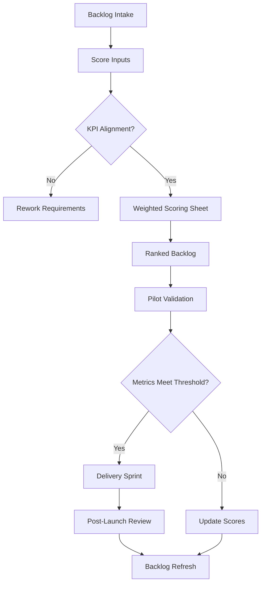

TL;DR
- Turn qualitative excitement into repeatable scores by weighting impact, confidence, effort, and risk for each candidate.
- Anchor prioritization in a single business KPI—cycle time, cost per ticket, or incremental revenue—so stakeholders can validate assumptions.
- Refresh the backlog monthly with feedback loops from shipped automations and sunset ideas that no longer match strategic goals.

## Map the Automation Backlog Inputs
Start with a working session that inventories every automation candidate from product, ops, marketing, and engineering. Capture the triggering pain point, the manual steps you plan to replace, affected personas, and an initial hypothesis of measurable value. Supplement anecdotes with hard data—support ticket volume, average handle time, or revenue attribution—so the backlog is grounded in reality rather than slogans. Document any compliance or data residency considerations at this stage to avoid future surprises.

### Align on the Primary KPI
Pick a single North Star metric for the current quarter. For CX-led teams that might be first-response time; for growth teams it may be qualified lead velocity. Communicate why this KPI matters, what baseline you measure, and what good looks like. When every backlog item references the same KPI delta, prioritization becomes an apples-to-apples comparison instead of turf wars between departments.

## Build the Scoring Model
Design a simple rubric with four lenses: Impact (1–5), Confidence (1–5), Effort (1–5), and Risk (1–5). Assign weights—for example, 40% impact, 25% confidence, 20% effort, 15% risk. Use workshop exercises where stakeholders score a few sample items together to calibrate what a "5" vs "3" looks like. Capture rationales in your backlog tool so you can revisit assumptions after launch.

### Facilitate Collaborative Scoring
Run a recurring prioritization session with cross-functional leads. Present data snapshots such as ticket volumes or funnel leakage to ground scoring debates. Encourage teams to challenge optimism bias by asking for evidence or prototypes. When consensus is elusive, average the scores but document dissenting viewpoints. The goal is transparency, not unanimity.

## Validate Through Pilot Metrics
Before committing engineering time, sanity check the top items. Build lightweight prototypes or manual wizards-of-oz to measure whether the automation will indeed move the KPI. Track leading indicators such as contact deflection rate or form completion velocity. Feed these pilot results back into the backlog to either elevate the project or downgrade it if reality underperforms the model.

### Governance and Rebalancing
Hold a monthly backlog retrospective. Compare expected vs actual benefits of automations shipped in the previous cycle. Adjust scoring weights if you consistently over- or under-estimate risk. Retire ideas that no longer map to the KPI or that duplicate capabilities delivered elsewhere in the organization. Publish a changelog so executive sponsors see momentum and reasoning.

## Comparison Table
| Factor | Description | How to Measure | Owner | Notes |
| --- | --- | --- | --- | --- |
| Impact | Direct effect on KPI (cycle time, revenue, CX) | Forecast KPI delta | Business Lead | Weight highest when strategic focus is growth |
| Confidence | Evidence supporting the impact estimate | Pilot data, historical analogs | Product Ops | Lower score if data is anecdotal |
| Effort | Engineering and change management lift | Person-weeks, vendor cost | Engineering Lead | Invert score or use weighted subtraction |
| Risk | Compliance, trust, or failure exposure | Risk register severity | Security/Legal | Ensure high-risk items include mitigation plan |

## Diagram

## Checklist
- [ ] Gather candidate automations with documented pain points, personas, and data snapshots.
- [ ] Agree on a single KPI and publish baseline metrics and targets.
- [ ] Configure a scoring rubric with weighted impact, confidence, effort, and risk columns.
- [ ] Facilitate cross-functional scoring workshops and capture qualitative rationales.
- [ ] Run pilots for top-ranked ideas and update backlog scores based on observed results.

> **Benchmarks**
> - Time to implement: 1 week to design the framework and run the first scoring workshop. [Estimate]
> - Expected outcome: Prioritized backlog that improves time-to-value by 30% versus ad-hoc selection. [Estimate]

## Internal Links
- [See how the practical blueprint turns prioritized ideas into shipped automations.](../ai-automation-foundations/practical-blueprint-first-win.mdx)
- [Align cost expectations with the automation ROI calculator to validate scoring inputs.](../ai-automation-foundations/automation-roi-calculator-simple-model.mdx)
- [Factor downstream monetization impacts using the offer testing framework.](../monetization-analytics/offer-testing-framework.mdx)
- [Assess data hygiene requirements in the companion audit guide.](../ai-automation-foundations/automation-data-readiness-audit.mdx)

## Sources
- [Google SRE guidance on evaluating automation opportunities](https://sre.google/sre-book/accelerating-sre-on-call-and-developing-automation/)
- [Harvard Business Review on prioritizing AI initiatives](https://hbr.org/2023/10/how-to-prioritize-ai-automation-initiatives)
