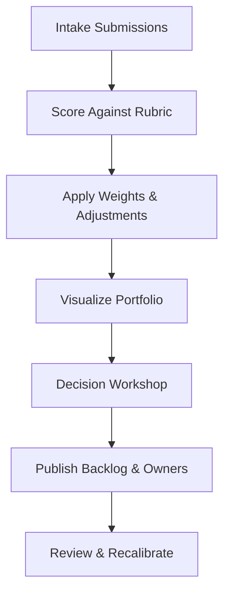

## TL;DR

- Use a weighted scoring matrix covering impact, effort, risk, and data readiness to compare automation candidates consistently.
- Translate qualitative stakeholder input into structured scores backed by evidence, not gut feel.
- Run calibration workshops and Monte Carlo-style sensitivity checks to see how rankings change as assumptions shift.
- Maintain a living backlog document with decision logs, owners, and re-evaluation cadences so priorities adapt as your org matures.

## Establish the Scoring Criteria and Weights

Begin by drafting a short list of criteria with stakeholders from operations, engineering, compliance, and finance. Common dimensions include customer or revenue impact, implementation effort, regulatory risk, data readiness, and strategic alignment. Assign weights that reflect company priorities. For example, in regulated industries risk mitigation may outweigh speed, whereas startups may emphasize impact. Document the rationale in the backlog charter to avoid re-litigating decisions later.

Create clear scoring rubrics. For impact, define what a 5 versus a 3 means in terms of KPI movement. For effort, estimate engineering weeks and change management lift. For data readiness, assess availability, quality, and governance approvals. The more explicit your scales, the easier it is for teams to contribute ideas and understand how they will be evaluated. Publish the rubric in a shared workspace so contributors can self-evaluate before submitting proposals.

## Collect Candidate Use Cases with Evidence

Source automation ideas through workshops, analytics review, and frontline suggestion channels. Require submitters to provide evidence—baseline metrics, affected systems, existing SOPs—and to outline potential risks. Encourage teams to include a quick win and a stretch idea to balance innovation with practicality. Store submissions in a structured template that feeds directly into your scoring sheet, minimizing transcription errors.

Hold intake reviews monthly or quarterly depending on demand. During reviews, assign preliminary scores using the rubric. Capture the reasoning in comment fields, referencing data sources or SME interviews. When evidence is missing, tag the record with `[Estimate]` and assign an owner to validate before the next review cycle. Transparency builds trust and keeps the backlog grounded in real operational data.

## Run the Weighted Scoring Model

Once candidates have provisional scores, run the weighted model. Multiply each criterion score by its weight and sum the results. Visualize output in a bubble chart that plots impact versus effort, with bubble size representing risk. This helps leadership spot quick wins, strategic bets, and items that need more research. Share the chart ahead of prioritization meetings so participants arrive informed.

Layer in risk adjustments. For high-risk items, apply a penalty multiplier or require additional validation steps before they move up the queue. Likewise, reward high data readiness with a bonus to reflect faster implementation potential. These adjustments keep the model honest and aligned with how projects actually unfold.

## Facilitate Decision Workshops

Hold a structured decision workshop with cross-functional leaders. Present the ranked list, evidence summaries, and sensitivity insights. Start with the top five to ten items; ask each stakeholder to surface concerns or dependencies. Document decisions live, including any manual overrides. Overrides are acceptable if recorded with rationale and follow-up actions, such as "Legal review required before greenlighting Q2 launch." Publish the outcome, the next review date, and responsible owners for top items.

After the workshop, send a summary to all idea submitters. Acknowledge deferred ideas and explain what evidence would help elevate them in future cycles. This feedback loop keeps engagement high and ensures your backlog remains a living asset rather than a black box.

## Comparison Table

| Criterion | Definition | Weight (Example) | Evidence Required |
| --- | --- | --- | --- |
| Impact | Expected KPI or revenue improvement | 0.35 | Historical performance metrics, customer feedback |
| Effort | Engineering + change management lift | 0.25 | Capacity estimates, integration complexity |
| Risk | Regulatory, brand, or operational exposure | 0.20 | Compliance input, failure impact analysis |
| Data Readiness | Availability and quality of inputs/labels | 0.15 | Data inventory, quality audits |
| Strategic Fit | Alignment with roadmap or executive themes | 0.05 | OKR linkage, executive sponsor notes |

## Diagram-as-Text

## Checklist

- [ ] Define scoring criteria, weights, and rubric descriptions with cross-functional input.
- [ ] Collect candidate use cases with baseline metrics and risk notes.
- [ ] Score each item with evidence-backed ratings and document assumptions.
- [ ] Apply weighted calculations and visualize the portfolio for discussion.
- [ ] Facilitate a decision workshop, capturing approvals and overrides.
- [ ] Publish backlog updates with next review dates and assigned owners.

> **Benchmarks**
> - Time to implement: 2–3 weeks to launch the framework and run the first prioritization cycle [Estimate].
> - Expected outcome: A ranked backlog that shortens decision time by 50% and increases stakeholder satisfaction scores.
> - Common failure modes: Missing data leading to biased scores, executive overrides without documentation, and backlog drift without scheduled reviews.
> - Rollback steps: If the framework loses trust, revert to the previous prioritization method while running a retrospective to repair scoring rubrics.

## Internal Links

- Feed high-scoring opportunities into the [Practical Blueprint for AI Automation](./practical-blueprint-first-win.mdx) for delivery planning.
- Validate financial benefits with the [Automation ROI Calculator](./automation-roi-calculator-simple-model.mdx).
- When opportunities involve content or marketing workflows, coordinate with the [Programmatic Topic Hubs playbook](../content-factory-distribution/programmatic-topic-hubs.mdx).

## Sources

- [Gartner research on intelligent automation prioritization](https://www.gartner.com/en/documents/4000544)
- [NISTIR 8269 on AI risk management considerations](https://www.nist.gov/system/files/documents/2020/01/16/NISTIR8269.pdf)
