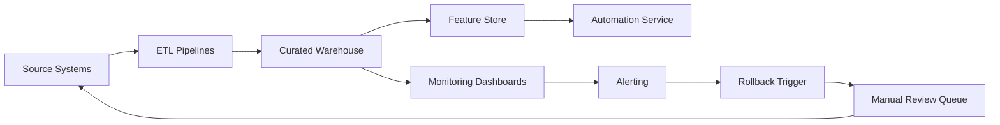

TL;DR
- Catalog every dataset feeding automation, documenting lineage, access controls, and update frequency.
- Quantify quality by profiling nulls, drift, and bias, then gate automations behind acceptance thresholds.
- Bake remediation plans—schema contracts, monitoring, and rollback criteria—into the audit so launches stay resilient.

## Inventory and Lineage Mapping
Begin with a data walk-through for each automation candidate. Create a lineage diagram that shows source systems, ingestion pipelines, transformations, and downstream consumers. Capture owners for every node and confirm whether SLAs exist for freshness or uptime. Use catalog tooling or spreadsheets if needed; completeness matters more than polish. Identify shadow datasets maintained by analysts or operations teams because these often hide quality gaps.

### Access and Compliance Review
Review who can read, write, or delete the data. Document authentication methods, audit log retention, and encryption status. Where personal data exists, map to regulatory requirements such as GDPR or CCPA and note whether consent records accompany the datasets. Flag gaps like missing data processing agreements with vendors or stale role-based access controls.

## Profile Data Quality Metrics
Pull a 90-day sample and profile completeness, uniqueness, consistency, validity, and timeliness. Use automated profiling scripts alongside manual spot checks. For machine-learning-driven automations, evaluate label quality, class balance, and potential demographic bias. Record baseline metrics and define acceptable ranges. Create anomaly thresholds so future monitoring can alert on drift before automations go off the rails.

### Establish Schema Contracts
For every upstream API or file feed, define schema contracts specifying field names, types, allowed values, and nullability. Agree on communication protocols when schema changes are planned. Where possible, implement automated contract tests that block deployments if schemas deviate. Contracts prevent silent failures that lead to inaccurate automations.

## Operationalize Remediation
Prioritize remediation actions using impact vs effort. High-impact fixes include removing duplicate customer records, backfilling missing consent flags, or improving timestamp precision. Assign owners, due dates, and acceptance tests. For risks that cannot be resolved immediately, design compensating controls such as feature flags or manual review gates until data matures.

### Launch Readiness Review
Before launch, run a readout with stakeholders covering lineage, quality baselines, remediation status, and monitoring plans. Confirm you have rollback criteria—if data quality falls below thresholds, automations should pause and alert owners. Store the audit in a shared repository so future teams can reference decisions and re-run the checklist when new data sources emerge.

## Comparison Table
| Audit Dimension | Key Questions | Sample Metric | Tooling | Owner |
| --- | --- | --- | --- | --- |
| Lineage | Do we understand every hop from source to automation? | % nodes with documented owner | Data Catalog, dbt docs | Data Engineering |
| Quality | Are accuracy and completeness within tolerance? | Null rate, dedupe score | Great Expectations, Soda | Analytics |
| Compliance | Are privacy and access controls enforced? | Access review cadence | IAM, privacy review | Security |
| Monitoring | Can we detect drift and alert quickly? | MTTA for data incident | Observability stack | SRE |

## Diagram

## Checklist
- [ ] Document lineage for every data source with owner, SLA, and transformation notes.
- [ ] Audit access controls, encryption, and consent records for sensitive attributes.
- [ ] Profile 90-day data samples for completeness, drift, and bias.
- [ ] Establish schema contracts and automated tests for critical feeds.
- [ ] Define rollback criteria and monitoring alerts tied to quality thresholds.

> **Benchmarks**
> - Time to implement: 2 weeks to complete the first audit for a moderate-size automation program. [Estimate]
> - Expected outcome: Reduce automation incident volume tied to bad data by 50% within two quarters. [Estimate]

## Internal Links
- [Feed prioritized opportunities from the backlog scoring framework into this audit process.](../ai-automation-foundations/automation-backlog-prioritization-framework.mdx)
- [Reference the production guardrails playbook for rollback execution.](../ai-automation-foundations/production-guardrails-for-ai.mdx)
- [Coordinate with the n8n queue resilience guide when data flows through webhooks.](../n8n-workflows-integrations/n8n-queues-with-redis-webhooks.mdx)
- [Loop insights back into the evaluation loop design for content agents.](../multi-agent-orchestration/designing-evaluation-loops.mdx)

## Sources
- [AWS Data Readiness Assessment](https://pages.awscloud.com/rs/112-TZM-766/images/Data%20Readiness%20Assessment.pdf)
- [Google Cloud guide to data governance](https://cloud.google.com/architecture/data-governance)
