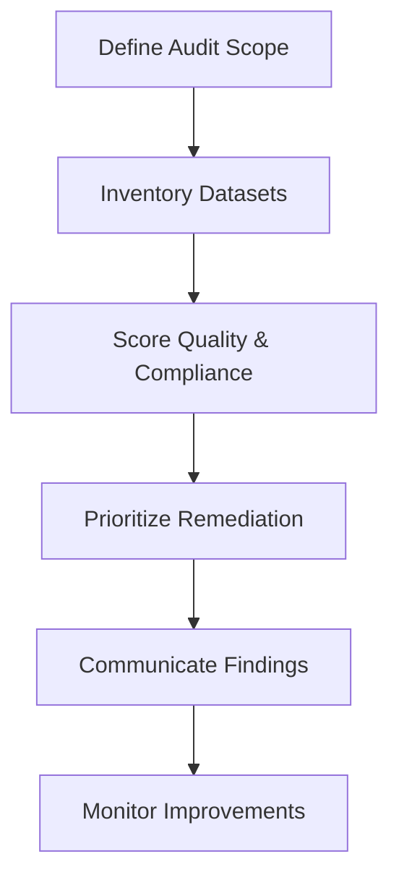

## TL;DR

- Inventory every dataset, feature, and label the automation depends on, including owners and access constraints.
- Score datasets across completeness, accuracy, timeliness, and compliance to identify remediation priorities.
- Trace lineage and retention policies to surface governance gaps before regulators or auditors do.
- Package findings into a remediation plan with owners, budgets, and timelines so automation projects launch on solid ground.

## Phase 1: Define Scope and Assemble Stakeholders

Start the audit by documenting which workflows, KPIs, and automations you plan to support. List the systems of record, data warehouses, and third-party APIs involved. Invite stakeholders from data engineering, analytics, security, and the business unit that owns the process. Clarify audit objectives—such as "validate support ticket data for a triage automation"—so everyone understands the boundaries and expected deliverables.

Establish a shared workspace for documentation. Create templates for data inventories, quality scoring, and issue tracking. Encourage teams to link existing resources (ERDs, SOPs, prior audits) instead of duplicating effort. Confirm timelines and set up recurring working sessions to keep momentum throughout the audit.

## Phase 2: Build the Data Inventory

Catalog each dataset involved in the automation. For structured data, capture table names, schemas, primary keys, and update frequencies. For unstructured data, note formats, storage locations, and any preprocessing steps. Record data owners, SMEs, and access points. Include metadata about retention policies, consent requirements, and encryption standards.

Identify labels or target variables required for supervised learning or evaluation. Document how labels are generated, who validates them, and what the historical coverage looks like. When labels are missing or inconsistent, tag them for remediation. Without reliable labels, model training and monitoring will fail.

## Phase 3: Assess Data Quality and Governance

Score each dataset against four dimensions: completeness, accuracy, timeliness, and compliance. Use a 1–5 scale with explicit definitions (e.g., "Completeness 5 = >99% of fields populated"). Where possible, back scores with automated profiling reports from tools such as dbt tests or Great Expectations suites. Attach screenshots or report links to the audit log.

Evaluate governance posture. Verify that data handling aligns with regulations like GDPR or sector-specific standards. Check if access controls exist, if retention policies are documented, and whether data subjects can exercise rights (access, deletion). Surface any vendor dependencies that need contractual review before automation begins.

## Phase 4: Prioritize Remediation Work

Translate audit findings into actionable remediation tasks. Group issues by severity and effort. For example, "Missing ticket status labels" might require a two-week data entry clean-up, whereas "No consent capture for SMS content" could demand legal review and product changes. Assign owners and due dates, and secure budget for tooling or contractor support where necessary.

Develop interim mitigation strategies. If a high-value automation depends on imperfect data, consider adjustments such as human review stages, additional validation logic, or limited rollout until quality improves. Document these mitigations so stakeholders understand residual risks.

## Phase 5: Communicate Outcomes and Track Progress

Compile findings into an executive summary: top risks, remediation roadmap, and go/no-go recommendation for the automation project. Present the summary to leadership, emphasizing how data investments unlock automation value. Establish a cadence—quarterly or aligned with product roadmaps—to revisit the audit and update scores as remediation completes.

Store audit artifacts in a centralized knowledge base. Future automation projects can reuse inventories and quality scores, accelerating discovery. Track progress in a shared issue tracker and celebrate milestones (e.g., "Support ticket dataset upgraded to Quality Score 4"). Continuous communication keeps data teams and business stakeholders aligned.

## Comparison Table

| Dimension | Questions to Ask | Tooling Support | Escalation Path |
| --- | --- | --- | --- |
| Completeness | Are key fields populated consistently? | SQL profiling, dbt tests | Data engineering lead |
| Accuracy | Do values match source-of-truth systems? | Reconciliation scripts, SME reviews | Business process owner |
| Timeliness | Does data arrive when automation needs it? | Pipeline monitoring, freshness alerts | Platform operations |
| Compliance | Are consent, retention, and access controls enforced? | Data catalogs, privacy dashboards | Security & legal |

## Diagram-as-Text

## Checklist

- [ ] Document automation scope, stakeholders, and audit objectives.
- [ ] Inventory datasets, labels, owners, and access mechanisms.
- [ ] Score quality, timeliness, and compliance with evidence.
- [ ] Create remediation tasks with severity, effort, and owners.
- [ ] Present findings with go/no-go recommendations and mitigations.
- [ ] Schedule periodic reviews to refresh scores and track progress.

> **Benchmarks**
> - Time to implement: 3–4 weeks for a medium-complexity workflow spanning three systems [Estimate].
> - Expected outcome: Data quality scores that meet or exceed 4/5 on critical datasets before automation build begins.
> - Common failure modes: Incomplete inventories, lack of label governance, and remediation tasks without budget.
> - Rollback steps: If automation launches with poor data, pause new data ingestion, revert to manual processing, and activate remediation owners with executive sponsorship.

## Internal Links

- Feed audit results into the [Automation Backlog Prioritization Framework](./automation-backlog-prioritization-framework.mdx) to adjust scores based on readiness.
- Use findings to refine the [Practical Blueprint for AI Automation](./practical-blueprint-first-win.mdx) discovery process.
- Coordinate remediation with [CI for Content Repos](../devops-for-creators/ci-for-content-repos.mdx) to enforce documentation linting and link checks.

## Sources

- [Irish Data Governance Framework](https://datagov.ie/wp-content/uploads/2021/04/Data-Governance-Framework.pdf)
- [NIST AI Risk Management Framework Playbook](https://nvlpubs.nist.gov/nistpubs/ai/NIST.AI.100-2e2023.pdf)
