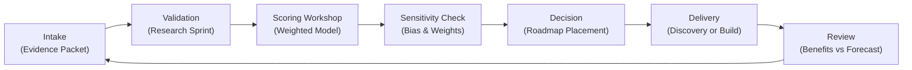

## TL;DR

- Establish a data readiness mandate that ties automation investments to verifiable availability, quality, governance, and access controls.
- Map the full data supply chain—from capture to consumption—to reveal bottlenecks, manual patches, and undocumented ownership gaps.
- Quantify quality, latency, and compliance scores with reusable instruments so every automation candidate enters delivery with transparent risk signals.
- Turn the audit into an operational rhythm with remediation backlogs, improvement KPIs, and stakeholder coaching that keeps trust high.

## Introduction

Automations fail quietly when data is missing, stale, or inconsistent. Bots grind to a halt because a column was renamed, predictive models drift because retention rules are unclear, and compliance officers step in when provenance cannot be demonstrated. Yet many teams rush into pilots assuming data will "work itself out". A disciplined automation data readiness audit prevents expensive rework by proving that the inputs supporting automation are reliable from day one.

This guide delivers a people-first, evidence-based playbook for auditing data readiness before automation projects move beyond discovery. You will define the scope of readiness, build a reusable assessment framework, run quantitative evaluations, and operationalize remediation. Expect a thorough process that balances technical metrics with change management, backed by research from IBM, McKinsey, Deloitte, and ISO data governance standards.

## Frame the Data Readiness Mandate

A successful audit starts with a shared understanding of what "ready" means. Use this section to align leaders, sponsors, and data stewards on scope and intent.

### Anchor readiness to business outcomes

Interview executive sponsors to learn which automation outcomes matter most: faster customer onboarding, reduced payment errors, or real-time campaign optimization. Translate each outcome into a data dependency statement. For example, "Reduce invoice handling time" becomes "Need invoice header, line items, dispute codes, and resolution timestamps accessible with <4-hour latency." Document these statements in the audit charter so every check traces back to a business need.

### Align with governance and risk expectations

Review regulatory obligations (GDPR, HIPAA, PCI) and internal control frameworks (ISO/IEC 38505, SOC 2). Meet with compliance and security leads to inventory mandatory controls: encryption standards, retention policies, data residency requirements, and bias checks for AI-enabled automation. Deloitte’s data trust research shows organizations that codify controls early reduce remediation costs by 45% because they avoid late-stage redesigns. Bake these controls into the readiness criteria.

### Define the readiness framework

Create a four-pillar framework—Availability, Quality, Governance, and Accessibility. Each pillar should have 3–4 sub-metrics with scoring rubrics from 1 to 5. For example, Availability might include "Source System Uptime" and "Refresh Frequency", while Governance contains "Lineage Documented" and "Steward Assigned". This framework becomes the backbone of your audit, ensuring consistency across automation candidates.

## Map the Data Supply Chain End-to-End

To audit readiness, you must understand how data flows from capture to automation consumption.

### Identify critical data assets

Start with process mining outputs, existing automation documentation, and stakeholder interviews. List every dataset, table, API, or file that the automation will touch. Include upstream reference data (e.g., customer master) and downstream systems consuming outputs. IBM’s data readiness guide recommends cataloging assets with metadata such as owner, storage location, and sensitivity classification. Use a shared catalog tool or spreadsheet to track these attributes.

### Trace lineage and dependencies

For each asset, map where data originates, how it transforms, and which systems rely on it. Visualize lineage using simple diagrams or lineage tools. Highlight manual steps—CSV exports, email approvals, macros—that introduce latency or errors. Identify dependencies on third-party vendors or shared services. Document whether lineage is formally recorded or exists only in tribal knowledge.

### Assess infrastructure and integration maturity

Evaluate the platforms hosting your data. Are they cloud-native with APIs, or legacy mainframes requiring screen scraping? Check integration points for robust APIs, message queues, or brittle flat files. Note maintenance windows, versioning practices, and monitoring coverage. Capture infrastructure health scores using your 1–5 rubric. This step prevents surprises when automation engineers attempt to connect to unstable endpoints.

## Quantify Readiness with Evidence-Based Metrics

With the supply chain mapped, you can measure each pillar of the framework rigorously.

### Develop measurement instruments

Create survey forms, SQL scripts, and API checks to quantify each metric. For Availability, run automated scripts that track uptime and refresh latency over two weeks. For Quality, sample records and compute accuracy, completeness, and consistency percentages. Governance metrics may require document reviews to confirm policies and stewardship assignments. Accessibility focuses on user provisioning, RBAC controls, and audit logging.

### Worked example: evaluating claims processing data

A healthcare automation team wants to automate claims adjudication. The audit team gathers measurements:

- Availability: Claims table refreshed every 30 minutes, with 99.2% uptime over 14 days (score 4). Supporting provider data refreshes nightly with 97% uptime (score 3).
- Quality: Sample of 500 claims shows 1.4% missing provider IDs and 0.6% inconsistent status codes (score 3). Provider reference table has 4.8% duplicate entries (score 2).
- Governance: Lineage diagrams exist, but steward role is unassigned. Data retention documented but no bias assessment for automation models (score 2).
- Accessibility: Role-based controls enforced, but access requests take 5 business days to approve (score 2).

Aggregate using weighted scores (Availability 25%, Quality 30%, Governance 25%, Accessibility 20%): `(4*0.25)+(3*0.30)+(2*0.25)+(2*0.20)=2.85`. The automation cannot proceed without remediation. Document the evidence, recommend assigning stewards, cleansing duplicates, and accelerating access approvals before re-scoring.

### Validate findings with stakeholders

Share preliminary scores with data owners and automation sponsors. Facilitate a review session to confirm interpretations, gather missing context, and align on remediation priorities. If stakeholders dispute a score, require additional evidence. McKinsey’s State of AI report emphasizes co-ownership between business and tech teams; joint validation prevents adversarial dynamics and accelerates fixes.

### Produce a readiness heatmap

Summarize results in a visual dashboard or heatmap showing scores per pillar and per dataset. Highlight severe risks in red, moderate issues in amber, and ready areas in green. Include supporting notes and evidence links. Use this heatmap in governance forums to communicate readiness and resource needs succinctly.

## Operationalize Remediation and Continuous Improvement

An audit is only valuable if it triggers action. Build operational loops that convert findings into progress.

### Build a remediation backlog

Log every issue in a backlog categorized by pillar and severity. Assign owners, due dates, and estimated effort. Prioritize fixes that unblock automation delivery first, then structural improvements. For example, duplicate provider IDs may require data cleansing sprints, while missing bias assessments call for collaboration with the risk team. Track backlog burndown in weekly stand-ups.

### Integrate with automation delivery cadence

Align remediation milestones with automation stage gates. Require a minimum readiness score (e.g., 3.5) before moving into build. If remediation delays threaten delivery, escalate to governance forums to re-evaluate timelines or scope. Document exceptions formally so risk teams stay informed. This integration prevents automation squads from inheriting unresolved data liabilities.

### Establish KPIs and dashboards

Define key performance indicators such as "percentage of automation candidates with readiness score ≥3.5", "average time to close high-severity data issues", and "number of datasets with assigned stewards". Automate reporting where possible. Deloitte’s data trust study notes that organizations monitoring trust metrics quarterly have 30% higher stakeholder confidence. Share dashboards with executives to demonstrate progress and justify data investment requests.

### Coach stakeholders and update documentation

Deliver enablement sessions for process owners and analysts explaining the readiness framework, scoring rubric, and remediation expectations. Provide templates for data profiling, stewardship charters, and access request playbooks. Update documentation after every audit cycle to reflect new standards or tools. Embedding education reduces friction and encourages departments to prepare data proactively.

## Sustain the Audit as an Ongoing Program

Readiness is not a one-off project. Turn the audit into a continuous capability that evolves with your automation portfolio.

### Schedule recurring audits and spot checks

Conduct full readiness audits quarterly for critical automation domains and semi-annually for lower-risk areas. Supplement with monthly spot checks on key datasets, especially those feeding high-volume bots or machine learning models. Use automation to monitor data drift, latency spikes, and access anomalies between audits. Establish a rapid response playbook for addressing incidents uncovered by monitoring.

### Evolve the framework with new regulations and technologies

Stay informed about emerging standards such as ISO/IEC 5259 for data quality and updates to ISO/IEC 27001 for security. Adjust your rubric to account for synthetic data, federated learning, or edge deployments if those technologies enter your automation stack. Engage with legal and compliance teams whenever regulatory environments change to ensure your controls remain defensible.

### Celebrate wins and communicate progress

Publish quarterly "data trust bulletins" summarizing readiness scores, remediation completed, and success stories. Highlight when an automation project launched smoothly because data issues were resolved early. Recognize stewards and engineers who contributed to improvements. These stories reinforce the value of the audit program and secure future funding.

## Comparison Table

| Method / Option | Best For | Strengths | Watch-Outs |
|---|---|---|---|
| Full Readiness Audit | High-stakes automations touching regulated data | Comprehensive view of risk, aligned with governance | Requires significant coordination and measurement tooling |
| Rapid Data Triage | Early discovery phases needing quick viability signal | Fast, low-cost assessment, good for backlog filtering | Limited depth, may miss systemic quality or governance issues |
| Continuous Monitoring Only | Mature data platforms with robust automation telemetry | Scales across datasets, near-real-time alerts | Still needs periodic deep dives to validate assumptions |

## Diagram (Mermaid)

## Checklist / SOP

1. Draft the audit charter, defining business outcomes, governance obligations, and the four-pillar readiness framework.
2. Inventory all data assets supporting the automation, capturing metadata, lineage, and ownership.
3. Run measurement instruments to quantify availability, quality, governance, and accessibility metrics.
4. Validate findings with stakeholders, produce the readiness heatmap, and document remediation recommendations.
5. Populate the remediation backlog, assign owners, and align fixes with automation delivery stage gates.
6. Review progress in governance forums, update dashboards, and schedule the next audit cycle with lessons learned.

## Benchmarks

> Time to implement: 4–6 weeks to launch the first full readiness audit. [Estimate]
> Expected outcome: 30–40% reduction in automation delivery rework linked to data defects within 12 months. [Estimate]
> Common pitfalls: Underestimating access provisioning delays, ignoring manual data patches, and skipping stakeholder validation. [Estimate]
> Rollback plan: Pause automation deployment, revert to manual process controls, and execute a targeted data remediation sprint. [Estimate]

## Internal Links

- Strengthen downstream risk decisions with the [automation risk matrix for small teams](./automation-risk-matrix-small-teams).
- Connect readiness insights to early delivery wins via the [practical blueprint for a first automation win](./practical-blueprint-first-win).
- For revenue-focused data strategies, explore the [creator analytics stack blueprint](../monetization-analytics/creator-analytics-stack-blueprint).

## Sources

- IBM, "The Data Readiness Report," guidance on building data trust for automation and AI initiatives.
- McKinsey & Company, "The State of AI in 2023," insights on data foundations driving successful AI-enabled automation.
- Deloitte, "Data Trust," research on governance practices reducing risk and remediation costs.
- ISO/IEC 8000-61, international standard outlining data quality management requirements relevant to automation.

