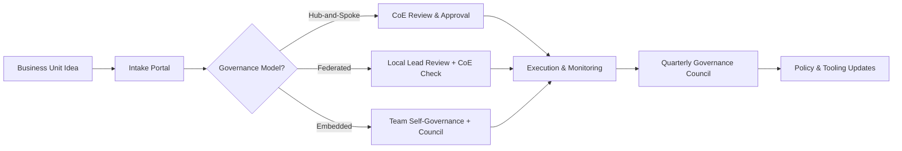

## TL;DR

- Governance is a product: define roles, decision rights, and guardrails before scaling automation across teams.
- Choose between hub-and-spoke, federated, or embedded models based on maturity, regulatory load, and talent distribution.
- Formalize intake, approval, and monitoring workflows with RACI charts and operating rhythms.
- Build transparency loops—scorecards, retrospectives, and executive councils—to keep automation aligned with strategy and risk tolerance.

## Understand Governance Goals and Constraints

Start by clarifying why governance matters for your organization. Are you operating in a regulated industry with strict audit requirements? Do you need speed to keep up with competitive pressures? Do teams have automation skills or are they new to AI? These questions shape how centralized or decentralized your governance structure should be. Document goals such as "ensure privacy compliance," "accelerate experimentation," or "standardize tooling" so every decision traces back to a business need.

Assess current maturity. Inventory existing automation projects, their owners, and performance outcomes. Identify pain points—duplicate tools, unreviewed models, compliance surprises—that governance must fix. Interview stakeholders to learn how decisions are currently made. The insights inform whether you need centralized control, shared guardrails, or embedded governance coaches.

## Select the Right Operating Model

Three archetypes dominate automation governance:

1. **Hub-and-Spoke**: A central center of excellence (CoE) sets standards, manages vendor relationships, and approves major launches. Business units execute under the CoE’s supervision.
2. **Federated**: A central team defines guidelines and tooling, but business units maintain local automation leads who own execution and compliance.
3. **Embedded**: Each product or functional team contains its own automation specialists, with light-touch oversight via councils.

Match the archetype to your context. Hub-and-spoke suits regulated sectors or early-stage programs that need discipline. Federated models fit mid-maturity organizations balancing scale with autonomy. Embedded governance works for advanced teams with strong automation literacy. You can evolve from one model to another as maturity grows—document transition criteria.

## Define Roles, RACI, and Operating Rhythm

Once you select a model, define roles clearly. Typical roles include automation product owner, technical lead, compliance officer, data steward, and change manager. Build a RACI matrix for key activities: idea intake, risk assessment, model approval, monitoring, retraining, and incident response. Share the RACI widely and revisit quarterly as responsibilities shift.

Establish operating rhythms. Hold monthly governance council meetings to review pipeline health, metrics, and risk escalations. Run quarterly portfolio reviews where business units pitch upcoming automations and report on existing ones. Align governance reviews with product release cadences to minimize friction. Document agendas, required materials, and decision thresholds so meetings stay efficient.

## Equip Teams with Standards and Tooling

Governance fails without usable standards. Publish templates for business cases, data readiness audits, model cards, and launch checklists. Provide shared tooling for prompt management, monitoring dashboards, and incident tracking. Offer training sessions and office hours. Measure adoption of templates and tools; treat low adoption as a signal that guidance may be too complex or misaligned with reality.

Establish policy repositories accessible to everyone. Include compliance requirements, acceptable use policies, and escalation contacts. For generative AI, add brand voice guidelines and transparency expectations. Keep documentation version-controlled and announce updates via governance newsletters or intranet posts.

## Monitor, Learn, and Iterate Governance

Governance is not "set and forget." Track metrics such as time-to-approve, number of incidents, stakeholder satisfaction, and ROI per automation. Use scorecards to highlight trends by business unit. After major launches or incidents, run retrospectives focused on governance effectiveness: Did approval steps catch issues? Was escalation fast enough? What guidance was missing? Feed lessons into updated policies and training.

Create transparency loops with executives. Present quarterly reports covering portfolio performance, risk posture, and investment needs. Include narratives that link automation outcomes to strategic objectives. Transparency builds trust and secures ongoing support for governance resources.

## Comparison Table

| Operating Model | Strengths | Watchouts | Ideal Context |
| --- | --- | --- | --- |
| Hub-and-Spoke | Strong control, consistent standards | Potential bottlenecks, slower experimentation | Early-stage programs, regulated industries |
| Federated | Balances autonomy with shared tooling | Requires capable local leads, risk of drift | Mid-maturity orgs with distributed expertise |
| Embedded | Fast iteration, deep domain alignment | Hard to maintain consistency, higher tooling spend | Advanced orgs with mature automation culture |

## Diagram-as-Text

## Checklist

- [ ] Document governance goals, constraints, and maturity assessment.
- [ ] Select an operating model (hub-and-spoke, federated, embedded) with transition criteria.
- [ ] Define roles and create a RACI matrix for intake, risk, approvals, and monitoring.
- [ ] Establish meeting cadences, agendas, and decision thresholds.
- [ ] Publish standards, templates, and tooling guides; train teams on usage.
- [ ] Track governance KPIs and run retrospectives to refine policies.

> **Benchmarks**
> - Time to implement: 6–8 weeks to stand up governance councils, documentation, and tooling for a mid-size org [Estimate].
> - Expected outcome: 30% faster approvals with reduced incident severity due to consistent guardrails.
> - Common failure modes: Under-resourced CoEs, unclear decision rights, and stale documentation.
> - Rollback steps: If the chosen model stalls delivery, temporarily centralize approvals under a rapid-response tiger team while redesigning the governance structure.

## Internal Links

- Ensure backlog decisions align with the [Automation Backlog Prioritization Framework](./automation-backlog-prioritization-framework.mdx).
- Embed data quality expectations from the [Automation Data Readiness Audit](./automation-data-readiness-audit.mdx).
- Coordinate change management with the [Automation Pilot to Scale Playbook](./automation-pilot-to-scale-playbook.mdx).

## Sources

- [McKinsey guidance on scaling intelligent automation](https://www.mckinsey.com/capabilities/operations/our-insights/how-to-scale-intelligent-automation)
- [ISO/IEC 38500 corporate governance of IT](https://www.iso.org/obp/ui/#iso:std:iso-iec:38500:ed-2:v1:en)
