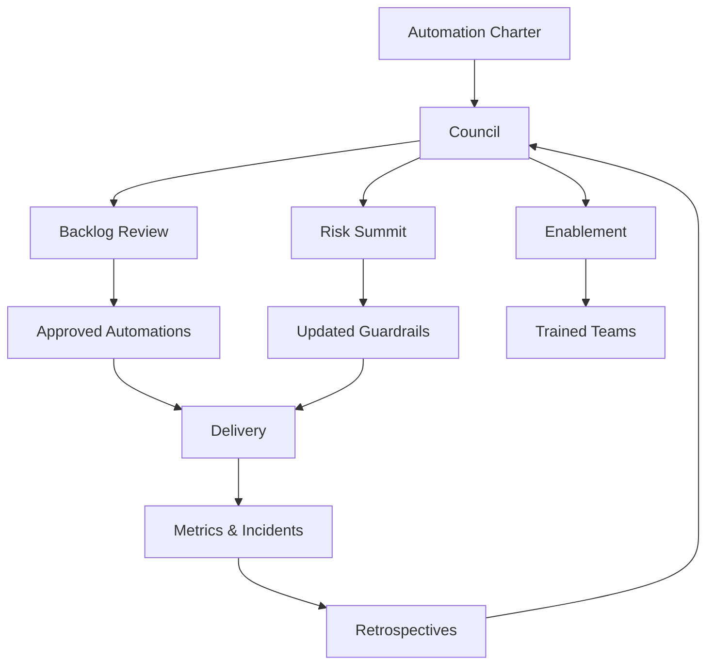

TL;DR
- Build a cross-functional automation council with clear RACI roles for ideation, approval, delivery, and oversight.
- Standardize guardrails—policies, tooling, and metrics—and assign ownership so governance becomes operational rather than theoretical.
- Create feedback loops via quarterly reviews and retrospectives to adapt controls as automation maturity increases.

## Establish the Governance Charter
Define the mission of your automation council: accelerate impact while protecting customers, compliance, and brand trust. Document scope (AI, RPA, workflow automation), decision rights, and escalation paths. Publish the charter so teams know where to submit ideas, how decisions are made, and how conflicts are resolved.

### RACI for Core Activities
Map responsibilities for backlog management, data readiness, security review, deployment, and monitoring. For example, Product may be Responsible for ideation, Engineering Accountable for build quality, Security Consulted on risk tiers, and Legal Informed of release timelines. Visualize the RACI to prevent bottlenecks and clarify expectations for lean teams.

## Governance Cadence and Rituals
Schedule recurring ceremonies: monthly backlog review, quarterly risk summit, and post-incident reviews. Use structured agendas that highlight KPI performance, risk register changes, and mitigation progress. Rotate facilitators to spread context and prevent single points of failure.

### Tooling and Guardrails
Adopt shared tooling for tracking decisions and compliance artifacts. This could include project management boards, centralized documentation, and automated policy checks. Align with the production guardrails playbook to ensure policies translate into rate limits, logging, and rollback capabilities. Monitor adoption metrics—how many automations pass governance gates on the first attempt.

## People Enablement
Provide training modules and office hours for teams new to automation governance. Develop quick-start guides that explain how to craft business cases, prepare data audits, and run pilots-to-scale. Highlight examples of successful governance to reinforce the value proposition.

### Continuous Improvement
Gather feedback after every governance ritual. Were requirements clear? Did teams have the right data? Use surveys and retrospectives to iterate on the operating model. Track governance KPIs such as time-to-approval, incident volume by tier, and compliance audit findings.

## Comparison Table
| Governance Element | Purpose | Primary Owner | Cadence | Metrics |
| --- | --- | --- | --- | --- |
| Automation Council | Decide priorities and guardrails | VP Operations | Monthly | Time-to-approval |
| Risk Review | Reassess risk tiers, incidents | Security Lead | Quarterly | Tier changes, incident count |
| Post-Incident Retro | Capture lessons and actions | SRE Lead | As needed | MTTR, action completion |
| Training & Enablement | Upskill teams | PMO | Quarterly | Attendance, satisfaction |

## Diagram

## Checklist
- [ ] Draft and publish an automation governance charter with scope and decision rights.
- [ ] Create a RACI matrix covering ideation, build, review, and monitoring.
- [ ] Schedule governance ceremonies with documented agendas and owners.
- [ ] Implement tooling that enforces guardrails and captures audit artifacts.
- [ ] Gather feedback and iterate on the operating model quarterly.

> **Benchmarks**
> - Time to implement: 2 weeks to stand up the council and first RACI. [Estimate]
> - Expected outcome: 25% faster approvals with measurable reduction in compliance escalations. [Estimate]

## Internal Links
- [Use the automation pilot-to-scale playbook to coordinate council checkpoints.](../ai-automation-foundations/automation-pilot-to-scale-playbook.mdx)
- [Reference the automation risk matrix when setting tier-specific guardrails.](../ai-automation-foundations/automation-risk-matrix-small-teams.mdx)
- [Leverage the content brief generator article to align enablement with content operations.](../content-factory-distribution/content-brief-generator.mdx)
- [Partner with the CI for content repos guide to standardize governance tooling integrations.](../devops-for-creators/ci-for-content-repos.mdx)

## Sources
- [OECD guidance on AI governance](https://www.oecd.org/going-digital/ai/governance-of-ai/)
- [ISACA recommendations for AI governance structures](https://www.isaca.org/resources/news-and-trends/newsletters/atisaca/2023/volume-5/establishing-ai-governance)
