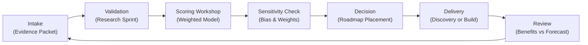

## TL;DR

- Establish a governance charter that ties automation decisions to business outcomes, risk appetite, and ethical principles.
- Choose an operating model—centralized, hub-and-spoke, or federated—based on organizational maturity, scale, and stakeholder distribution.
- Implement reusable frameworks for decision rights, funding, guardrails, and lifecycle management so every automation follows a predictable path.
- Embed governance into daily operations with cross-functional councils, telemetry, and feedback loops that evolve as automation volume grows.

## Introduction

Automation momentum collapses when governance is either too loose or too restrictive. Without clear decision rights, teams ship bots that break controls. When oversight is overly bureaucratic, innovation stalls and business units bypass the center. Building a resilient governance operating model means designing structures, rituals, and guardrails that make automation reliable, compliant, and high-impact.

In this article, you will architect a governance model tailored to your organization’s maturity. We will examine strategic foundations, compare operating models, assign accountability, and operationalize oversight with practical tools. Research from McKinsey, Gartner, Deloitte, ISO 38500, and BCG informs the playbook so you can deliver a governance system stakeholders trust.

## Define Governance Principles and Charter

A governance charter sets expectations and anchors every decision to enterprise outcomes.

### Clarify strategic objectives and guardrails

Start with executive workshops to articulate why automation governance matters. Capture the top objectives: protect brand reputation, accelerate ROI, ensure regulatory compliance, and support workforce transformation. Pair each objective with key guardrails. For example, "Protect customer trust" links to controls around data privacy and transparent AI usage. Gartner recommends anchoring governance on principles such as fairness, accountability, transparency, and explainability—include these in your charter to frame every decision.

### Map stakeholders and decision rights

Identify all parties touched by automation: business sponsors, product owners, engineers, risk and compliance teams, HR, and legal. Draft a RACI (Responsible, Accountable, Consulted, Informed) matrix covering lifecycle stages—ideation, prioritization, design, build, deployment, monitoring, and retirement. ISO 38500 emphasizes that boards remain accountable while delegating responsibility; ensure accountability is explicit to avoid finger-pointing when issues arise.

### Establish governance scope and cadences

Document which automation types fall under governance (RPA bots, workflow automation, machine learning, low-code apps). Define thresholds for escalation (e.g., projects touching regulated data or exceeding $250K investment). Set recurring cadences: monthly council reviews, quarterly strategy retrospectives, and annual maturity assessments. Include escalation paths for urgent incidents.

### Develop an automation ethics statement

Codify a concise ethics statement that articulates how automation will respect employees, customers, and partners. Include commitments to human oversight, equitable outcomes, transparent communication, and continuous learning. Deloitte notes that programs with published ethics principles earn 1.8x higher stakeholder trust because expectations are clear from the outset. Socialize the statement in onboarding materials, vendor contracts, and communications with frontline teams. Revisit annually to incorporate new regulatory guidance or societal expectations.

## Evaluate Operating Models Using the ACCESS Framework

Selecting the right operating model requires analyzing scale, capabilities, and culture. Use the ACCESS framework—Alignment, Control, Capability, Engagement, Speed, and Scalability—to compare options.

### Operating model overview

- **Centralized**: A single automation Center of Excellence (CoE) handles strategy, delivery, and controls.
- **Hub-and-Spoke**: A central CoE sets standards while business-aligned hubs deliver automations with shared services support.
- **Federated**: Business units own automation end-to-end within shared guardrails and governance forums.

### Worked example: ACCESS scoring for a growth-stage fintech

A fintech with 1,200 employees plans to scale automations across compliance, operations, and marketing. Apply ACCESS criteria (scored 1–5):

| Criterion | Centralized | Hub-and-Spoke | Federated |
| Alignment | 5 (single vision) | 4 (shared standards) | 3 (varied goals) |
| Control | 5 (tight oversight) | 4 (controlled via hub standards) | 2 (local variation) |
| Capability | 3 (CoE capacity limited to 25 engineers) | 4 (central guidance plus domain hubs) | 3 (capabilities vary by BU) |
| Engagement | 2 (business feels distant) | 4 (hubs sit with business) | 5 (full ownership) |
| Speed | 3 (queue-based delivery) | 4 (parallelized across hubs) | 5 (decentralized execution) |
| Scalability | 3 (CoE becomes bottleneck) | 5 (scales with hubs) | 4 (depends on BU investment) |

Aggregate weighted scores (Alignment 20%, Control 20%, Capability 20%, Engagement 15%, Speed 15%, Scalability 10):

- Centralized: `(5*.2)+(5*.2)+(3*.2)+(2*.15)+(3*.15)+(3*.1)=3.55`
- Hub-and-Spoke: `(4*.2)+(4*.2)+(4*.2)+(4*.15)+(4*.15)+(5*.1)=4.05`
- Federated: `(3*.2)+(2*.2)+(3*.2)+(5*.15)+(5*.15)+(4*.1)=3.65`

Hub-and-spoke wins because it balances control with engagement and speed. Document this rationale to support leadership approval.

### Create transition roadmap

Once you select a model, outline the transition: recruit core roles, establish funding flows, and define technology platforms. Plan pilot domains to test the structure before scaling. McKinsey advises launching with two high-impact journeys to prove the model and demonstrate ROI.

## Build Governance Architecture and Playbooks

Operationalizing governance requires clear processes, tooling, and documentation.

### Governance council and working groups

Form a multi-tier structure: a Strategic Council (executives), an Operational Steering Committee (CoE leads and hub representatives), and Specialist Guilds (security, architecture, change management). Define agendas: strategy alignment, backlog approval, risk review, capability development. Ensure minutes, decisions, and action items are stored in a shared workspace for auditability.

### Lifecycle controls and checkpoints

Design stage gates aligned with automation lifecycle: Ideation Intake, Discovery Review, Design Assurance, Pre-Production Readiness, and Post-Launch Monitoring. For each gate, define required artifacts (business case, data readiness audit, risk assessment, testing evidence) and approval authorities. Deloitte’s automation research highlights that disciplined stage gates reduce production incidents by up to 35%.

### Guardrails and policies

Publish policies covering coding standards, documentation, testing protocols, change management, and ethics. Provide templates for process documentation, exception handling, and rollback procedures. Include guidelines for AI usage—model explainability, bias mitigation, human-in-the-loop verification—drawing on BCG’s AI at Scale report. Update policies quarterly to reflect lessons learned.

### Funding and benefits realization

Define how automations are funded (central budget, chargeback, or hybrid). Establish benefits tracking with baseline metrics and realization checkpoints at 30, 90, and 180 days post-launch. Integrate with finance systems to reconcile forecast vs actual savings. Transparency in funding builds trust and sustains investment.

### Service catalog and vendor management

Create a service catalog outlining what the governance function provides: intake facilitation, design reviews, security assessments, training, and platform support. Pair this with vendor management guidelines that specify due diligence requirements, contract clauses for data protection, and performance SLAs. A well-defined catalog reduces ad hoc requests and makes it easier for business units to engage governance early.

## Embed Governance into Daily Operations

Governance becomes real when it shapes everyday behaviors.

### Tooling integration

Implement platforms that enforce guardrails: idea intake portals, project portfolio management tools, CI/CD pipelines with approvals, and monitoring dashboards. Automate evidence capture so audit trails are generated by default. Integrate with identity management to ensure only authorized personas can deploy automations.

### Coaching and enablement

Offer training paths for business users (automation literacy), hub developers (architecture and security), and executives (value realization). Provide playbooks, lunch-and-learns, and office hours. According to Gartner, organizations investing in governance education achieve adoption rates 40% higher than peers because stakeholders understand both benefits and obligations.

### Performance measurement and feedback loops

Track KPIs: percentage of automations passing gates on first attempt, incident frequency, benefit realization variance, and stakeholder satisfaction. Conduct quarterly retrospectives to review metrics, gather feedback from hubs, and adjust policies. Share dashboards widely to reinforce accountability and celebrate improvements.

### Incident management and escalation

Define how automation incidents are detected, triaged, and resolved. Establish severity levels, response timelines, and communication templates. Integrate with enterprise incident response to ensure coordinated action when automations impact customer-facing services. Maintain a blameless post-incident review practice to uncover root causes, update guardrails, and communicate lessons learned. BCG highlights that disciplined incident handling shortens recovery times by 35%, preserving trust in governance.

## Sustain and Evolve the Operating Model

Governance must evolve with scale, technology, and regulatory shifts.

### Maturity assessments and continuous improvement

Conduct semi-annual maturity assessments using frameworks like the Intelligent Automation Maturity Model. Score capabilities across strategy, people, process, technology, and risk. Use findings to prioritize investments—e.g., expanding the automation academy or upgrading monitoring tooling. Publish roadmaps to communicate progress.

### Regulatory readiness and ethics oversight

Monitor emerging regulations related to AI transparency, workforce impact, and data privacy. Establish an ethics working group to review sensitive use cases, drawing on ISO 38500 principles of responsibility and accountability. Document decisions in an ethics register accessible to leadership and auditors.

### Scaling playbook replication

As new business units or geographies adopt automation, provide a "governance in a box" kit: charter template, ACCESS scoring worksheet, RACI matrix, training curriculum, and technology stack blueprint. Pair new hubs with experienced mentors for the first two quarters to ensure consistency.

### Benchmark against peers and industry data

Participate in industry councils, benchmarking studies, or vendor-sponsored maturity surveys. Compare your governance metrics—incident rates, time-to-approve, training completion—to sector peers. Use insights to set stretch targets and justify investments in tooling or talent. McKinsey’s benchmarking data shows top-quartile automation programs revisit their operating model annually, using external comparisons to stay ahead of market expectations.

## Comparison Table

| Method / Option | Best For | Strengths | Watch-Outs |
|---|---|---|---|
| Centralized CoE | Early-stage programs needing control | Strong oversight, consistent standards, easier compliance | Slower delivery, potential bottleneck, limited business engagement |
| Hub-and-Spoke | Mid-sized enterprises scaling automation | Balances control with proximity to business, scalable capacity | Requires robust coordination and investment in hub talent |
| Federated | Mature organizations with strong governance culture | High autonomy, rapid innovation, business ownership | Risk of fragmentation, harder to maintain standards |

## Diagram (Mermaid)

## Checklist / SOP

1. Draft the governance charter, ACCESS criteria, and RACI matrix; secure executive sponsorship.
2. Score operating model options using ACCESS, document rationale, and approve the transition roadmap.
3. Stand up governance councils, define stage gates, publish guardrail policies, and launch the service catalog.
4. Integrate governance artifacts into tooling, ensuring evidence capture and permissions are automated.
5. Launch enablement programs, codify incident response procedures, track KPIs, and run quarterly retrospectives.
6. Refresh maturity assessments, benchmark externally, update policies for new regulations, and scale the model to additional business units.

## Benchmarks

> Time to implement: 8–12 weeks to operationalize the chosen governance model. [Estimate]
> Expected outcome: 25–35% reduction in automation incidents and rework within the first year. [Estimate]
> Common pitfalls: Understaffed governance councils, inconsistent stage gate enforcement, and insufficient business enablement. [Estimate]
> Rollback plan: Revert to prior oversight structure temporarily, convene an executive task force, and re-sequence rollout milestones. [Estimate]

## Internal Links

- Prioritize automation demand with the [automation backlog prioritization framework](./automation-backlog-prioritization-framework).
- Strengthen production controls using the [production guardrails for AI playbook](./production-guardrails-for-ai).
- For rollback patterns in content infrastructure, review the [content rollbacks disaster recovery guide](../devops-for-creators/content-rollbacks-disaster-recovery).

## Sources

- McKinsey & Company, "How to Scale Intelligent Automation," insights on governance structures and CoE design.
- Gartner, "How to Define AI Governance," principles for accountable automation oversight.
- Deloitte, "Intelligent Automation," research on risk, control, and operating models.
- ISO/IEC 38500:2015, corporate governance of IT standard guiding responsibility and accountability.
- BCG, "Building AI at Scale," recommendations for balancing innovation with governance.

