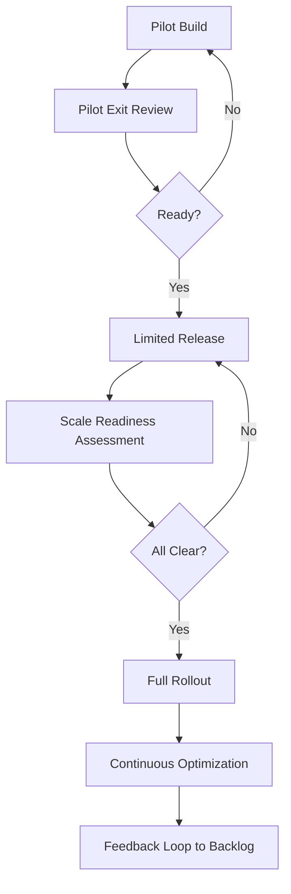

## TL;DR

- Treat scaling as a series of gates: pilot validation, limited release, full rollout, and ongoing optimization.
- Pair technical readiness (monitoring, performance) with organizational readiness (training, communications, change impact).
- Document incident response, rollback, and retraining plans before volume ramps up.
- Maintain a continuous improvement cadence that combines KPI dashboards with qualitative feedback loops.

## Gate 1: Pilot Exit Criteria

Before expanding beyond the pilot cohort, confirm the automation meets quantitative and qualitative thresholds. Quantitatively, validate KPI targets (e.g., 30% faster handle time) and error rates within tolerance. Qualitatively, survey pilot users for trust and usability scores; review support tickets for recurring friction. Capture lessons learned in a retrospective report, including prompt changes, data fixes, and process tweaks made during the pilot.

Formalize pilot artifacts: configuration snapshots, prompt libraries, model cards, and updated SOPs. Store them in version control. Obtain sign-off from the business owner, compliance officer, and platform engineering lead. Their approval becomes the gate pass to limited release.

## Gate 2: Limited Release with Change Management

Limited release means expanding to a broader segment while keeping the blast radius manageable. Segment users by geography, product line, or shift. Develop a communications plan that explains what is changing, why, and how support works. Provide training assets—videos, quick reference guides, sandbox sessions—tailored to each role interacting with the automation.

Run parallel monitoring during limited release. Compare performance between pilot and new segments. Watch for metric regression, support volume spikes, or negative customer feedback. Assign a change manager to hold daily stand-ups during the first two weeks, ensuring feedback loops stay fast. Update documentation as questions emerge.

## Gate 3: Full Rollout Preparation

Once limited release stabilizes, prepare for full rollout. Reassess infrastructure capacity, including API quotas, inference latency, and fallback mechanisms. Confirm observability coverage—dashboards, alerts, tracing—for the increased load. Conduct a game day exercise simulating worst-case incidents (model drift, API outage) to stress-test your runbooks.

Update legal and compliance artifacts. Ensure privacy notices, customer-facing disclosures, and risk registers reflect the expanded audience. Coordinate with finance on budget impacts, especially if consumption-based pricing will rise. If new teams inherit the automation, provide onboarding sessions and assign local champions.

## Gate 4: Ongoing Optimization and Governance

Scaling does not end at rollout. Establish a continuous improvement cadence—monthly optimization sprints or quarterly roadmap reviews. Track KPI trends, cost metrics, and user satisfaction. Maintain a backlog of enhancements sourced from analytics, user interviews, and incident reviews. Prioritize improvements using the governance model established for automation programs.

Plan retraining and evaluation cycles. For machine learning components, schedule data refreshes and accuracy audits. For deterministic automations, review business rules quarterly to ensure they still match reality. Celebrate wins publicly to reinforce adoption and investment in automation.

## Comparison Table

| Gate | Objectives | Key Deliverables | Decision Owners |
| --- | --- | --- | --- |
| Pilot Exit | Validate performance and user trust | Metrics report, retrospective, approvals | Product owner, compliance, engineering lead |
| Limited Release | Expand while managing risk | Training plan, comms assets, monitoring dashboards | Change manager, support lead |
| Full Rollout | Ensure scale readiness | Capacity assessment, game day results, updated disclosures | Platform engineering, legal, finance |
| Ongoing Optimization | Sustain performance and adoption | KPI reviews, enhancement backlog, retraining plan | Governance council, product owner |

## Diagram-as-Text

## Checklist

- [ ] Define quantitative and qualitative pilot exit criteria; document results.
- [ ] Package pilot artifacts (prompts, configs, SOPs) into version-controlled repositories.
- [ ] Build a change management plan with training materials and communication cadence.
- [ ] Validate infrastructure capacity, observability, and incident runbooks before full rollout.
- [ ] Update legal disclosures, budgets, and stakeholder alignment for the scaled audience.
- [ ] Schedule ongoing optimization reviews and retraining cycles.

> **Benchmarks**
> - Time to implement: 6–10 weeks from pilot exit to full rollout for a mid-complexity automation [Estimate].
> - Expected outcome: Sustain pilot KPI improvements within ±5% variance while doubling or tripling coverage.
> - Common failure modes: Skipping change management, underestimating capacity needs, and ignoring operator feedback.
> - Rollback steps: If issues spike, revert affected cohorts to manual workflow, restore previous model version, and run a joint incident review before relaunching.

## Internal Links

- Use the [Automation Governance Operating Models](./automation-governance-operating-models.mdx) guide to align decision rights during scale-up.
- Revisit the [Automation Data Readiness Audit](./automation-data-readiness-audit.mdx) before retraining cycles.
- Instrument metrics alongside the [CI for Content Repos](../devops-for-creators/ci-for-content-repos.mdx) workflow to catch documentation drift.

## Sources

- [Site Reliability Engineering practices for incident management](https://sre.google/sre-book/)
- [Harvard Business Review on building trust with automation](https://hbr.org/2020/09/how-to-build-trust-with-automation)
