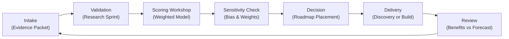

## TL;DR

- Use evidence-based stage gates to confirm pilots are technically sound, economically justified, and socially accepted before scaling.
- Build the SCALE framework—Strategy, Capacity, Architecture, Learning, Execution—to orchestrate expansion across technology, people, and processes.
- Establish reliability engineering, observability, and support operations so scaled automations behave predictably under production load.
- Mobilize change management, communication, and capability building to keep stakeholders confident as automation volume accelerates.

## Introduction

Pilots prove possibility but rarely guarantee durability. Many organizations celebrate early automation wins only to watch adoption stall when scaling across regions, products, or customer segments. Root causes range from brittle architecture and insufficient training to missing guardrails and unclear accountability. A disciplined pilot-to-scale playbook prevents these failures by combining strategy alignment, technical readiness, change leadership, and operational excellence.

This guide equips automation leaders with a holistic roadmap. You will assess pilot readiness, design the SCALE framework for expansion, operationalize reliability, and embed change programs that keep humans in the loop. Expect a mix of quantitative checkpoints, people-first tactics, and references to leading practices from McKinsey, Harvard Business Review, Google SRE, Prosci, and BCG.

## Assess Pilot Readiness Before Committing to Scale

Not every pilot deserves scale. Develop rigorous criteria to separate validated bets from experiments needing refinement.

### Confirm business value and ROI integrity

Review pilot KPIs: cycle time reduction, error rate drops, cost savings, or revenue uplift. Verify baselines and post-pilot measurements with finance. Challenge assumptions about volume extrapolation—what happens when automation handles 10x the transactions? Calculate incremental ROI, accounting for scaling costs (licenses, infrastructure, change management). McKinsey’s research shows scaling only the top 10–15% of pilots maximizes portfolio ROI because resources concentrate on proven impact.

### Validate data, process, and risk guardrails

Run a mini data readiness audit to ensure source systems can support higher throughput. Confirm process stability: are upstream inputs consistent, or will variability overwhelm the automation? Engage risk, compliance, and security to review audit trails, segregation of duties, and contingency plans. If guardrails are lacking, pause scaling and remediate.

### Test human experience and adoption potential

Interview pilot participants—operators, supervisors, customers—to gather qualitative feedback. Assess satisfaction, trust, and perceived fairness. Harvard Business Review emphasizes that transparent communication and participatory design drive adoption; incorporate these practices into your readiness review. If users report confusion or workarounds, invest in redesign before scaling.

## Build the SCALE Framework for Expansion

Use the SCALE framework to orchestrate the transition from pilot to enterprise capability.

### Strategy alignment

Define how scaling supports enterprise goals: efficiency, resiliency, customer experience, or new revenue. Map automations to strategic themes and set quarterly targets (e.g., "Automate 60% of accounts payable exceptions by Q4"). Align with the automation governance charter to ensure decision rights and funding are secure.

### Capacity planning

Forecast resource needs across engineering, operations, compliance, and support. Calculate full-time equivalents (FTE) required per automation as volume grows. Plan hiring or re-skilling for roles like platform engineers, citizen developer coaches, and automation support analysts. Establish a sourcing strategy—internal talent, contractors, or managed services—to avoid bottlenecks.

### Architecture and platform readiness

Evaluate whether your current stack can handle the scale: orchestrators, integration platforms, infrastructure, and monitoring tools. Design for elasticity, high availability, and disaster recovery. Define standards for API consumption, data pipelines, and version control. BCG notes that organizations scaling automation successfully invest early in platform resilience, preventing painful migrations later.

### Learning and enablement

Create a learning program covering technical skills, process redesign, and human factors. Use Prosci’s ADKAR model (Awareness, Desire, Knowledge, Ability, Reinforcement) to guide change interventions. Develop role-based curricula, certification paths, and coaching for supervisors who manage hybrid human-bot teams.

### Execution governance

Set up a scaling program office that coordinates rollout waves, tracks dependencies, and reports on progress. Use tiered stage gates: Pilot Exit, Controlled Rollout, Regional Expansion, and Global Scale. Define exit criteria for each gate (e.g., customer satisfaction ≥4.2/5, automation availability ≥99%, training completion ≥95%). Document decision logs and update stakeholders at every milestone.

## Worked Example: Scaling Claims Intake Automation

A regional insurer ran a pilot automating 20% of claims intake. The team applies the SCALE framework to expand nationally.

1. **Strategy**: Align with goal to reduce claims cycle time by 35%. Prioritize high-volume states first.
2. **Capacity**: Estimate 12 additional automation engineers, 6 process SMEs, and 4 support analysts. Secure budget for two citizen developer mentors to coach field teams.
3. **Architecture**: Upgrade orchestration platform to active-active deployment across two data centers. Implement message queue buffering to handle surge volumes.
4. **Learning**: Develop training for 300 adjusters, including a sandbox environment and AI ethics module.
5. **Execution**: Define stage gates—Controlled Rollout (two states), Regional Expansion (five states), National Scale (all states). Each gate requires error rates below 0.8%, SLA adherence at 98%, and support tickets resolved within 4 hours.

During Controlled Rollout, the team identifies data quality issues in one state. They run remediation sprints, update training, and only advance once KPIs stabilize. By National Scale, claims handling time drops 33%, and customer satisfaction rises 12%. This narrative demonstrates disciplined scaling informed by quantitative thresholds and change management.

## Operationalize Reliability and Support at Scale

Scaling raises stakes for reliability. Borrow practices from Site Reliability Engineering (SRE) to keep automations resilient.

### Define service level objectives (SLOs) and error budgets

Set SLOs for availability, latency, accuracy, and business KPIs. Example: "Automation availability 99.5% measured hourly," "Exception accuracy 97%". Use error budgets to manage releases—if budgets are consumed, freeze new deployments until stability returns. Google’s SRE model highlights how SLOs align engineering teams with business risk tolerance.

### Implement observability and automated testing

Deploy logging, tracing, and metrics pipelines capturing end-to-end automation performance. Instrument bots to emit business events (transactions processed, fallbacks triggered). Build automated regression suites with synthetic data and chaos tests to simulate failures. Integrate with CI/CD pipelines so every promotion includes tests for integration, security, and performance.

### Establish support operations and incident management

Create a multi-tier support model: Tier 0 self-service knowledge base, Tier 1 operations center, Tier 2 automation engineers, Tier 3 platform specialists. Define runbooks for common incidents, escalation paths, and communication templates. Conduct regular game days to practice recovery scenarios. Document learnings in post-incident reviews, updating guardrails and training materials.

### Manage change and version control

Adopt Git-based repositories for automation assets, with branching strategies and code reviews. Use feature flags or phased rollouts to limit blast radius. Coordinate changes across upstream systems to prevent breaking dependencies. Maintain a configuration management database (CMDB) capturing automation versions, dependencies, and owners.

## Drive Human-Centered Change and Adoption

Scaling hinges on people trusting and embracing automation.

### Craft compelling narratives and communication plans

Explain why scaling matters using stories, metrics, and testimonials from pilot users. Address concerns about job impact by highlighting new roles, reskilling opportunities, and value-added work automation unlocks. Harvard Business Review stresses transparency as the key to building trust; schedule town halls, newsletters, and micro-learning content to sustain engagement.

### Empower champions and peer networks

Recruit automation champions in each department to provide feedback, spot issues, and celebrate wins. Offer incentives—recognition, career pathways, bonus programs—for teams that embrace automation responsibly. Champions act as translators between central teams and frontline staff, reducing resistance.

### Support managers through change

Managers must learn to lead hybrid teams. Provide toolkits covering performance measurement, coaching for employees working alongside bots, and guidance on reallocating capacity. Implement manager roundtables to discuss challenges and share practices. Prosci’s ADKAR model emphasizes reinforcement; equip managers to celebrate progress and address setbacks quickly.

### Monitor adoption metrics

Track user satisfaction, training completion, process compliance, and manual override rates. If adoption lags, conduct root cause analysis—are workflows misaligned, messaging unclear, or incentives mis-set? Adjust change plans accordingly. Combine quantitative data with qualitative feedback to maintain a holistic view.

## Sustain Momentum with Continuous Improvement

Scaling is never "done". Build loops that keep the automation flywheel spinning.

### Run quarterly scaling retrospectives

Gather cross-functional teams to review performance, incident trends, adoption metrics, and ROI. Identify lessons learned, update the SCALE framework, and reprioritize the roadmap. Document actions and assign owners.

### Expand the portfolio responsibly

Use insights from scaled automations to refine backlog prioritization. Feed learnings into your [automation backlog prioritization framework](./automation-backlog-prioritization-framework) to ensure new ideas meet readiness standards. Align with governance councils to balance innovation with guardrails.

### Invest in innovation and experimentation

Allocate a percentage of capacity to experiment with emerging technologies—generative AI, multi-agent orchestration, or adaptive workflows. Pilot responsibly with guardrails, then fold successful experiments into the scaling pipeline. Connect with the [multi-agent tool selection framework](../multi-agent-orchestration/multi-agent-tool-selection-framework) to evaluate advanced orchestration options.

### Benchmark and celebrate wins

Compare KPIs against industry reports and peers. Share success stories: time saved, errors reduced, customer satisfaction gains. Recognize teams through awards, internal spotlights, or career progression. Celebration reinforces cultural acceptance and keeps morale high.

## Comparison Table

| Method / Option | Best For | Strengths | Watch-Outs |
|---|---|---|---|
| Stage-Gated Scaling | Organizations managing complex automations with high risk | Provides control, repeatability, and auditability | Can slow momentum if gates are overly rigid |
| Big Bang Rollout | Simple automations with low regulatory risk | Fast adoption, minimal coordination overhead | High failure impact, limited learning between phases |
| Federated Scaling Pods | Enterprises with mature automation governance | Empowers domain teams, accelerates localization | Requires strong guardrails and shared platforms |

## Diagram (Mermaid)

## Checklist / SOP

1. Run a pilot readiness review covering ROI validation, data/process stability, and human feedback.
2. Activate the SCALE framework, securing strategy alignment, resource capacity, platform readiness, learning programs, and execution governance.
3. Define stage gates with quantitative exit criteria and document decision logs for each expansion wave.
4. Implement SLOs, observability, automated testing, and support operations to sustain reliability.
5. Launch change management campaigns, empower champions, and track adoption metrics across regions.
6. Conduct quarterly retrospectives, refresh backlog priorities, and celebrate wins while integrating new innovations.

## Benchmarks

> Time to implement: 10–14 weeks to transition a pilot into controlled scale. [Estimate]
> Expected outcome: 25–40% faster automation deployment cycle times with sustained SLA performance. [Estimate]
> Common pitfalls: Underestimating data variability, neglecting change management, and skipping reliability engineering. [Estimate]
> Rollback plan: Pause rollout at current gate, revert affected processes to manual fallbacks, and execute remediation sprints before retrying. [Estimate]

## Internal Links

- Tighten post-deployment safeguards with the [production guardrails for AI guide](./production-guardrails-for-ai).
- Validate data pipelines ahead of scaling using the [automation data readiness audit](./automation-data-readiness-audit).
- Explore agent-based scaling strategies in the [multi-agent tool selection framework](../multi-agent-orchestration/multi-agent-tool-selection-framework).

## Sources

- McKinsey & Company, "How to Scale Intelligent Automation," guidance on focusing investments on proven pilots.
- Harvard Business Review, "How to Build Trust with Automation," insights on human adoption and transparency.
- Google, "Site Reliability Engineering," foundational practices for resilient automation operations.
- Prosci, "ADKAR Change Management Model," structure for building awareness through reinforcement.
- BCG, "How to Scale Automation and AI," strategies for platform readiness and portfolio governance.

