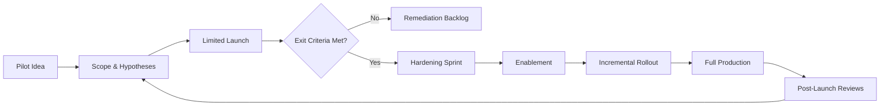

TL;DR
- Define explicit exit criteria—quantitative and qualitative—before launching a pilot, and log every assumption.
- Harden successful pilots with observability, rollback, and support playbooks before inviting more traffic.
- Plan change management by aligning enablement, documentation, and stakeholder communications for each rollout wave.

## Stage 1: Pilot Scoping
Clarify the pilot objective, target KPI lift, and manual fallback process. Limit scope to a narrow persona or segment to maximize learning speed. Document hypotheses about user behavior, edge cases, and data dependencies. Assign a pilot sponsor who collects feedback and unblocks issues quickly.

### Data and Tooling Readiness
Verify upstream data quality via the automation data readiness audit. Ensure access to sandbox environments and feature flags that isolate the pilot. Instrument logging and metrics from day one so you can measure success and diagnose failures without refactoring later.

## Stage 2: Pilot Execution
Launch the pilot to a small cohort—5–10% of the target population. Monitor key metrics daily: success rate, manual override frequency, user sentiment. Run qualitative interviews or surveys to capture trust, clarity, and friction points. Document findings in a living report shared with stakeholders.

### Exit Criteria Review
Hold a go/no-go review at the end of the pilot window. Compare actual results with the exit criteria defined upfront. Investigate any gaps: Did the automation underperform due to inaccurate prompts, missing training data, or user confusion? Capture remediation items and assign owners before expanding reach.

## Stage 3: Hardening for Scale
Once a pilot meets exit criteria, focus on resiliency. Add automated tests, load testing, and chaos drills to surface weaknesses. Implement rate limiting, circuit breakers, and fallback experiences outlined in your production guardrails. Update documentation to include runbooks, escalation paths, and contact points.

### Operational Enablement
Train support and operations teams on the new automation. Provide macro scripts or SOPs for handling exceptions. Schedule office hours with the product owner for the first few weeks of launch. Update knowledge bases and customer-facing FAQs to set expectations.

## Stage 4: Incremental Rollout
Increase coverage gradually: 25%, 50%, 100%, or by region. Use feature flags to toggle cohorts and revert quickly if metrics regress. Communicate rollout plans to leadership, support, and affected users. Track capacity to ensure infrastructure scales without bottlenecks.

### Post-Launch Optimization
Set a 30- and 90-day review cadence to evaluate performance. Analyze drift in user behavior, model accuracy, and ROI. Feed learnings back into the automation backlog prioritization framework to inform the next wave of ideas.

## Comparison Table
| Stage | Goal | Key Deliverables | Owner | Sample Metrics |
| --- | --- | --- | --- | --- |
| Pilot Scoping | Define learning plan | Hypothesis doc, exit criteria | Product Lead | Time to pilot launch |
| Pilot Execution | Validate value and UX | Daily metric reports, interviews | Ops Lead | Success rate, override % |
| Hardening | Ensure resilience | Runbooks, automated tests | Engineering | Mean time to detect, error budget |
| Incremental Rollout | Expand safely | Feature flag plan, comms brief | Program Manager | Adoption %, incident count |

## Diagram

## Checklist
- [ ] Document pilot scope, KPIs, exit criteria, and fallback plan.
- [ ] Validate data readiness and instrumentation before launch.
- [ ] Monitor pilot metrics daily and collect qualitative feedback.
- [ ] Execute hardening sprints covering tests, observability, and guardrails.
- [ ] Schedule staged rollouts with communication and enablement support.

> **Benchmarks**
> - Time to implement: 4–6 weeks from pilot design to full rollout for a moderate complexity automation. [Estimate]
> - Expected outcome: 20% faster time-to-scale with 30% fewer post-launch incidents. [Estimate]

## Internal Links
- [Use the automation backlog prioritization framework to decide which pilots graduate next.](../ai-automation-foundations/automation-backlog-prioritization-framework.mdx)
- [Coordinate with the production guardrails playbook to harden pilots before expansion.](../ai-automation-foundations/production-guardrails-for-ai.mdx)
- [Align support processes with the Vercel previews and rollback fundamentals.](../devops-for-creators/vercel-content-sites-previews-edge-caching.mdx)
- [Share learnings with the automation governance operating model for accountability.](../ai-automation-foundations/automation-governance-operating-models.mdx)

## Sources
- [Microsoft Azure design principles](https://learn.microsoft.com/azure/architecture/guide/design-principles/)
- [Stanford overview of control theory for feedback systems](https://plato.stanford.edu/entries/control-theory/)
