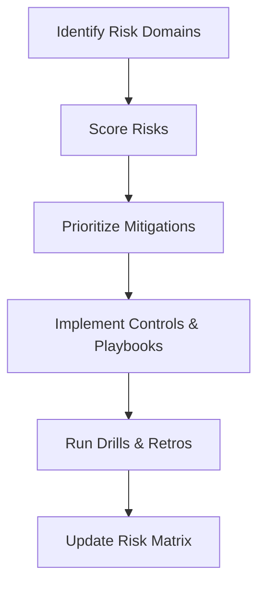

## TL;DR

- Small teams need a pragmatic risk matrix that surfaces the most critical automation hazards without over-engineering.
- Evaluate risk along impact, likelihood, detectability, and control maturity to prioritize mitigations.
- Use scenario planning to stress-test mitigations and ensure stakeholders know how to respond when incidents occur.
- Keep the matrix alive through quarterly reviews and incident retrospectives so risk posture reflects reality.

## Step 1: Identify Automation Risk Domains

Begin with a brainstorming session that includes operations, legal, security, and customer-facing roles. Identify domains such as data privacy, financial exposure, reputational harm, safety, and regulatory compliance. For each domain, list potential failure modes: erroneous decisions, biased outputs, model drift, prompt injection, or unplanned downtime. Encourage team members to share past incidents or near-misses from manual processes; these experiences often reveal hidden risks.

Group related risks and assign owners. Document assumptions about existing controls, such as manual approval steps, authentication, or content moderation. Capture dependencies on third-party vendors and note where shared responsibility models apply. Having a clear inventory sets the stage for scoring.

## Step 2: Score Risks Using a Lightweight Matrix

Adopt a 1–5 scale for four dimensions: impact, likelihood, detectability, and control maturity. Impact measures potential harm to customers, finances, or compliance. Likelihood estimates how often the risk might materialize based on history and system design. Detectability gauges how easily the team can spot the issue. Control maturity assesses whether preventive and detective controls exist and are effective.

Calculate a composite risk score by multiplying or averaging the dimensions. For small teams, a simple formula such as `(Impact × Likelihood) / Control Maturity` keeps analysis manageable. Visualize scores in a heat map to highlight high-priority risks. Flag any risk above a predetermined threshold (e.g., >8 on a 1–10 scale) for immediate mitigation planning.

## Step 3: Design Mitigation Plans and Playbooks

For each high-priority risk, define mitigation actions, responsible owners, and timelines. Mitigations may include implementing human-in-the-loop review, adding anomaly detection dashboards, or negotiating stronger SLAs with vendors. Document triggers that activate mitigations and the expected response time. Create playbooks with step-by-step instructions, escalation contacts, and communication templates.

Include monitoring hooks in your mitigations. If a risk involves data drift, schedule automated data quality checks. If it concerns biased outputs, set up fairness evaluations with representative sample reviews. Small teams benefit from automation-assisted monitoring because they lack large operations centers.

## Step 4: Run Scenario Drills and Update the Matrix

Hold quarterly scenario drills where the team rehearses responding to high-risk situations. Use tabletop exercises to walk through detection, response, communication, and recovery. Capture lessons learned and update the matrix accordingly—adjust scores, revise mitigations, or assign new owners. Share outcomes with leadership to maintain visibility into risk posture.

After actual incidents, run retrospectives focused on control effectiveness. Did the incident align with an existing risk entry? Were controls sufficient? What new risks emerged? Update the matrix within a week of the retrospective so it remains accurate. Encourage teams to log minor incidents as well; patterns of "small" issues often signal systemic problems.

## Comparison Table

| Risk Dimension | Definition | Scoring Tips | Example Evidence |
| --- | --- | --- | --- |
| Impact | Severity of harm if risk occurs | Map to revenue, compliance, or customer outcomes | Incident cost estimates, SLAs |
| Likelihood | Probability of occurrence | Use historical frequency and architecture review | Ticket trends, vendor uptime |
| Detectability | Ability to spot the issue quickly | Evaluate monitoring coverage and alert quality | Dashboard coverage, on-call logs |
| Control Maturity | Strength of preventive/detective controls | Rate policies, automations, and training coverage | Audit reports, training completion |

## Diagram-as-Text

## Checklist

- [ ] Gather cross-functional stakeholders and list automation risks by domain.
- [ ] Score each risk across impact, likelihood, detectability, and control maturity.
- [ ] Visualize scores and set thresholds for high-priority mitigation.
- [ ] Document mitigation actions, owners, and playbooks with monitoring hooks.
- [ ] Conduct scenario drills and capture lessons learned.
- [ ] Refresh the matrix after incidents and quarterly reviews.

> **Benchmarks**
> - Time to implement: 2 weeks to build the initial matrix and mitigation plans for five to seven risks [Estimate].
> - Expected outcome: 50% reduction in untracked automation risks and faster incident detection times.
> - Common failure modes: Stale matrices, unclear ownership, and mitigation tasks without follow-through.
> - Rollback steps: If the matrix becomes unwieldy, revert to the last trusted version, prioritize top three risks, and rebuild incrementally with stakeholder input.

## Internal Links

- Align risk scoring with the [Automation Backlog Prioritization Framework](./automation-backlog-prioritization-framework.mdx) to weigh risk in investment decisions.
- Use guardrail tactics from [Production Guardrails for AI](./production-guardrails-for-ai.mdx) when defining mitigations.
- Loop insights into the [Offer Testing Framework](../monetization-analytics/offer-testing-framework.mdx) if automations influence monetization experiments.

## Sources

- [ISO 31000 risk management guidelines](https://www.iso.org/standard/72737.html)
- [ENISA guidelines for securing connected systems](https://www.enisa.europa.eu/publications/guidelines-for-securing-the-internet-of-things)
