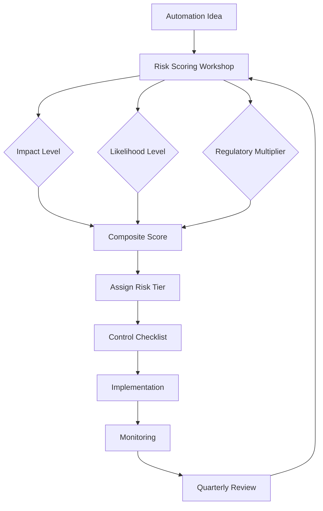

TL;DR
- Classify automation risks by business impact, failure likelihood, and regulatory exposure to assign the right review depth.
- Predefine mitigation playbooks—controls, testing, and human checkpoints—per risk tier so small teams act quickly.
- Track residual risk after mitigations and revisit quarterly to accommodate model drift, new data, and policy changes.

## Frame the Risk Dimensions
For lean automation teams, a simple 3x3 matrix can bring clarity. Define the vertical axis as business impact (customer harm, revenue loss, regulatory fines) and the horizontal axis as likelihood of occurrence (based on complexity, data volatility, or provider reliability). Add a third layer—regulatory exposure—as a multiplier that can bump items up a tier when compliance stakes are high. This keeps the framework manageable without ignoring nuanced contexts.

### Determine Scoring Inputs
Collect historical incident data, provider uptime stats, and process documentation to ground your scoring. Interview subject matter experts to assess areas like fraud risk or brand safety. Incorporate data from the automation data readiness audit to understand the probability of bad inputs. Document the rationale for each score, referencing metrics or expert quotes to aid audits later.

## Define Control Expectations by Tier
For low-risk automations, focus on lightweight peer reviews and logging. Medium-risk items should include staged rollouts, automated tests, and runbooks. High-risk initiatives require formal sign-off, human-in-the-loop verification, and contingency plans reviewed by legal or compliance. Keep these expectations in a living document and make them accessible via your automation backlog tooling.

### Embed Escalation Paths
Clarify who gets paged when incidents happen for each risk tier. Map severity thresholds to communication channels—Slack for low, pager for medium, on-call escalation plus executive alerts for high. Include contact information and backup owners so coverage exists during vacations. Link to your Vercel rollback runbook or equivalent platform procedures to accelerate response.

## Monitor and Reassess
Establish quarterly risk reviews where you reassess scores based on new telemetry: incident counts, model drift, policy updates, or vendor changes. Automations that demonstrate low incident rates may downgrade tiers, freeing oversight capacity. Conversely, negative trends should elevate risk tiers and trigger additional controls like rate limiting or manual approval gates.

### Document Residual Risk
After implementing mitigations, calculate residual risk. Use qualitative descriptors—low, medium, high—and capture why risk remains acceptable or what contingencies stay in place. This transparency builds trust with executives and auditors.

## Comparison Table
| Risk Tier | Typical Characteristics | Required Controls | Escalation | Example Use Case |
| --- | --- | --- | --- | --- |
| Low | Non-customer-facing, reversible errors | Peer review, logging | Slack channel | Internal reporting automation |
| Medium | Customer touchpoints, moderate data sensitivity | Staged rollout, automated testing | On-call rotation | Automated refund approvals |
| High | Regulatory or brand-critical, irreversible harm | Human-in-loop, legal sign-off, rollback rehearsal | Pager duty + exec alerts | Loan decision automation |

## Diagram

## Checklist
- [ ] Score automations against impact, likelihood, and regulatory exposure metrics.
- [ ] Define control expectations and escalation paths for each risk tier.
- [ ] Record rationales and data points supporting every risk score.
- [ ] Schedule quarterly reviews to adjust tiers based on telemetry.
- [ ] Document residual risk and ensure executive alignment on acceptance.

> **Benchmarks**
> - Time to implement: 3 days to convene stakeholders and publish the first matrix. [Estimate]
> - Expected outcome: 40% faster approvals while maintaining audit-ready documentation. [Estimate]

## Internal Links
- [Use the production guardrails guide to implement high-tier controls.](../ai-automation-foundations/production-guardrails-for-ai.mdx)
- [Reference the automation backlog scoring framework when triaging candidate ideas.](../ai-automation-foundations/automation-backlog-prioritization-framework.mdx)
- [Coordinate with the agent routing patterns to identify where human checkpoints are inserted.](../multi-agent-orchestration/agent-routing-patterns.mdx)
- [Cross-check monitoring signals with the CI guardrails for content repos.](../devops-for-creators/ci-for-content-repos.mdx)

## Sources
- [NIST AI Risk Management Framework](https://nvlpubs.nist.gov/nistpubs/ir/2023/NIST.IR.8367.pdf)
- [Deloitte AI governance blueprint](https://www2.deloitte.com/content/dam/Deloitte/us/Documents/risk/us-risk-ai-governance-framework.pdf)
