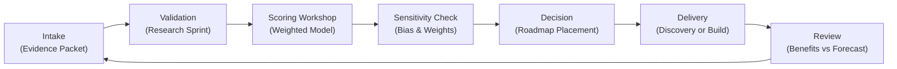

## TL;DR

- Adopt a risk philosophy that balances automation velocity with the duty to protect customers, employees, and regulators.
- Build the RAIL matrix—Risk impact, Automation likelihood, Issue detectability, and control Leverage—to quantify exposure consistently.
- Use evidence-based scoring, heatmaps, and playbooks to prioritize mitigations even when resources are constrained.
- Operationalize risk reviews as part of daily work with alerts, escalation paths, and continuous learning loops.

## Introduction

Small automation teams often ship quickly without the luxury of large governance departments. Yet stakeholders expect the same level of trust, compliance, and resilience as enterprise programs. A pragmatic risk matrix helps small teams identify and mitigate threats without drowning in bureaucracy. By codifying what risk means, how it is measured, and who responds, you can safeguard innovation while preserving agility.

This article presents a complete playbook for designing and operating an automation risk matrix. We will define a risk philosophy, construct the RAIL model, walk through a worked example, integrate risk into delivery, and sustain continuous improvement. Insights draw from IBM’s Data Breach Report, ISO 31000 risk principles, ENISA cybersecurity guidance, NIST’s AI Risk Management Framework, and Deloitte’s automation scaling research.

Small teams rarely have full-time risk analysts, so this playbook emphasizes templates, automation, and shared ownership that can be executed alongside delivery work without creating friction. You will learn how to set thresholds that leadership understands, how to automate evidence capture, and how to communicate risk posture in plain language.

## Define a Risk Philosophy that Fits Small Teams

Before building spreadsheets or dashboards, clarify how your team thinks about risk.

### Establish guiding principles

Draft principles that reflect your mission and constraints, such as "Protect customer trust above velocity," "Default to transparency," "Automate controls where possible," and "Escalate early when uncertainty is high." Align principles with corporate policies and regulatory obligations. These principles anchor decisions when trade-offs arise.

### Map stakeholders and responsibilities

List stakeholders: product owners, automation engineers, process SMEs, compliance, IT security, finance, and customer service. For each, capture roles in risk identification, assessment, mitigation, and communication. Small teams often rely on hybrid roles—assign clear responsibilities so nothing falls through the cracks.

### Determine risk appetite and thresholds

Collaborate with leadership to define acceptable risk levels. Use qualitative scales (Low, Moderate, High) linked to business outcomes: revenue at risk, customer exposure, regulatory penalties. Document what triggers escalation or requires executive approval. ISO 31000 emphasizes that appetite must be explicit to guide consistent decisions.

### Catalog top risk scenarios

Brainstorm scenarios across categories—data integrity failure, unauthorized access, process drift, vendor outage, unethical bias. For each scenario, note potential causes, business impact, existing controls, and detection signals. This catalog accelerates assessments because you begin with shared mental models rather than blank-slate debates. Revisit the catalog quarterly as new technologies or regulations emerge.

## Construct the RAIL Matrix

The RAIL matrix measures Risk impact, Automation likelihood, Issue detectability, and control Leverage to produce an actionable score.

### Define scoring rubrics

Create a 1–5 scale for each dimension:

- **Risk Impact**: from negligible inconvenience to severe financial, legal, or reputational harm. Incorporate IBM breach cost data to quantify potential losses.
- **Automation Likelihood**: probability that automation will trigger or amplify an issue, considering complexity, data volatility, and dependency on third parties.
- **Issue Detectability**: ease of identifying problems before they harm stakeholders. Low scores mean silent failures; high scores mean robust monitoring and alerts.
- **Control Leverage**: maturity and effectiveness of controls (preventive, detective, corrective). High leverage indicates tested backups, guardrails, and response playbooks.

Document examples for each score so assessments are consistent.

### Calculate composite scores

Use weighted scoring to reflect priorities. A common approach: Impact 35%, Likelihood 25%, Detectability 20%, Control Leverage 20%. Compute the composite risk score using `Score = (Impact*0.35) + (Likelihood*0.25) + ((6-Detectability)*0.20) + ((6-ControlLeverage)*0.20)`. Subtracting detectability and control leverage from 6 inverts the scale so stronger controls reduce risk. Categorize composite scores: 4.0+ Critical, 3.0–3.9 High, 2.0–2.9 Medium, <2.0 Low.

### Visualize with heatmaps and narratives

Plot impact vs likelihood on a heatmap, color-coding by composite score. Annotate each risk with narrative context—root cause, affected stakeholders, control status, and remediation owner. ENISA recommends pairing visuals with narratives to prevent oversimplification.

### Select tooling that matches capacity

Small teams do not need a full governance, risk, and compliance (GRC) suite on day one. Start with spreadsheets or lightweight tools like Airtable or Notion. Ensure tooling supports version control, audit logs, and easy sharing. As automation volume grows, integrate with ticketing systems to auto-create remediation tasks. Tooling choice should reduce administrative overhead while keeping data reliable.

## Worked Example: Automating Vendor Invoice Approvals

A small finance automation team wants to deploy a bot that approves low-risk vendor invoices. They build a RAIL matrix entry.

- **Risk Impact**: If the bot misclassifies invoices, it could approve fraudulent payments. Finance estimates potential loss at $150K before detection. Impact score: 4.
- **Automation Likelihood**: Workflow relies on supplier master data and spending thresholds. Data quality is solid, but thresholds can change monthly. Likelihood score: 3.
- **Issue Detectability**: Current monitoring checks run nightly and sample 5% of transactions. Fraud might go unnoticed for several days. Detectability score: 2 (hard to catch quickly).
- **Control Leverage**: Manual review fallback exists, but no automated anomaly detection. Control leverage score: 2.

Composite score: `(4*0.35)+(3*0.25)+((6-2)*0.20)+((6-2)*0.20)=1.4+0.75+0.8+0.8=3.75` (High risk).

Mitigation actions:

1. Implement real-time anomaly detection using spend deviation thresholds (raises detectability to 4).
2. Add control for secondary approval above $50K until model confidence exceeds 95% (increases leverage to 3).
3. Update supplier master data process to notify the bot of threshold changes daily (reduces likelihood to 2).

After mitigation, recompute: `(4*0.35)+(2*0.25)+((6-4)*0.20)+((6-3)*0.20)=1.4+0.5+0.4+0.6=2.9` (Medium risk). The team documents actions, owners, budgets, and due dates before launch.

## Integrate Risk Management into Daily Operations

A matrix only adds value if it influences daily work.

### Embed risk checkpoints into lifecycle

Require a RAIL assessment at key stages: idea intake, discovery, design, pre-production, and post-launch review. Tie go/no-go decisions to risk thresholds. For example, automations scoring High or Critical must show approved mitigation plans before build. Align this cadence with your [automation data readiness audit](./automation-data-readiness-audit) and governance stage gates.

### Automate monitoring and alerts

Implement telemetry that feeds detectability metrics: log aggregation, anomaly detection, data drift monitoring, and user feedback channels. Configure alerts to notify owners when thresholds exceed tolerances. Use runbooks to guide response steps, ensuring small teams can react quickly without 24/7 staffing.

### Maintain risk registers and playbooks

Track each risk in a lightweight register with fields for description, RAIL scores, mitigation actions, owners, costs, and review dates. Create playbooks for top scenarios—data corruption, credential compromise, model drift, third-party outage. Include rollback procedures referencing the [automation pilot to scale playbook](./automation-pilot-to-scale-playbook) for staged responses.

### Prioritize mitigation with constrained resources

Rank mitigation tasks by risk reduction value per effort. For example, a two-day task enabling real-time alerts may reduce risk score by 1.0—prioritize it over a multi-week rewrite that yields marginal improvements. Communicate trade-offs transparently to sponsors so everyone understands why some risks remain temporary.

### Collaborate across teams

Share risk insights with security, finance, and operations partners. Host monthly risk huddles to review new automations, outstanding mitigations, and incidents. Encourage feedback loops: if customer support sees anomalies, they know how to escalate into the risk process. Deloitte’s research shows cross-functional collaboration reduces automation incidents by 30% compared with siloed teams.

## Sustain Continuous Improvement

Risk management evolves as automation footprint grows.

### Review and recalibrate quarterly

Schedule quarterly retrospectives to review risk outcomes, near misses, and incident reports. Adjust scoring rubrics, weightings, or thresholds based on trends. For example, if detectability scores are consistently low, invest in monitoring tools or process automation. Document changes and communicate to stakeholders.

### Benchmark against standards and industry data

Compare your matrix with NIST AI Risk Management Framework controls and ISO 31000 guidelines. Participate in industry surveys or peer forums to benchmark incident rates and response times. IBM’s breach data can help quantify ROI of security investments to leadership.

### Build culture and competency

Train team members on risk assessment skills—scenario planning, root cause analysis, control design. Offer micro-learning modules, tabletop exercises, and certifications. Celebrate proactive risk identification to reinforce culture. Link participation to performance reviews or advancement opportunities.

### Communicate to executives and regulators

Produce quarterly risk briefs summarizing heatmaps, trends, mitigations, and outstanding issues. Highlight how investments—such as observability upgrades—reduced risk scores. When regulators inquire, provide documentation showing RAIL assessments, mitigation logs, and incident response timelines. Transparent communication builds trust and accelerates approvals for new automations.

### Expand automation responsibly

As you consider new use cases, reference the RAIL matrix during backlog prioritization. High-risk ideas may require additional guardrails or phased pilots. Connect with the [production guardrails for AI framework](./production-guardrails-for-ai) to ensure post-launch controls stay aligned.

## Comparison Table

| Method / Option | Best For | Strengths | Watch-Outs |
|---|---|---|---|
| RAIL Matrix | Small teams balancing agility and control | Holistic view covering impact, likelihood, detection, controls | Requires disciplined scoring and periodic calibration |
| Simple Impact-Likelihood Grid | Teams just starting risk tracking | Easy to explain and implement quickly | Ignores detectability and control maturity, can hide critical gaps |
| Full Enterprise GRC Suite | Large regulated enterprises | Integrated with audits, workflows, and compliance reporting | Overhead can overwhelm small teams, slower to adapt |

## Diagram (Mermaid)

## Checklist / SOP

1. Define risk principles, stakeholder responsibilities, appetite thresholds, and the risk scenario catalog.
2. Build the RAIL matrix with scoring rubrics, weighting logic, tooling, and visualization templates.
3. Run RAIL assessments at lifecycle gates and record outcomes in the risk register.
4. Automate monitoring, alerting, and runbooks to strengthen detectability and response speed.
5. Prioritize mitigations by risk reduction value, then track progress through cross-functional huddles.
6. Conduct quarterly recalibrations, benchmark externally, communicate to executives, and integrate insights into backlog planning.

## Benchmarks

> Time to implement: 3–5 weeks to stand up the initial RAIL matrix and supporting workflows. [Estimate]
> Expected outcome: 30–45% reduction in unplanned automation incidents within six months. [Estimate]
> Common pitfalls: Inconsistent scoring, neglected monitoring automation, and lack of stakeholder alignment. [Estimate]
> Rollback plan: Suspend high-risk automations, execute manual fallbacks, and convene an emergency risk review to reassess controls. [Estimate]

## Internal Links

- Evaluate data dependencies using the [automation data readiness audit](./automation-data-readiness-audit) before finalizing risk scores.
- Plan remediation workflows with the [automation pilot to scale playbook](./automation-pilot-to-scale-playbook) for staged rollouts.
- Harden secrets management with the [content repo secrets rotation guide](../devops-for-creators/content-repo-secrets-rotation).

## Sources

- IBM, "Cost of a Data Breach Report," benchmarking the financial impact of security failures.
- ISO 31000:2018, risk management guidelines informing appetite and governance.
- ENISA, "Artificial Intelligence Cybersecurity Challenges," insights on automation-specific threats.
- NIST, "AI Risk Management Framework," best practices for identifying and mitigating AI-related risks.
- Deloitte, "Intelligent Automation," research on risk governance for lean teams.

