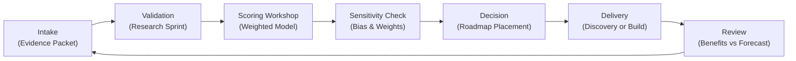

## TL;DR

- Use a standardized automation ROI model with defined inputs for value, cost, risk, and timing so teams can produce finance-ready numbers in under 20 minutes.
- Apply the VALUE framework—Volume, Accuracy, Labor, Utilization, and Expansion—to capture tangible and intangible benefits.
- Build scenario planning, sensitivity analysis, and guardrails directly into the spreadsheet to maintain credibility with finance and risk partners.
- Integrate ROI tracking into governance rhythms, retrospectives, and portfolio reviews to ensure realized value matches forecasts.

## Introduction

Automation sponsors often pitch ideas with bold savings claims, only to watch finance teams poke holes in assumptions or delay approvals due to incomplete data. A reusable ROI calculator solves this gap by standardizing how opportunities are evaluated, forcing teams to collect the right evidence, and providing stakeholders with a transparent view of value versus cost. When the model is simple, configurable, and auditable, small teams can update forecasts in minutes and keep leadership aligned. The tool stays intentionally lightweight so teams can adapt it without specialized software.

This article walks you through building a practical automation ROI model from the ground up. You will design the VALUE framework for benefit capture, assemble the core calculator, run a worked example, embed governance, and extend the tool with sensitivity analysis. The approach draws on Deloitte’s financial impact research, McKinsey’s digital reinvention studies, COSO’s risk alignment guidance, Gartner’s ROI measurement practices, and PMI’s benefits realization framework.

## Define the VALUE Framework for Benefits

Start with a consistent way to capture benefits so the calculator is grounded in comparable metrics.

### Volume reduction

Quantify hours or transactions removed from manual work. Gather baseline volumes (e.g., invoices processed per month) and the time per transaction. Document the percentage automation can realistically handle. Convert to labor hours or throughput capacity gains. McKinsey reports that high-performing automation programs document baseline volumes before modeling ROI, leading to 20% more accurate forecasts.

### Accuracy improvement

Estimate error reduction. Capture current error rates, rework time, and downstream impacts such as chargebacks or compliance penalties. Calculate savings from reduced rework and improved quality. Include avoided costs from regulatory fines or customer churn where evidence exists.

### Labor repurposing

Determine how automation frees people for higher-value work. Instead of assuming headcount reduction, assign monetary value to redeployed capacity—e.g., analysts spending more time on revenue-generating activities. Document assumptions about productivity uplift and confirm with business owners.

### Utilization of assets

Consider how automation increases utilization of existing assets like platforms, licenses, or equipment. For example, bots that run after hours might boost system throughput, delaying capital expenditures. Include avoided cost or extended asset life.

### Expansion opportunities

Capture revenue or customer experience improvements. Examples: faster onboarding leading to more customers, cross-selling enabled by timely data, or new services launched because staff capacity expanded. Quantify using metrics such as incremental revenue, NPS improvement, or retention rate changes. Gartner emphasizes including both efficiency and growth benefits to secure executive buy-in.

## Build the Core ROI Calculator

Translate VALUE inputs into a repeatable calculator built around five tabs: Inputs, Benefits, Costs, Scenarios, and Outputs.

### Inputs tab

Collect metadata: project name, sponsor, process description, baseline metrics, strategic alignment, risk rating, and dependencies. Include drop-downs for benefit categories, automation type, and stage of lifecycle. Add fields for data sources, validation dates, and owners to improve auditability.

### Benefits tab

For each VALUE component, create rows capturing baseline metrics, post-automation projections, percentage change, and financial value. Use formulas such as `AnnualLaborSavings = (BaselineVolume * TimePerTransaction * WageRate) * AutomationCoverage`. Add space for intangible benefits (e.g., compliance risk reduction) with qualitative justification and estimated ranges.

### Costs tab

Break down costs into initial and ongoing categories: discovery, build, licenses, infrastructure, support, training, change management, and risk mitigation. Require users to indicate whether costs are capital (CAPEX) or operating (OPEX). Integrate guardrail costs from the [production guardrails for AI](./production-guardrails-for-ai) framework to reflect compliance investments.

### Scenarios tab

Set up Low, Expected, and High scenarios. Allow adjustments to key drivers (automation coverage, volume growth, wage inflation, error rate reduction). Use data tables to calculate Net Present Value (NPV), Payback Period, and Return on Investment for each scenario. Include sliders or input cells to make scenario testing fast during workshops.

### Outputs tab

Summarize results with charts and tables: ROI percentage, annualized net benefit, payback in months, cumulative cash flow, and sensitivity to major assumptions. Add a narrative section where teams document key assumptions, risks, and mitigation plans. Provide a ready-to-share PDF or dashboard view for executives.

### Data validation checklist

Create a short checklist embedded in the spreadsheet to confirm data freshness and credibility before sharing results. Include confirmations that baseline volumes were validated within the last quarter, wage rates align with finance-approved tables, and customer metrics come from authoritative analytics dashboards. Add reminders to document sample sizes for time studies and to capture stakeholder signoffs. This checklist prevents rushed estimates from slipping into executive conversations and reinforces audit discipline.

## Worked Example: Automating Customer Refund Handling

A digital retail company considers automating customer refund approvals. The team uses the calculator.

1. **Baseline metrics**: 18,000 refunds per quarter, average handling time 12 minutes, analyst wage $32/hour, error rate 3.5%, rework cost $15 per error.
2. **Automation coverage**: 70% of refunds eligible; time per transaction drops to 3 minutes for automated cases.
3. **Volume reduction**: `(18,000 * 0.7 * (12-3)/60) * $32 = $60,480` quarterly labor savings.
4. **Accuracy improvement**: Errors drop to 1.2%. Savings: `(18,000 * (0.035-0.012) * $15) = $6,210` per quarter.
5. **Labor repurposing**: 1.5 FTE analysts redirected to proactive retention efforts valued at $25,000 per quarter.
6. **Expansion**: Faster refunds projected to improve customer retention by 1%, equating to $40,000 quarterly incremental revenue.

Total quarterly benefit: `$60,480 + $6,210 + $25,000 + $40,000 = $131,690`.

Costs: Implementation $85,000 (one-time), licenses $18,000 per year, support $12,000 per year, training $8,000 initial, change management $5,000.

Scenarios:

- **Expected**: ROI 168% over three years, payback in 7 months.
- **Low** (automation coverage 55%, retention uplift 0.5%): ROI 92%, payback 11 months.
- **High** (coverage 80%, retention uplift 1.4%): ROI 214%, payback 5 months.

Sensitivity analysis shows ROI is most sensitive to retention uplift and automation coverage. The team documents mitigation: pilot in a high-volume region to validate coverage and run A/B tests to confirm retention impact.

## Operationalize the Calculator with Governance

A model only matters if embedded in operating rhythms.

### Establish ownership and cadence

Assign an ROI Owner (often the business analyst or product manager) responsible for maintaining inputs, validating data, and sharing updates. Schedule monthly reviews with finance to compare forecasts versus actuals. Tie updates to governance meetings such as backlog prioritization or quarterly business reviews.

### Integrate with prioritization and risk processes

Require every idea in the [automation backlog prioritization framework](./automation-backlog-prioritization-framework) to submit the calculator. Use the composite ROI to rank opportunities, adjusting for risk scores from the [automation risk matrix](./automation-risk-matrix-small-teams). This ensures high-risk ideas with weak ROI are deprioritized.

### Track actual benefits

After deployment, replace estimated values with actuals. Collect data from operational dashboards, finance systems, and customer metrics. Compare variance against the original scenario. Use PMI’s Benefits Realization guidance to manage corrective actions if benefits lag.

### Embed guardrails and audit readiness

Link the calculator to evidence repositories: time studies, data readiness assessments, risk signoffs, and post-implementation reviews. COSO recommends integrating risk data with performance metrics; include a section documenting key risks, control owners, and mitigation costs. Store versions with timestamps to create an audit trail.

## Extend the Model with Sensitivity and Portfolio Views

Once the core calculator works, enhance it to drive strategic decisions.

### Sensitivity analysis dashboard

Use tornado charts to show how ROI changes with each assumption. Highlight break-even points for coverage, wage rates, or error reduction. Share the dashboard during executive reviews so stakeholders understand which levers matter most.

### Portfolio aggregation

Combine outputs from multiple calculators into a portfolio view. Track total investment, cumulative benefits, weighted ROI, and risk-adjusted returns. This helps leadership decide funding levels and resource allocation. Deloitte notes that organizations with portfolio-level ROI visibility achieve 30% higher benefit realization.

### Scenario planning for macro shifts

Incorporate macro levers such as wage inflation, demand fluctuations, or regulatory costs. Create scenario templates (e.g., Recession, Hypergrowth, Regulatory Tightening) that adjust multiple projects simultaneously. Use these to stress-test the automation roadmap.

### Communication toolkit

Develop executive-ready visuals: one-page summaries, infographics, and talking points. Present ROI alongside qualitative benefits like employee experience improvements. Harvard Business Review suggests pairing numbers with stories to maintain trust and support.

## Comparison Table

| Method / Option | Best For | Strengths | Watch-Outs |
|---|---|---|---|
| VALUE ROI Calculator | Teams needing fast, repeatable ROI analysis | Transparent, configurable, finance-aligned | Requires disciplined data collection and periodic refresh |
| Back-of-the-Envelope Estimate | Early ideation without data access | Quick directional signal | High risk of bias, not audit-ready, weak stakeholder trust |
| Enterprise Financial Model | Large programs with finance support | Deep integration with ERP, risk, and scenario engines | Slow to update, requires specialist skills |

## Diagram (Mermaid)

## Checklist / SOP

1. Customize the VALUE framework to match your organization’s benefit categories and data sources.
2. Build the five-tab calculator with formulas, validation rules, and scenario controls.
3. Collect baseline metrics, run the calculator for each automation idea, and document assumptions.
4. Present results to finance and leadership, incorporating sensitivity analysis and guardrails.
5. After launch, replace estimates with actuals, track variance, and update the portfolio dashboard.
6. Refresh the calculator quarterly to reflect wage changes, new risk factors, and emerging benefit categories.

## Benchmarks

> Time to implement: 2–3 weeks to build the calculator, validate data sources, and pilot with two use cases. [Estimate]
> Expected outcome: 25–40% improvement in accuracy of automation business cases within six months. [Estimate]
> Common pitfalls: Incomplete baseline data, ignoring ongoing support costs, and failing to update assumptions post-launch. [Estimate]
> Rollback plan: Revert to prior ROI model while conducting a variance analysis and stakeholder workshop to rebuild trust. [Estimate]

## Internal Links

- Feed ROI insights directly into the [automation backlog prioritization framework](./automation-backlog-prioritization-framework) to rank opportunities objectively.
- Validate foundational data using the [automation data readiness audit](./automation-data-readiness-audit) before publishing ROI numbers.
- Connect customer retention forecasts with the [cohort revenue forecasting model](../monetization-analytics/cohort-revenue-forecasting).

## Sources

- Deloitte, "Intelligent Automation Financial Impact," benchmarking automation value drivers and cost structures.
- McKinsey & Company, "The Case for Digital Reinvention," evidence on ROI uplift from disciplined automation programs.
- COSO, "Enterprise Risk Management: Integrating with Strategy and Performance," guidance on aligning value and risk.
- Gartner, "Measure the ROI of Automation," best practices for quantifying benefits and payback.
- Project Management Institute, "Benefits Realization Management Framework," methods for tracking post-launch outcomes.

