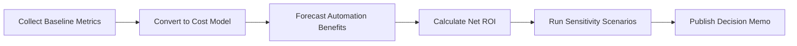

## TL;DR

- Treat automation ROI as a structured conversation with finance: define scope, capture baselines, and document every assumption.
- Combine labor savings, error reduction, and incremental revenue to calculate gross benefit before applying ongoing run costs.
- Run sensitivity analysis on volume, accuracy uplift, and adoption rates to show best, base, and worst cases.
- Maintain an evidence folder—baselines, approval notes, calculations—so you can update the model quarterly and defend it to executives.

## Step 1: Frame the Problem and Gather Inputs

Start with a 30-minute workshop that includes the workflow owner, finance partner, and automation lead. Establish the measurement window (typically 12 months), define the KPI to improve, and list the systems that record time, volume, and quality metrics. Capture current process maps, staffing levels, and cost centers. Request the average fully loaded hourly rate (including benefits and overhead) from finance; rely on official numbers to avoid disputes later.

Collect baseline data next. Pull ticket counts, transaction volume, or content throughput from analytics tools. If historical accuracy or defect rates are missing, run a two-week manual sampling sprint. Document sample sizes, calculation methods, and outliers. These notes become part of your ROI audit trail. When data is unavailable, flag it as `[Estimate]` and note the owner tasked with improving measurement before the next review.

## Step 2: Convert Inputs into Baseline Costs and Time

Translate volume and handle time into labor hours. Multiply by the fully loaded rate to calculate current cost. Break the cost into categories such as frontline labor, quality assurance, and supervisor oversight. Include intangible costs where possible—customer refunds, compliance penalties, or churn driven by slow response. Even if you cannot assign exact dollars, convert them into proxy metrics (e.g., "5% of churn events cite slow support"), which helps frame strategic value.

For processes involving multiple roles, create swim lanes showing each participant's touch time. Capturing this detail lets you identify which portions can be eliminated, accelerated, or augmented by AI. Record tool licensing fees, infrastructure expenses, and any vendor retainers associated with the current process to ensure you measure net benefit instead of gross labor savings only.

## Step 3: Model Automation Benefits and Costs

Outline the automation concept: what will be replaced, accelerated, or improved. Estimate time savings per transaction, accuracy uplift, and new throughput capacity. For each benefit line, document the assumption source—historical experiments, vendor benchmarks, or SME interviews. Multiply per-transaction savings by projected volume to calculate annual benefit. Add incremental revenue or pipeline acceleration if the automation unlocks new capacity to serve more customers.

Then quantify costs. Include upfront implementation (engineering hours, vendor setup fees), ongoing run costs (model inference, platform licensing), and maintenance (model retraining, QA). Allocate contingency funds for compliance reviews or additional monitoring. Present gross benefit, total cost, and net benefit both in dollars and percentage ROI so stakeholders can compare opportunities in the backlog.

## Step 4: Build a Sensitivity Table

Sensitivity analysis prevents executive surprises. Identify the three assumptions with the most impact—usually transaction volume, adoption rate, and accuracy gain. Create low, base, and high scenarios for each. Multiply combinations to produce a grid that shows net ROI under different realities. Highlight scenarios that dip below break-even and note what triggers them (e.g., adoption under 60%). Use the analysis to negotiate phased rollouts or extra training investment to keep adoption high.

Share the table during review meetings. Finance partners appreciate the transparency and are more likely to approve budget when they can see the downside risk quantified. It also prepares you for board-level questions about "what if usage stays low" or "what if accuracy plateaus." Keep the model nimble by using spreadsheet references rather than hard-coded numbers so future updates are easy.

## Step 5: Document a Worked Example

To socialize the model, walk through a worked example. Choose a process where stakeholders understand the pain. Present baseline metrics, show each assumption, and step through the calculation cells. Highlight how you validated each number—time studies, CRM exports, or compliance audit logs. This transparency encourages other teams to adopt the model instead of spinning up conflicting spreadsheets.

End the example with an action plan: tasks required to capture missing data, upcoming pilot milestones, and decision gates tied to ROI thresholds. Encourage teams to revisit the model quarterly. Automation performance drifts, and capturing real results ensures reinvestment decisions rely on facts rather than outdated assumptions.

## Comparison Table

| Component | Description | Data Source | Owner |
| --- | --- | --- | --- |
| Baseline Labor Hours | Current handle time × volume for each role | Time tracking, CRM exports | Operations Lead |
| Quality/Error Costs | Rework hours, refunds, compliance penalties | QA logs, finance reports | Quality Manager |
| Automation Benefits | Time saved, error reduction, incremental revenue | Pilot metrics, SME estimates | Automation PM |
| Implementation Costs | Build, integration, change management | Project plan, vendor quotes | Engineering Manager |
| Run Costs | Licensing, inference, monitoring | Vendor invoices, cloud billing | Finance Partner |

## Diagram-as-Text

## Checklist

- [ ] Schedule a kickoff with operations, finance, and automation leads to define scope and KPI.
- [ ] Gather baseline volume, handle time, quality metrics, and fully loaded labor rates.
- [ ] Document automation assumptions with sources or `[Estimate]` tags.
- [ ] Calculate implementation, run, and maintenance costs alongside benefits.
- [ ] Build sensitivity scenarios for volume, adoption, and accuracy changes.
- [ ] Store the model, notes, and approvals in a shared evidence folder.

> **Benchmarks**
> - Time to implement: 20–30 minutes to draft the initial model; 2–3 hours to validate with finance.
> - Expected outcome: Visibility into break-even month and net benefit percentage before development starts.
> - Common failure modes: Unsourced assumptions, ignoring maintenance costs, and overestimating adoption.
> - Rollback steps: If ROI falls below threshold, pause expansion, revert to manual SOP for affected segments, and update assumptions with real performance data before relaunch.

## Internal Links

- Pair this model with the [Practical Blueprint for AI Automation](./practical-blueprint-first-win.mdx) to guide discovery and launch sequencing.
- Reference the risk controls in [Guardrails for AI in Production](./production-guardrails-for-ai.mdx) when budgeting monitoring costs.
- Tie monetization forecasts to the [Offer Testing Framework for affiliates](../monetization-analytics/offer-testing-framework.mdx) when automation impacts conversion funnels.

## Sources

- [Deloitte research on intelligent automation business cases](https://www2.deloitte.com/us/en/pages/operations/articles/intelligent-automation-financial-impact.html)
- [COSO guidance on integrating risk with performance](https://www.coso.org/documents/enterprise-risk-management-integrating-with-strategy-and-performance.pdf)
