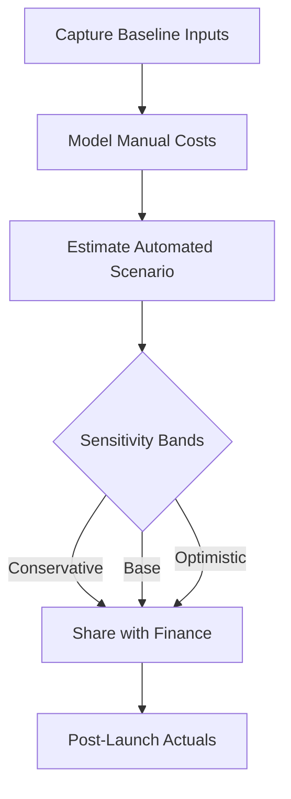

TL;DR
- Anchor automation business cases in a single measurable KPI and tangible baseline hours.
- Pair conservative and ambitious time-savings assumptions so finance sees the sensitivity window.
- Revisit the model post-launch with observed run rates to maintain trust in the automation program.

## Identify the Right Inputs
Start with the process narrative before numbers. List the trigger, actors, systems touched, and volume. Capture present-state cycle time by interviewing operators and corroborating with tooling logs. Select **one KPI**—for example, average fulfillment time or manual analyst hours per request—so stakeholders focus on the outcome that matters most. Inventory fixed implementation costs (vendor fees, integration hours) separately from variable run costs (API calls, human review minutes) because they behave differently in the ROI equation.

### Gather Baseline Evidence
Document baseline metrics in a small table or screenshot of the instrument you used. Pull at least four weeks of data to smooth anomalies. If logs are missing, create a temporary sampling spreadsheet and ask operators to annotate a dozen instances. Include quality costs such as rework or compliance delays because the automation may lower them even if throughput is unchanged. The baseline sheet becomes the living truth you will update once automation ships.

## Translate Inputs into the ROI Model
Structure the ROI sheet with three sections: baseline workload, automation scenario, and financial summary. For workload, record transactions per period, manual minutes per transaction, and error rate. In the automation scenario, estimate new minutes per transaction (including oversight), expected error rate, and tooling expenses. Convert minutes to cost by multiplying by fully loaded hourly rates. Finally, calculate net gain as `(manual cost - automated cost) - implementation investment`. Make sure you schedule depreciation for capitalized tooling over 12–24 months so the monthly ROI stays realistic.

### Work a Sample Scenario
Assume a support team handles 800 tickets monthly at 12 minutes each, costing $4,800 (based on $30/hour fully loaded). You prototype an LLM-assisted triage that cuts handling to 4 minutes while adding $600/month in API usage plus 120 minutes of reviewer oversight. Automated cost becomes $2,400 in labor + $600 in usage = $3,000, yielding $1,800 monthly savings. If implementation required $6,000 upfront, the simple payback occurs in just over three months. Share both the formula cells and the reasoning narrative so reviewers can audit them quickly.

## Run Sensitivity Analyses
Finance teams will challenge your assumptions. Prepare low, medium, and high scenarios by flexing ticket volume, time saved per ticket, and oversight load. Use data from your discovery interviews to justify each band. Invite the frontline manager to review the assumptions so that leadership sees the analysis as collaborative rather than imposed.

## Comparison Table
| Scenario | Ticket Volume/Month | Minutes per Ticket | Monthly Labor Cost | Oversight Minutes | Net Monthly Savings |
| --- | --- | --- | --- | --- | --- |
| Conservative | 700 | 6 | $2,100 | 200 | $900 |
| Base Case | 800 | 4 | $1,600 | 120 | $1,800 |
| Optimistic | 900 | 3 | $1,350 | 90 | $2,550 |

## Diagram

## Checklist
- [ ] Interview operators and export four weeks of volume/time data.
- [ ] Document a single primary KPI and supporting quality metrics.
- [ ] Build baseline, automation, and summary tabs with transparent formulas.
- [ ] Run conservative/base/optimistic scenarios before stakeholder review.
- [ ] Schedule a post-launch review to replace estimates with observed data.

> **Benchmarks**
> - Time to implement: 20–30 minutes to assemble the first version of the model. [Estimate]
> - Expected outcome: Identify automations with ≥25% labor savings and three-month payback windows. [Estimate]

## Internal Links
- [See the broader automation rollout blueprint for stakeholder alignment.](../ai-automation-foundations/practical-blueprint-first-win.mdx)
- [Pair ROI with monetization data from your affiliate analytics to tell a complete story.](../monetization-analytics/affiliate-offers-that-fit.mdx)

## Sources
- [Practical ROI estimation techniques for automation teams](https://numpyninja.com/blog/how-to-estimate-roi-for-automation-projects)
- [NIST NICE Workforce Framework for Cybersecurity roles and cost modeling](https://www.nist.gov/system/files/documents/2017/05/09/NIST_SP800-181.pdf)
