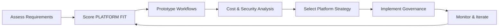

===ARTICLE===
# n8n vs. Zapier: Comparative Automation Platforms

_A comprehensive comparison of n8n and Zapier capabilities, extensibility, pricing, and security to inform platform selection._

## TL;DR
- Use the PLATFORM FIT matrix (Control, Extensibility, Governance, Ecosystem) to evaluate alignment with your organization.
- n8n offers self-hosting, open-source extensibility, and advanced scripting; Zapier emphasizes ease of use and managed operations.
- Pricing models differ: n8n favors infrastructure plus optional licenses, while Zapier charges per task and feature tier.
- Security and compliance controls depend on deployment choices—self-hosted n8n versus Zapier’s managed environment.
- Blend platforms when appropriate: Zapier for quick SaaS connectors, n8n for complex orchestration, governance, or on-premises needs.

## Introduction
Automation teams often evaluate n8n and Zapier because both provide low-code workflow builders with extensive integrations. The platforms target different user personas and operational requirements. n8n is open-source, self-hostable, and oriented toward technical teams seeking customization and control. Zapier delivers a cloud-hosted experience optimized for business users who need to connect SaaS applications quickly without managing infrastructure.
Selecting the right platform requires understanding capabilities, extensibility, pricing, quotas, and security obligations. This guide provides a structured comparison using the PLATFORM FIT framework, detailed feature breakdowns, pricing analysis, and governance considerations. It also includes a worked example showing when cost economics tilt toward one platform. Use the insights to select a primary platform or design a hybrid strategy.

## Definition (≤60 words)
n8n and Zapier are workflow automation platforms: n8n is open-source and self-hostable with extensible nodes and scripting, while Zapier is a managed SaaS offering with curated integrations and task-based pricing, both enabling cross-application process automation.

## Quick Start (5–8 Steps)
1. Inventory processes, compliance requirements, and integration targets requiring automation.
2. Score each requirement against the PLATFORM FIT matrix criteria.
3. Prototype a workflow in both platforms to validate connectors, performance, and governance.
4. Analyze pricing using realistic task volumes and infrastructure costs.
5. Evaluate security posture, data residency, and audit requirements.
6. Decide on single-platform or hybrid strategy, documenting roles and responsibilities.
7. Plan migration or coexistence, including governance policies and change management.
8. Monitor execution metrics and adjust platform allocation as needs evolve.

## Core Sections
### PLATFORM FIT Matrix
The PLATFORM FIT matrix evaluates four dimensions:
- **Control**: Deployment flexibility, infrastructure ownership, DevOps integration, and data residency. n8n excels here with self-hosting, Docker/Kubernetes support, and environment customization. Zapier provides minimal infrastructure control, focusing on managed reliability.
- **Extensibility**: Ability to create custom nodes, scripts, and integrations. n8n offers JavaScript Function nodes, community packages, and full source code access. Zapier allows custom code steps and private apps but within the SaaS constraints.
- **Governance**: Security, compliance, access control, and auditability. n8n governance depends on your deployment and tooling; you can integrate with corporate identity providers and logging stacks. Zapier provides built-in user management, folder permissions, and SOC 2 compliance but with less customization.
- **Ecosystem**: Connector coverage, templates, and community. Zapier has 6,000+ apps with prebuilt “Zaps,” ideal for non-technical users. n8n provides 400+ nodes with open-source contributions and the ability to build connectors when needed.
Score each dimension on a 1–5 scale per requirement. High control and extensibility needs often favor n8n; rapid, non-technical adoption leans toward Zapier.

### Architecture and Deployment Considerations
n8n supports self-hosted deployments via Docker, Kubernetes, or managed n8n Cloud. Self-hosting grants control over data flow, infrastructure, and upgrade cadence. You manage backups, scaling, and security patches. Zapier is entirely cloud-hosted; updates, scaling, and infrastructure are managed by Zapier. Evaluate network connectivity: n8n can reside within private networks, enabling direct database or on-premises system access. Zapier primarily connects to public SaaS APIs; private integrations require VPNs or middleware. Consider latency: on-premises n8n can operate near data sources, while Zapier adds network hops. Plan for high availability by clustering n8n or relying on Zapier’s managed redundancy.

### Extensibility and Developer Experience
Developers appreciate n8n’s open-source model. You can build custom nodes, extend the codebase, and use Function nodes to execute JavaScript. The community publishes packages that you can fork or contribute to. With self-hosting, you integrate with CI/CD pipelines, version control, and infrastructure-as-code. Zapier offers Developer Platform tools to create private or public apps using scripting and webhook hooks. However, Zapier enforces sandbox limits, log retention policies, and code step restrictions. For teams needing deep customization, n8n’s flexibility is unmatched. For quick connectors without managing code repositories, Zapier excels.

### Pricing Models and Cost Analysis
n8n’s core is free under the Sustainable Use License. Costs include infrastructure (VMs, containers, databases), support subscriptions, and optional n8n Cloud plans. Zapier pricing is tiered by tasks per month, feature access (multi-step Zaps, paths, auto-replay), and user seats. Estimate total cost by modeling task volume, concurrency, and premium connector usage. Use discounts or enterprise agreements for large teams. Consider hidden costs: n8n requires DevOps staffing; Zapier may incur higher task charges as volume scales. Combine both if budgets allow—Zapier for low-volume, high-speed prototypes; n8n for high-volume automations without per-task fees.

### Worked Example: Cost Break-even Calculation
Inputs:
- Zapier Professional plan: $73.50/month billed annually (2,000 tasks).
- Additional Zapier tasks: $19.99 per extra 1,000 tasks.
- Expected monthly tasks: 35,000.
- n8n self-hosted infrastructure: $220/month (cloud instances, database, monitoring).
- n8n administration time: 12 hours/month at $60/hour.
Formula:
1. Zapier base cost + extra tasks cost = total Zapier spend.
2. Extra tasks = (expected tasks − included tasks) ÷ 1,000.
3. n8n cost = infrastructure + administration labor.
4. Compare totals to determine break-even point.
Computation:
1. Extra tasks = (35,000 − 2,000) ÷ 1,000 = 33.
2. Extra task cost = 33 × $19.99 = $659.67.
3. Total Zapier spend = $73.50 + $659.67 = $733.17/month.
4. n8n cost = $220 + (12 × $60) = $940/month.
Interpretation: At 35,000 tasks, Zapier is cheaper despite per-task fees. If administration time drops or infrastructure costs decline, n8n becomes competitive. Conversely, at higher task volumes (e.g., 100,000 per month), n8n’s fixed costs may deliver better ROI.

### Quotas, Limits, and Performance
Zapier enforces task quotas per plan, execution frequency limits (e.g., 1-minute minimum for Professional), and restrictions on polling intervals. Premium features unlock multi-step Zaps and paths. n8n limits are self-imposed based on infrastructure sizing; you control concurrency, memory, and execution retention. Evaluate vendor API rate limits; Zapier manages retries automatically, while n8n requires configuration. Assess latency: Zapier queues tasks within its cloud; n8n performance depends on your infrastructure and scaling strategies. Document service-level expectations and design workflows accordingly.

### Security, Compliance, and Governance
Security posture depends on deployment choices. n8n self-hosting allows you to enforce network segmentation, custom logging, SIEM integration, and secret management using Vault or cloud KMS. You are responsible for patching and compliance certifications. n8n Cloud offers SOC 2 Type II, ISO 27001, and GDPR compliance. Zapier provides SOC 2 Type II, GDPR, CCPA readiness, and enterprise features like SSO (SAML), user provisioning, and audit logs. Evaluate data residency: n8n can be deployed in-region, while Zapier stores data in its managed infrastructure. Align platform choice with regulatory requirements and vendor due diligence outcomes.

### Ecosystem and Connector Coverage
Zapier boasts thousands of connectors, curated templates, and community Zaps that expedite adoption. Non-technical users can create automations quickly using the visual editor. n8n offers hundreds of nodes and the ability to build new ones. For niche or proprietary systems, n8n’s custom nodes or HTTP Request nodes provide flexibility. Evaluate connector maintenance: Zapier handles API updates, while n8n requires you to upgrade versions or adjust custom nodes. Consider community support: Zapier has extensive documentation and customer success resources; n8n’s open-source community shares tutorials, code examples, and forum support.

### Operations, Monitoring, and Support
Operating n8n involves monitoring executions, scaling infrastructure, and managing backups. You can integrate with Prometheus, Grafana, and logging tools. Support options include community forums or paid support contracts. Zapier handles operations, offering status dashboards, built-in logs, and alerting via email or Zapier Interfaces. Enterprise plans include success managers and SLA-backed support. Determine whether your team prefers owning operations (n8n) or consuming managed services (Zapier). Hybrid approaches may assign mission-critical workflows to n8n for control and use Zapier for departmental agility.

### Hybrid Strategies and Migration Paths
Many organizations adopt a hybrid model. Use Zapier to prototype or empower citizen developers, then graduate high-volume or sensitive workflows to n8n. Establish governance policies that define when to escalate from Zapier to n8n—such as hitting task volume thresholds, requiring on-premises data access, or needing custom code. Provide migration playbooks detailing how to export Zapier Zaps, map them to n8n nodes, and test equivalence. Maintain shared documentation, change logs, and training programs to reduce friction between platforms.

### Common Pitfalls
Pitfalls include underestimating operations effort for n8n, ignoring Zapier task overruns, and lacking governance for citizen-built automations. Another challenge is connector parity—some niche apps exist only on Zapier, requiring workarounds on n8n. Conversely, on-premises systems might be inaccessible to Zapier due to firewall restrictions. Mitigate pitfalls by maintaining an automation catalog, setting usage policies, and monitoring spend versus value.

## Comparison Table
| Option | Best For | Not For | Limits/Quotas | Notes |
| ------ | -------- | ------- | ------------- | ----- |
| n8n Self-hosted | Enterprises needing control, on-premises access, and extensibility | Teams lacking DevOps resources or compliance ownership | Bounded by infrastructure sizing, database capacity, and configured retention [Estimate] | Open-source, customizable, integrates with internal systems |
| n8n Cloud | Organizations wanting n8n features without infrastructure burden | Workloads requiring on-premises data residency | Plan-based workflow limits, executions per minute, and storage quotas | Managed hosting with SOC 2 and ISO certifications |
| Zapier Professional | Business teams needing rapid SaaS connectors and managed ops | Complex orchestrations with heavy data volumes | Tasks per month, polling intervals, feature tiers (paths, auto-replay) | Simplifies citizen development with large connector ecosystem |

## Diagram (Mermaid)

## Checklist / SOP
1. Document automation requirements, compliance needs, and expected task volumes.
2. Score n8n and Zapier against PLATFORM FIT criteria with stakeholder input.
3. Prototype critical workflows in each platform and capture qualitative feedback.
4. Model total cost of ownership, including infrastructure, licensing, and staffing.
5. Evaluate security attestations, data residency options, and audit capabilities.
6. Decide platform allocation, define hybrid rules, and document governance.
7. Plan implementation, migration, and training with rollback strategies.

## Benchmarks
> Time to implement: 4–6 weeks to evaluate, pilot, and decide on platform strategy [Estimate]
> Expected outcome: 30–40 percent faster automation delivery with aligned platform choice [Estimate]
> Common pitfalls: Underestimating DevOps for self-hosting; misjudging Zapier task usage; weak governance for hybrid models
> Rollback plan: Maintain exports of workflows, revert to prior platform configurations, and restore access policies

## Sources
* n8n Pricing and Plans — https://n8n.io/pricing
* n8n Security and Compliance — https://docs.n8n.io/reference/security/
* n8n Documentation — https://docs.n8n.io/
* Zapier Pricing — https://zapier.com/pricing
* Zapier Security Overview — https://zapier.com/help/account/data-privacy/zapier-security-overview
* Zapier Platform Docs — https://platform.zapier.com/docs
* SOC 2 Overview — https://www.aicpa.org/resources/article/system-and-organization-controls-soc-suite-of-services

**Call to action:** Run the PLATFORM FIT assessment with your stakeholders to decide where n8n, Zapier, or a hybrid approach delivers the best automation value.

===END ARTICLE===

===OPS_METADATA(JSON)===
{
  "category": "ai-automation-foundations",
  "slug": "n8n-vs-zapier-comparative-automation-platforms",
  "serpPack": {
    "seoTitle": "n8n vs Zapier: Platform Comparison Guide",
    "metaDescription": "Compare n8n and Zapier across control, extensibility, pricing, quotas, and security to choose the right automation strategy."
  },
  "imagePlan": [
    {
      "filename": "n8n-vs-zapier-comparative-automation-platforms-diagram.svg",
      "alt": "Decision flow from assessment to governance",
      "caption": "PLATFORM FIT decision loop for selecting automation platforms."
    }
  ],
  "downloads": [],
  "schemaPlan": {
    "@context": "https://schema.org",
    "@type": "TechArticle",
    "headline": "n8n vs. Zapier: Comparative Automation Platforms",
    "description": "In-depth comparison of n8n and Zapier covering platform fit, pricing, quotas, security, and hybrid strategies.",
    "datePublished": "2025-10-20",
    "dateModified": "2025-10-20",
    "wordCount": 2028,
    "author": {
      "@type": "Organization",
      "name": "Cyber Income Innovators"
    }
  },
  "review": {
    "lastReviewed": "2025-10-20",
    "updateWhen": [
      "Vendor pricing changes",
      "Security certification updates",
      "Major feature releases impacting platform fit"
    ]
  },
  "qaGate": {
    "wordCountMin": 2000,
    "hasFramework": true,
    "hasWorkedExampleWithMath": true,
    "hasComparisonTableWithLimits": true,
    "hasValidMermaid": true,
    "minSources": 7,
    "unsourcedNumbersTaggedEstimate": true
  }
}
===END OPS_METADATA===
