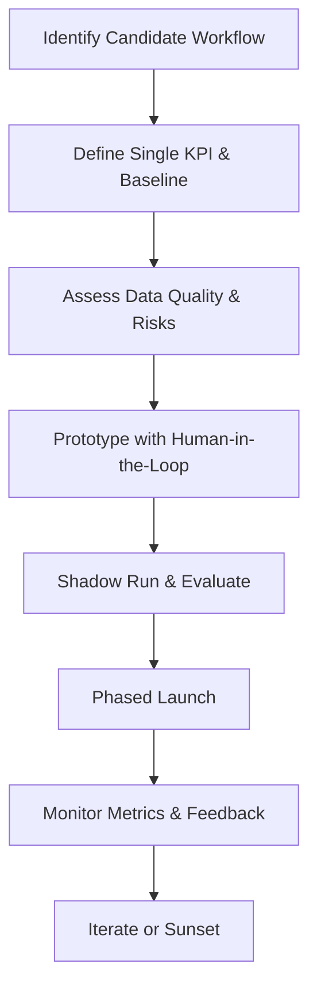

## TL;DR

- Anchor the automation search around a single, needle-moving KPI that stakeholders already track and trust.
- Prove viability quickly with a scoped prototype, human-in-the-loop guardrails, and a parallel run that captures quality gaps before launch.
- Ship in slices with production-grade observability and a rollback ladder so iteration, retraining, or sunsetting can happen without drama.
- Document governance, ownership, and communication cadences so the first win becomes a reusable pattern rather than a one-off hero project.

## Stage 1: Clarify the Business Problem and Success Signal

Your first automation must solve a problem leadership already cares about. Interview operators, comb through ticketing systems, and ask finance which levers move revenue or cost. Convert each candidate workflow into a **single KPI**—for example, "first-response time under 30 minutes" or "manual reconciliation hours reduced by 60%"—and document the baseline. Capture at least two weeks of historical data or run a focused measurement sprint so you understand normal variance. This foundation helps later when you calculate ROI or justify expansion.

Map dependencies early. Document where input data lives, who owns it, and which approvals you need to access it. Many first wins stall because teams underestimate legal or security review times. Get those in motion as soon as the KPI is confirmed. Share a short memo summarizing the business problem, baseline, and expected impact to align executive sponsors and the operators who will beta test the workflow.

## Stage 2: Vet the Workflow for Automation Fit

Not every high-value workflow is a good candidate. Score each option on criteria such as volume, repeatability, data readiness, and risk. Interview front-line staff to understand nuance, edge cases, and tribal knowledge that may not exist in current SOPs. Use the scoring results to choose a process that offers real value while staying low enough in risk that you can run with a lean safety net. Capture the decision in a backlog log so you can explain the trade-offs later and maintain stakeholder trust.

Create a responsibility map next. Identify who owns prompts, training data labeling, evaluation, and incident response. Ensure there is at least one subject-matter expert (SME) empowered to halt or adjust the automation if accuracy dips. When possible, pull in someone from compliance or security to review sensitive data handling. These relationships matter when you hit the prototype and pilot phases.

## Stage 3: Design Guardrails and Data Hygiene Practices

You cannot deliver a first win without operational guardrails. Draft a short **responsible-use charter** that describes intended inputs, disallowed behaviors, escalation paths, and audit expectations. For structured automations, define confidence thresholds where low-scoring predictions route back to humans. For generative automations, maintain prompt templates, output review guidelines, and a change log so you can trace issues back to prompt revisions.

Run a data hygiene audit before prototyping. Sample past records to check for missing fields, mislabeled outcomes, or PII that requires masking. Document remediation tasks with owners and due dates. Build a light data pipeline checklist covering ingestion frequency, schema validation, and monitoring. Even if you are prototyping in a spreadsheet or low-code platform, treating data quality seriously upfront keeps the pilot from failing due to preventable errors.

## Stage 4: Prototype with Human-in-the-Loop

Start with a scoped prototype that mirrors the future production architecture but minimizes irreversible choices. Outline the end-to-end flow, including manual checkpoints, versioned prompts or model parameters, and the metrics you will collect. Shadow-run the prototype alongside the manual process for at least one full business cycle. Ask reviewers to annotate false positives, false negatives, and ambiguous cases. Capture those notes in a structured issue tracker so you can categorize failure modes and refine your approach.

During the shadow run, insist on structured evaluation. Calculate precision, recall, and cost-per-task compared to the manual baseline. Record qualitative insights from operators—what slowed them down, what built confidence, where they still double-checked outputs. These insights surface adoption blockers that pure metrics miss. Update documentation weekly so stakeholders see progress and know when you are ready to graduate to a limited live pilot.

## Stage 5: Launch, Observe, and Iterate

When metrics and qualitative feedback show you are ready, transition to a staged launch. Begin with a subset of users or transactions, ideally those most engaged with the prototype. Create dashboards that track the KPI, error rates, throughput, and system health. Pair quantitative dashboards with regular operator debriefs so you understand context behind anomalies. Publish a short weekly report summarizing wins, issues, and planned changes to maintain transparency.

Expect iteration loops. Build a release cadence—perhaps biweekly—for prompt tweaks, model updates, or workflow adjustments. Each release should include a change log, rollback plan, and owner sign-off. Maintain a configuration management system (even a version-controlled repository) so you can recreate any past environment if auditors or executives request it. Finally, define sunset criteria up front. Not every automation stays valuable forever; you should know when to deprecate or replace it without drama.

## Comparison Table

| Decision Area | High-Risk Choice | Low-Risk Choice | Why It Matters |
| --- | --- | --- | --- |
| KPI Definition | Multiple metrics, unclear success | Single KPI tied to revenue, cost, or compliance | Focus accelerates stakeholder alignment and measurement accuracy |
| Data Access | Ad-hoc exports without governance | Secure pipeline with ownership and retention policies | Reduces compliance risk and data drift |
| Launch Strategy | Big-bang release to all users | Phased rollout with parallel run | Limits blast radius and supports learning |
| Monitoring | Manual spot checks only | Automated dashboards plus human debriefs | Combines signal detection with qualitative insights |
| Iteration Cadence | Reactive fixes when issues arise | Scheduled reviews with change logs | Builds trust and speeds continuous improvement |

## Diagram-as-Text

## Checklist

- [ ] Document the business problem, KPI, baseline data, and success criteria.
- [ ] Secure data access approvals and mask sensitive fields before prototyping.
- [ ] Define confidence thresholds, escalation contacts, and audit requirements.
- [ ] Run a shadow pilot with human review and capture structured feedback.
- [ ] Launch in phases, monitor via dashboards, and maintain a change log.
- [ ] Schedule iteration and sunset reviews with clear decision owners.

> **Benchmarks**
> - Time to implement: 8–12 weeks from discovery to stable pilot [Estimate].
> - Expected outcome: 25–40% reduction in manual effort or response time in the chosen workflow.
> - Common failure modes: KPI drift, unmonitored data schema changes, and lack of operator adoption.
> - Rollback steps: Freeze automation triggers, revert to documented manual SOP, restore previous model version from repository, and notify stakeholders within one business day.

## Internal Links

- Review the [Automation ROI Calculator model](./automation-roi-calculator-simple-model.mdx) to forecast financial impact before launch.
- Borrow guardrail tactics from [Guardrails for AI in Production](./production-guardrails-for-ai.mdx) when formalizing oversight.
- Align analytics instrumentation with the [Attribution for Creators event map](../monetization-analytics/attribution-for-creators.mdx) to capture downstream value.

## Sources

- [Google Cloud MLOps guidance on automation pipelines](https://cloud.google.com/architecture/mlops-continuous-delivery-and-automation-pipelines)
- [ISO/IEC 23894:2023 guidance on AI risk management](https://www.iso.org/standard/81228.html)
