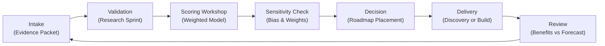

## TL;DR

- Anchor your first automation win on a clearly defined outcome, guardrails, and stakeholder commitments before writing a line of code.
- Use the FIRST blueprint—Focus, Investigate, Run, Stabilize, Transfer—to guide selection, delivery, and adoption.
- Combine disciplined MLOps practices, data readiness, and responsible AI controls to keep the pilot reliable and compliant.
- Celebrate and communicate success with measurable impact, lessons learned, and a roadmap for scaling responsibly.

## Introduction

The first automation win sets the tone for everything that follows. Done right, it earns executive trust, rallies teams, and proves automation is more than hype. Done poorly, it can sour stakeholders, derail funding, and create risk debt that takes months to unwind. A practical blueprint increases the odds of success by orchestrating strategy, data, technology, and change from the start.

This guide walks you through the FIRST blueprint for achieving your first automation win. You will learn how to pick the right use case, prepare data and guardrails, execute with disciplined engineering, manage change, and measure outcomes. The approach blends insights from Google’s MLOps practices, McKinsey’s State of AI research, ISO standards for AI management systems, Prosci’s ADKAR model, and Microsoft’s Responsible AI guidelines.

## Focus: Align on Outcomes and Guardrails

Begin by creating alignment around why this automation matters and what success looks like.

### Define the business objective

Identify the target metric you want to improve—cycle time, error rate, conversion, or customer satisfaction. Quantify the baseline and desired improvement. For instance, reduce invoice approval time from 6 hours to 45 minutes. Tie the objective to a strategic initiative so leadership understands the stakes.

### Secure executive sponsor and stakeholders

Select an executive sponsor with decision authority and budget. Map stakeholders: process owners, frontline staff, compliance, IT, and customer representatives. Host a kickoff workshop to align on scope, guardrails, and expected contributions. Capture commitments in a one-page charter.

### Establish guardrails and success criteria

Define mandatory controls: data privacy, security, responsible AI requirements, and human oversight. Document success criteria such as "95% accuracy on critical fields," "No unresolved high-severity incidents," and "Stakeholder satisfaction ≥4/5." ISO/IEC 42001 guidance recommends linking AI controls to business impact; integrate these guardrails into the charter.

### Assess change readiness

Interview frontline staff, supervisors, and HR partners to gauge openness to automation. Identify potential resistance drivers—fear of job loss, tool fatigue, or lack of training. Capture change risks in the charter and outline mitigation actions such as early involvement, transparent communications, and tailored coaching. This context will inform the Stabilize phase later in the journey.

## Investigate: Evaluate Data, Process, and Feasibility

The best ideas fail without trustworthy data and stable processes.

### Assess data readiness

Perform a rapid data readiness check using the [automation data readiness audit](./automation-data-readiness-audit). Verify data availability, quality, lineage, and access. Identify gaps—missing fields, inconsistent formats, or unclear ownership—and plan remediation.

### Map the process and pain points

Document the current workflow end-to-end. Use process mapping or task mining to identify variations, decision points, and exceptions. Highlight steps suitable for automation and those requiring human judgment. Confirm with frontline staff to avoid surprises.

### Conduct feasibility scoring

Evaluate complexity, integration needs, regulatory constraints, and change impact. Use a lightweight scoring model (1–5) for each dimension. Prioritize use cases scoring high on value and feasibility with manageable risk. McKinsey’s research suggests focusing on high-volume, rules-based processes for early wins.

### Build the hypothesis and pilot scope

Translate findings into a clear hypothesis: "If we automate invoice validation rules with ML-powered classification, we will reduce handling time by 70% while maintaining 98% accuracy." Define pilot scope: data sources, transaction volume, geography, and timeline. Limit scope to manageable segments to increase success odds.

### Assemble the evidence packet

Compile a concise evidence packet containing time studies, data quality reports, risk assessments, and stakeholder interviews. Store it in a shared workspace and update it as new findings emerge. This packet accelerates approvals, informs delivery sprints, and becomes the basis for storytelling once the pilot succeeds.

## Run: Execute with the FIRST Delivery Blueprint

With alignment and feasibility confirmed, move into execution using the FIRST blueprint.

### Form the delivery squad

Assemble a cross-functional team: product owner, automation engineer, data scientist (if AI needed), process SME, QA lead, and change manager. Assign clear roles and communication channels. Co-locate virtually via shared collaboration spaces.

### Implement disciplined delivery

Follow modern MLOps and automation practices: version control, automated testing, CI/CD pipelines, and infrastructure-as-code. Google’s MLOps guidelines emphasize continuous delivery with automated validation, model monitoring, and rollback strategies. Ensure environments (dev, test, prod) are isolated but consistent.

### Harden security and compliance pipelines

Coordinate with security to embed static analysis, dependency scanning, and secret management into your CI/CD workflow. Verify least-privilege access for service accounts and encrypt data at rest and in transit. Align deployment approvals with compliance requirements so the pilot satisfies audits from day one.

### Integrate responsible AI controls

If AI components are involved, apply Microsoft’s Responsible AI standard: data documentation, bias testing, explainability, and human oversight. Set thresholds for model confidence; route low-confidence cases to humans. Maintain audit logs for all automated decisions.

### Worked example: Delivering an automated invoice triage

- **Sprint 0**: Team sets up repository, CI pipeline, and data sandbox. Completes data profiling and creates synthetic data for testing.
- **Sprint 1**: Build rule-based extraction and classification models. Achieve 92% accuracy. Identify top five misclassification drivers.
- **Sprint 2**: Improve model with additional features and bias checks. Introduce human-in-the-loop review for low-confidence invoices. Accuracy rises to 97%.
- **Sprint 3**: Conduct end-to-end testing, security review, and change impact assessment. Prepare runbooks and training materials.
- **Pilot launch**: Deploy to 20% of invoices with real-time monitoring. Daily stand-ups review performance metrics, incidents, and stakeholder feedback.

## Stabilize: Prepare Operations, Support, and Change Management

A pilot is only successful if people use it and operations run smoothly.

### Design support model and runbooks

Create Tier 0 (self-service), Tier 1 (operations), and Tier 2 (engineering) support structures. Develop runbooks covering incident response, escalation, and rollback procedures. Integrate with existing service management tools.

### Enable users and managers

Train frontline users with hands-on sessions, cheat sheets, and bite-sized videos. Coach managers on metrics, escalation paths, and performance conversations. Prosci’s ADKAR model suggests reinforcing new behaviors through recognition and feedback loops.

### Establish monitoring and feedback loops

Implement dashboards tracking throughput, accuracy, exception rates, and user feedback. Set alert thresholds and weekly review cadences. Gather qualitative feedback via surveys and office hours. Adjust workflows based on insights.

### Document lessons learned

Capture technical, process, and change learnings in a living document. Include metrics, issues resolved, and improvement ideas. This knowledge base supports scaling and onboarding new team members.

## Transfer: Measure Impact and Communicate the Win

Once stabilized, package results and share broadly.

### Measure against the charter

Compare pilot outcomes to success criteria: Did cycle time drop? Are accuracy targets met? What is user satisfaction? Quantify benefits using the [automation ROI calculator](./automation-roi-calculator-simple-model) to demonstrate financial value.

### Create storytelling artifacts

Develop a concise narrative: problem, approach, outcomes, and next steps. Include before-and-after metrics, customer testimonials, and quotes from frontline staff. Visualize the journey with timelines or dashboards.

### Broadcast and celebrate

Present results in town halls, leadership meetings, and internal communities. Recognize contributors with shout-outs, badges, or development opportunities. Celebration builds momentum and encourages new ideas.

### Plan next steps responsibly

Decide whether to expand the pilot, enhance features, or select new use cases. Consult the [automation backlog prioritization framework](./automation-backlog-prioritization-framework) to rank opportunities using objective scoring. Maintain guardrails and support models as you scale.

### Codify a reusable playbook

Package artifacts—charter template, evidence packet structure, delivery checklists, and training modules—into a shared workspace. Record short video walkthroughs explaining how to apply the FIRST blueprint. This playbook accelerates future pilots and prevents teams from reinventing steps under deadline pressure.

## Sustain Momentum and Build the Roadmap

The first win should launch a sustainable automation journey.

### Run retrospectives and maturity assessments

Conduct retrospectives focused on strategy, delivery, and change. Evaluate maturity across people, process, technology, and governance. Identify investments needed for scaling, such as additional tooling or training.

### Build a rolling 90-day roadmap

Create a roadmap with the next three automation candidates, highlighting dependencies, required capabilities, and expected value. Keep it flexible to respond to new insights or shifting priorities.

### Invest in capability building

Develop training paths for citizen developers, data stewards, and automation champions. Offer mentorship programs and communities of practice. McKinsey notes that capability building is a top differentiator for successful AI programs.

### Align with enterprise initiatives

Connect automation plans with broader initiatives like digital transformation, customer experience, or operational excellence. Share metrics with enterprise PMOs to reinforce alignment.

### Maintain responsible AI governance

Review responsible AI policies regularly. Update documentation, consent workflows, and monitoring practices as regulations evolve. ISO/IEC 42001 emphasizes continuous improvement of AI management systems; treat governance as a living program.

### Track metrics on a shared scoreboard

Publish a dashboard showing pipeline stages, adoption rates, ROI, and customer sentiment for each automation. Update it monthly and review in governance meetings so wins stay visible and emerging risks surface early. Transparency maintains momentum and reinforces accountability.

## Comparison Table

| Method / Option | Best For | Strengths | Watch-Outs |
|---|---|---|---|
| FIRST Blueprint | Teams seeking structured first automation win | Aligns stakeholders, integrates guardrails, repeatable | Requires disciplined facilitation and cross-functional time |
| Ad-hoc Pilot | Startups needing rapid experimentation | Fast setup, low upfront overhead | High risk of failure, limited trust, poor auditability |
| Outsourced Proof of Concept | Organizations lacking internal talent | Access to expertise, accelerates prototyping | May create black boxes, harder to internalize learnings |

## Diagram (Mermaid)

## Checklist / SOP

1. Draft the FIRST charter capturing objectives, sponsors, guardrails, and success criteria.
2. Assess data, process, and feasibility; scope the pilot with measurable hypotheses.
3. Form the delivery squad, implement disciplined MLOps practices, and integrate responsible AI controls.
4. Launch the pilot, monitor metrics, support users, and iterate quickly on feedback.
5. Measure impact against the charter, craft storytelling assets, and celebrate the win.
6. Run retrospectives, update the roadmap, and invest in capabilities for sustained automation growth.

## Benchmarks

> Time to implement: 8–10 weeks from charter to measurable pilot outcomes. [Estimate]
> Expected outcome: 20–30% improvement in the target metric with high stakeholder satisfaction. [Estimate]
> Common pitfalls: Scope creep, insufficient data readiness, and neglecting change management. [Estimate]
> Rollback plan: Pause the pilot, revert to manual workflow, and execute a focused remediation sprint on data or controls before relaunch. [Estimate]

## Internal Links

- Validate readiness with the [automation data readiness audit](./automation-data-readiness-audit) before committing to build.
- Quantify impact using the [automation ROI calculator](./automation-roi-calculator-simple-model) for consistent storytelling.
- Learn from growth experimentation tactics in the [offer testing framework](../monetization-analytics/offer-testing-framework).

## Sources

- Google Cloud, "MLOps: Continuous delivery and automation pipelines," best practices for reliable ML-driven automation.
- McKinsey & Company, "The State of AI in 2023," insights on first-mover advantage and capability gaps.
- ISO/IEC 42001, management system standard for AI governance and controls.
- Prosci, "ADKAR Change Management Model," framework for driving adoption and reinforcement.
- Microsoft, "Responsible AI Standard," guidance for ethical and compliant AI deployments.

