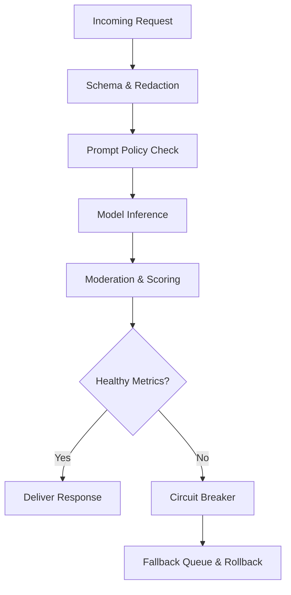

## TL;DR

- Treat guardrails as layered controls spanning data ingress, model prompts, response monitoring, and post-deployment observability.
- Redact or tokenize sensitive data before it reaches the model, and enforce allow/deny prompt lists to prevent prompt injection.
- Combine adaptive rate limits and circuit breakers to isolate incidents before they snowball.
- Maintain rollback playbooks and audit logs so you can revert safely and meet regulatory requests without scrambling.

## Layer 1: Data Redaction and Input Hygiene

Production guardrails start before prompts ever touch a model. Catalog the sensitive data fields your automation ingests—PII, PCI, PHI—and map where redaction or tokenization must happen. Use deterministic masking for identifiers you may need to rehydrate later, and salted hashing for values you never want to expose. Maintain a redaction rule library in version control so security and privacy teams can review changes. Automate validation: every payload should pass through a schema check and redaction test harness before hitting the model endpoint.

Input hygiene also includes prompt sanitization. Strip HTML, executable code, and suspicious control sequences from user inputs. If you accept attachments, run antivirus scans and convert documents to plain text in a secure sandbox. Document what the system rejects and why—transparent error messages help users adjust their behavior and reduce support tickets.

## Layer 2: Prompt Governance and Policy Enforcement

Prompt injection can derail otherwise safe automations. Maintain a prompt policy that enumerates allowed intents, disallowed content, and high-risk phrases. Use allow lists for system prompts and helper libraries, and deny lists for instructions that could trigger data exfiltration or brand damage. Review prompts with legal and compliance teams when they touch regulated content. Track prompt versions and approvals in a change log so you can trace outputs back to specific prompt sets.

For generative outputs, implement content moderation filters downstream. Leverage vendor tools or custom classifiers to flag disallowed categories. Pair machine filters with human review on borderline cases. Document escalation paths and resolution SLAs to ensure compliance requirements are met even during high-volume incidents.

## Layer 3: Rate Limiting and Adaptive Quotas

Rate limits protect your infrastructure and help identify abuse. Implement multiple tiers: per-user, per-IP, and per-API-key. Base thresholds on historical usage and update them dynamically as adoption grows. Include burst credits for legitimate spikes (such as marketing campaigns) but cap sustained traffic to prevent runaway costs or outages. Log every throttled request with metadata so analysts can investigate patterns.

Adaptive quotas detect anomalies early. Monitor error rates, response latency, and token consumption. If metrics exceed safe ranges, automatically shrink quotas or reroute traffic to a low-impact queue. Communicate with stakeholders when throttling occurs, and provide instructions for requesting higher limits. Transparency keeps teams from trying to bypass safeguards.

## Layer 4: Circuit Breakers and Fallback Paths

Circuit breakers shut down problematic components before they cause widespread damage. Define trigger conditions—such as a spike in low-confidence outputs, repeated moderation failures, or infrastructure errors. When activated, circuit breakers should route traffic to a safe fallback, such as a manual queue or cached response. Publish the list of circuit breakers, their owners, and reset procedures so on-call engineers know how to respond.

Design fallback experiences intentionally. Provide clear user messaging when automations enter safe mode. Capture the manual workload impact so leadership understands cost implications. After every circuit breaker event, run a blameless postmortem that covers root cause, detection latency, and remediation actions. Feed the lessons back into the guardrail roadmap.

## Layer 5: Rollbacks and Audit Trails

No guardrail stack is complete without robust rollback plans. Version control every prompt, model, and configuration file. Store artifacts with metadata about deployment date, approver, and change ticket. In incident drills, rehearse reverting to the prior version and validate that downstream systems (such as analytics dashboards) continue to function.

Audit trails support compliance and trust. Capture request IDs, user identifiers (where allowed), model version, confidence scores, and post-processing results. Retain logs according to your regulatory obligations. Offer a self-service retrieval process for legal, compliance, or customer support teams who need to trace an output. Label synthetic or AI-generated content clearly if surfaced to end users, aligning with emerging transparency standards.

## Comparison Table

| Guardrail Layer | Primary Goal | Key Tools | Failure Signal |
| --- | --- | --- | --- |
| Data Redaction | Prevent sensitive data exposure | Tokenization, masking, schema validation | Payloads contain raw PII or fail audits |
| Prompt Governance | Enforce policy and brand voice | Prompt libraries, moderation filters | Prompt injection incidents or policy violations |
| Rate Limiting | Protect infrastructure and budget | API gateway, adaptive quotas | Cost spikes, throttling complaints |
| Circuit Breakers | Contain systemic faults | Observability alerts, fallback queues | Unbounded error cascades |
| Rollback & Audit | Recover and prove compliance | Version control, log retention | Slow incident recovery or audit gaps |

## Diagram-as-Text

## Checklist

- [ ] Inventory sensitive data, implement redaction rules, and automate schema validation.
- [ ] Maintain allow/deny prompt lists with documented approvals and change logs.
- [ ] Configure multi-tier rate limits and alerting on abnormal usage patterns.
- [ ] Define circuit breaker triggers, owners, and fallback experiences.
- [ ] Version control models, prompts, and configs with rollback rehearsal schedules.
- [ ] Centralize audit logs with access controls and retention policies.

> **Benchmarks**
> - Time to implement: 4–6 weeks to stand up the full guardrail stack for a single high-impact workflow [Estimate].
> - Expected outcome: <1% unredacted payload incidents and <30 minutes mean time to detect policy violations.
> - Common failure modes: Outdated redaction rules, undocumented prompt changes, and alert fatigue in on-call rotations.
> - Rollback steps: Trigger relevant circuit breaker, disable automation triggers, redeploy last known-good version, and notify stakeholders via incident channel within 15 minutes.

## Internal Links

- Align guardrails with the [Practical Blueprint for AI Automation](./practical-blueprint-first-win.mdx) to keep controls present from discovery.
- Estimate the financial impact of safeguards using the [Automation ROI Calculator](./automation-roi-calculator-simple-model.mdx).
- Coordinate rollout with the [Vercel previews and caching basics](../devops-for-creators/vercel-content-sites-previews-edge-caching.mdx) guide to ensure deployment hygiene.

## Sources

- [Google Responsible AI practices](https://cloud.google.com/architecture/responsible-ai-practices)
- [OWASP API Security Top 10](https://owasp.org/www-project-api-security/)
