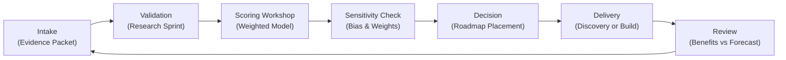

## TL;DR

- Build a layered guardrail strategy that defines accountability, acceptable use, and escalation paths before AI automation goes live.
- Protect inputs with redaction, validation, and allowlists so sensitive data and malicious prompts never reach the model boundary.
- Monitor outputs with policy enforcement, rate limiting, and anomaly detection to catch abuse, drift, or hallucinations fast.
- Prepare resilient rollback and recovery plans with chaos drills, kill switches, and observability to minimize impact when something breaks.

## Introduction

AI-powered automation introduces dynamic behavior and new risk surfaces. Models ingest unstructured data, generate responses, and influence customer experiences in real time. Without strong guardrails, a misaligned prompt, exposed secret, or model drift can lead to compliance violations or brand damage. Production guardrails keep AI systems trustworthy by combining preventive, detective, and corrective controls.

This guide delivers a practical blueprint for AI guardrails. You will establish governance and accountability, secure inputs, enforce output policies, run a worked example on anomaly handling, and operate guardrails as an ongoing program. The approach is informed by Google’s responsible AI practices, OWASP API security guidance, NIST’s AI Risk Management Framework, Microsoft’s Responsible AI Standard, and IBM’s research on trustworthy AI.

## Establish Guardrail Governance and Accountability

Guardrails begin with clear ownership and expectations.

### Define governance charter

Document why guardrails exist, what systems they cover, and how decisions are made. Include principles such as transparency, privacy, fairness, and resiliency. Assign an executive owner, operational leads, and escalation contacts. Align the charter with broader automation governance described in the [automation governance operating models](./automation-governance-operating-models) guide.

### Map risk scenarios and tolerance

Identify critical scenarios: data leakage, prompt injection, policy violation, model drift, excessive cost, and service outage. For each, define risk tolerance levels and desired response times. Use NIST AI RMF categories (Map, Measure, Manage, Govern) to structure the analysis.

### Align with legal and compliance

Engage legal, privacy, and security teams to understand regulatory obligations—GDPR, CCPA, sector-specific rules. Document retention policies, audit requirements, and user consent flows. Microsoft’s Responsible AI Standard recommends clear documentation for stakeholders; integrate these artifacts into your guardrail repository.

### Create guardrail service catalog

List services offered by the guardrail team: prompt review, redaction pipelines, safety testing, incident response, and governance reviews. Define SLAs and intake forms to streamline engagement with product teams.

## Secure Inputs: Redaction, Validation, and Policy Enforcement

Control what enters the model boundary to prevent sensitive exposure or malicious manipulation.

### Data redaction and minimization

Implement preprocessing layers that remove personally identifiable information (PII), payment data, secrets, and other sensitive content. Use pattern matching, named entity recognition, and allowlists. Store redaction logs for auditing. IBM’s AI trust research emphasizes minimizing sensitive data exposure to reduce breach risk.

### Prompt validation and allowlists

Validate prompts before they reach the model. Enforce length limits, forbidden keywords, and structural checks. Maintain allowlists for approved functions and metadata. Reject or sanitize prompts that violate policy. OWASP API Security guidelines recommend strict input validation to block injection attacks.

### Context isolation and sandboxing

For systems pulling context from knowledge bases, implement isolation to prevent unauthorized cross-tenant access. Use scoped tokens and signed requests. Sandbox untrusted content (e.g., user-provided documents) in separate environments where they can be scanned before ingestion.

### Access control and rate limiting

Apply least-privilege access to APIs, service accounts, and integration layers. Enforce per-user and per-application rate limits to protect against abuse and runaway costs. Monitor anomalies in request patterns—spikes may signal misuse or automation loops gone wrong.

### Third-party and plugin vetting

If your AI system connects to external plugins or partner APIs, conduct due diligence on their security posture. Require SOC 2 or ISO certifications where applicable, review data sharing agreements, and test integrations for injection and privilege escalation risks. Maintain a registry of approved integrations with renewal dates so expired assessments do not leave hidden gaps.

## Monitor Outputs and Behavior in Real Time

Detect harmful outputs, drift, and operational issues quickly.

### Policy enforcement engine

Route model outputs through a policy engine that checks for prohibited content, bias, or hallucinations. Define rules using pattern matching, classifier models, or human review thresholds. Block or flag outputs that violate policy. Google’s responsible AI practices encourage layered policy review to prevent unsafe responses.

### Observability and metrics

Collect metrics on latency, success rate, token usage, sentiment, toxicity, and hallucination scores. Emit structured logs with prompt-response pairs for audit trails. Integrate with observability platforms and the [automation risk matrix](./automation-risk-matrix-small-teams) to track risk posture.

### Cost governance controls

Establish budgets and alerts for token consumption, third-party API calls, and infrastructure usage. Automatically throttle or reroute workloads when spend exceeds thresholds. Provide finance with dashboards linking guardrail events to cost impact so investments are justified with data.

### Drift and performance monitoring

Establish baseline distributions for inputs and outputs. Use statistical tests and embedding similarity checks to detect drift. Schedule periodic evaluation against benchmark datasets. Trigger retraining or rollback when accuracy drops below thresholds.

### Human-in-the-loop review

For high-risk workflows, require human review of a sample of outputs or any outputs flagged by policy. Provide annotation tools and escalation paths. Document review outcomes to refine guardrails over time.

## Worked Example: Handling Prompt Injection in Customer Support Bot

A support bot assists customers with account questions. During testing, a user attempts prompt injection to extract internal instructions.

1. **Detection**: The policy engine flags the response because it contains internal URLs and a request to ignore previous instructions.
2. **Automatic response**: Output is blocked and replaced with a safe fallback message instructing the user to contact support.
3. **Alerting**: Incident alert sent to guardrail on-call channel with prompt, sanitized context, and user metadata.
4. **Investigation**: Analysts review logs, confirm it was a malicious attempt, and classify severity as Medium.
5. **Mitigation**: Update prompt validation allowlist to block the new pattern, add contextual instructions reminding the model to reject policy override attempts, and refresh the redaction pipeline to strip internal URLs earlier.
6. **Post-incident**: Document incident, update training data with adversarial examples, and run a chaos test to ensure the new guardrail catches similar attacks.

This workflow demonstrates how layered guardrails—policy engine, redaction, alerts, and human review—contain the incident without customer impact.

## Build Resilience: Rollbacks, Kill Switches, and Recovery

Prepare for failures so you can respond quickly.

### Rollback strategy

Design blue-green or canary deployments so you can revert to the previous model or ruleset instantly. Version prompts, policies, and configuration files. Maintain backward-compatible APIs to avoid cascading failures.

### Kill switches and circuit breakers

Implement kill switches that disable automated actions while keeping human-driven workflows operational. Use circuit breakers to halt outbound calls if downstream services fail. Test kill switches quarterly to ensure they work under pressure.

### Chaos engineering and drills

Run chaos experiments injecting latency, API failures, or malformed prompts. Observe whether guardrails catch issues and whether alerts reach on-call staff. Conduct tabletop exercises covering data leakage, hallucination, and compliance incidents.

### Data retention and audit trails

Store sanitized prompt-response logs, decision rationale, and policy enforcement outcomes in tamper-evident storage. Set retention schedules aligned with regulations. Provide auditors with self-serve access to guardrail evidence when needed.

## Operate Guardrails as a Program

Treat guardrails as a living capability, not a one-time project.

### Establish operating rhythms

Schedule weekly guardrail stand-ups to review incidents, metrics, and upcoming launches. Hold monthly governance reviews with executives to discuss risk posture, investment needs, and roadmap alignment. Integrate updates into change advisory boards.

### Maintain guardrail backlog

Track improvements in a backlog prioritized by risk reduction and effort. Examples: new policy rules, improved redaction models, expanded monitoring. Align with the [automation pilot to scale playbook](./automation-pilot-to-scale-playbook) to ensure new automations inherit guardrails from day one.

### Train teams on safe usage

Provide training for developers, product owners, and support teams covering guardrail policies, incident response, and escalation. Offer simulations and certification paths. Encourage feedback loops so frontline teams can suggest improvements.

### Build shared guardrail tooling architecture

Create a reference architecture diagram showing data flow through redaction services, policy engines, monitoring pipelines, and rollback automation. Standardize SDKs and APIs so product teams plug into guardrails without bespoke engineering. Maintain IaC modules for rapid deployment across environments.

### Measure guardrail effectiveness

Define KPIs: incidents per month, mean time to detect, mean time to recover, percentage of blocked unsafe outputs, and compliance audit pass rate. Share results on dashboards to build trust. Use findings to refine guardrail investments.

### Benchmark and improve

Compare guardrail practices against industry frameworks and peer organizations. Participate in responsible AI communities, review OWASP updates, and incorporate lessons from external incidents. Continuous improvement keeps guardrails relevant as technology evolves.

A mature guardrail program is not about blocking innovation; it provides the confidence to ship responsibly. By investing in prevention, detection, and recovery, automation teams earn the trust of customers, regulators, and executives—and gain the freedom to scale ambitious AI use cases.

## Comparison Table

| Method / Option | Best For | Strengths | Watch-Outs |
|---|---|---|---|
| Layered Guardrail Stack | Production AI automation with compliance needs | Comprehensive protection across input, output, and operations | Requires ongoing investment and cross-team coordination |
| Minimal Policy Filter | Low-risk internal assistants | Quick to implement, low overhead | Limited coverage, misses advanced attacks |
| Third-Party Safety Proxy | Teams lacking guardrail expertise | Offloads safety checks to specialized providers | Vendor dependency, limited customization |

## Diagram (Mermaid)

## Checklist / SOP

1. Draft the guardrail charter, risk scenarios, and service catalog; secure executive sponsorship.
2. Implement input controls—redaction, validation, access management—and document policies.
3. Deploy output monitoring, policy enforcement, drift detection, and human review workflows.
4. Establish rollback strategies, kill switches, and chaos drills to validate resilience.
5. Operate guardrails with weekly stand-ups, training, and KPI tracking; update backlog priorities regularly.
6. Benchmark guardrail practices against industry frameworks and iterate on improvements.

## Benchmarks

> Time to implement: 6–9 weeks to deploy core guardrails for a single AI workflow. [Estimate]
> Expected outcome: 40–60% reduction in AI-related incidents and policy violations within the first quarter. [Estimate]
> Common pitfalls: Incomplete redaction coverage, lack of alert tuning, and kill switches that are never tested. [Estimate]
> Rollback plan: Trigger kill switch, revert to last known-good model, and engage incident response to audit prompts and policies. [Estimate]

## Internal Links

- Align guardrails with the [automation risk matrix for small teams](./automation-risk-matrix-small-teams) to quantify exposure.
- Ensure pilots adopt guardrails early via the [automation pilot to scale playbook](./automation-pilot-to-scale-playbook).
- Extend observability practices from the [MDX site observability stack](../devops-for-creators/mdx-site-observability-stack) to AI workloads.

## Sources

- Google Cloud, "Responsible AI Practices," guidance on layered AI safeguards.
- OWASP, "API Security Top 10," input validation and access control recommendations.
- NIST, "AI Risk Management Framework," structure for managing AI risks end-to-end.
- Microsoft, "Responsible AI Standard," policies for accountability and transparency.
- IBM Research, "Trusted AI," methodologies for building trustworthy AI systems.

