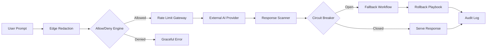

TL;DR
- Scrub or tokenize PII before prompts leave your trust boundary and log the transformations for audits.
- Gate every AI call with rate limits, circuit breakers, and human-in-the-loop rollbacks to manage cascading failures.
- Track prompts, responses, and decisions with tamper-evident logs so you can reconstruct incidents quickly.

## Establish Redaction and Data Hygiene
Begin with a data inventory: list fields that count as personally identifiable information and regulated attributes. Implement streaming redaction or reversible tokenization at the edge of your automation. For sensitive identifiers, use format-preserving tokens so downstream systems keep working while the model sees anonymized values. Validate that redaction runs before persistence or transport to third-party APIs, and add checksum hashing so auditors can trace tokens back if legally required.

### Prompt Allow/Deny Policies
Create an allow list of prompt templates that your product team pre-approves and a deny list that filters risky phrases (credentials, financial advice, or regulatory triggers). Use pattern detection to block prompts containing known sensitive substrings. Pair rules-based filtering with embedding similarity search so you can detect novel variants of disallowed content. Document escalation paths when prompts are blocked, and ensure customer-facing workflows return graceful error messaging.

## Enforce Rate Limits and Circuit Breakers
Implement per-tenant, per-endpoint rate limits to guard against abuse and runaway loops. Use leaky bucket or token bucket algorithms so burstiness is smoothed without starving legitimate traffic. Layer circuit breakers (open, half-open, closed states) around external AI providers; when error rates spike, trip the breaker and route to a fallback experience. Instrument metrics so platform teams can see real-time request budgets and throttling events.

### Rollback and Fallback Strategies
Define what "safe mode" means for each feature—perhaps a deterministic template response or human review queue. Store the last known-good model configuration and prompt set in version control, and automate rollback scripts so operators can redeploy previous artifacts within minutes. Practice game days where you simulate provider outages and model regressions to confirm rollback SLAs.

## Audit Logging and Governance
Capture prompt/response pairs, redaction results, moderator decisions, and rate-limit events in an append-only log. Use role-based access controls so only security and compliance teams can view raw content. Generate weekly summaries that highlight blocked prompts, trips to fallback, and user impact. Feed these logs into your incident response workflow so on-call engineers can correlate anomalies with user reports.

## Comparison Table
| Control Layer | Primary Risk Mitigated | Key Signals | Owner | Example Tooling |
| --- | --- | --- | --- | --- |
| Redaction Tokenization | PII exfiltration | Detected PII fields, checksum matches | Data Privacy | Presidio, custom regex services |
| Prompt Policy Engine | Prompt injection, abuse | Blocked prompt count, allow list hits | Product Ops | Azure Content Safety filters |
| Rate Limit & Circuit Breaker | Cost blowouts, cascading failures | Requests/minute, breaker state | Platform Engineering | Envoy, Kong |
| Rollback Automation | Regression exposure | Deployment logs, time to restore | SRE | GitOps pipelines |
| Audit Logging | Compliance gaps | Log integrity, access audits | Security | WORM storage, SIEM |

## Diagram

## Checklist
- [ ] Map PII and regulated data sources; implement reversible tokenization prior to prompt dispatch.
- [ ] Deploy allow/deny prompt filters with documented escalation paths.
- [ ] Configure per-tenant rate limits and circuit breakers tied to observability alerts.
- [ ] Version control models/prompts and rehearse rollback drills quarterly.
- [ ] Centralize audit logs with restricted access and weekly compliance reviews.

> **Benchmarks**
> - Time to implement: 2–3 weeks for a midsize team to deploy all guardrail layers across one product surface. [Estimate]
> - Expected outcome: Reduce severity-one AI incidents by 60% and rollback mean time to recovery to under 15 minutes. [Estimate]

## Internal Links
- [Design routing patterns that complement these guardrails.](../multi-agent-orchestration/agent-routing-patterns.mdx)
- [Coordinate guardrails with deployment safety nets described in the Vercel previews guide.](../devops-for-creators/vercel-content-sites-previews-edge-caching.mdx)

## Sources
- [Azure OpenAI content filtering guidance](https://learn.microsoft.com/azure/ai-services/openai/concepts/content-filtering)
- [Circuit breaking patterns from the Google SRE workbook](https://sre.google/workbook/circuit-breaking/)
