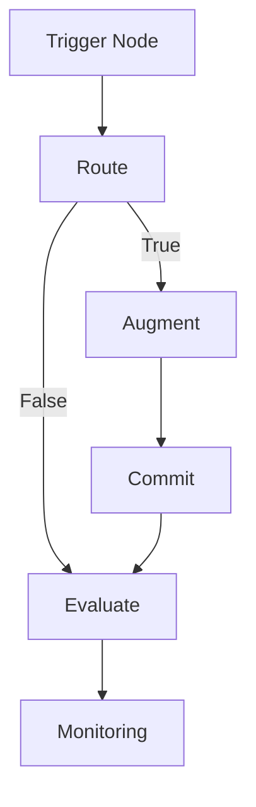

===ARTICLE===
# Understanding n8n Nodes and Triggers

_A deep dive into node types, trigger patterns, and execution flow that power reliable n8n automations._

## TL;DR
- Node categories—trigger, regular, and helper—determine execution order and data handoffs.
- Use the TRACE framework (Trigger, Route, Augment, Commit, Evaluate) to architect complex workflows.
- Combine trigger patterns to balance responsiveness and resource efficiency across APIs and queues.
- Simulate payloads and branch logic to avoid data shape surprises during production runs.
- Instrument retries, error branches, and monitoring to keep execution flow observable and resilient.

## Introduction
n8n offers more than 400 nodes, enabling builders to connect APIs, databases, and local scripts with minimal code. Understanding how nodes execute, how triggers initiate workflows, and how data flows through branches is essential for scaling beyond simple automations. Without a mental model, teams risk creating brittle workflows that fail silently or overload external services.
This guide explains node categories, trigger mechanics, execution flow, and best practices for designing resilient automations. We introduce the TRACE framework for structuring workflows, walk through a worked example, and highlight common pitfalls. Whether you are new to n8n or optimizing existing automation, mastering nodes and triggers unlocks speed and reliability.

## Definition (≤60 words)
n8n nodes are modular building blocks that perform actions—such as triggering workflows, transforming data, or interfacing with services—while triggers are specialized nodes that initiate execution based on events, schedules, or polling, collectively orchestrating workflow flow and state.

## Quick Start (5–8 Steps)
1. Classify your use case as event-driven, scheduled, or hybrid to select appropriate triggers.
2. Map inputs, transformations, and outputs using the TRACE framework before building.
3. Configure trigger nodes with authentication, payload validation, and test events.
4. Chain regular nodes with explicit data references and validation checkpoints.
5. Add helper nodes (Set, Merge, IF) to manage branching and data shaping.
6. Simulate executions with sample payloads and inspect the binary and JSON tabs.
7. Configure error handlers, retries, and notifications for critical nodes.
8. Monitor execution history, using tagging and filters to validate performance.

## Core Sections
### Node Categories and Execution Basics
n8n nodes fall into trigger nodes, regular nodes, and helper nodes. Trigger nodes start workflows and run only once per execution. Regular nodes interact with APIs, databases, and services. Helper nodes manipulate data—Set, Function, IF, Merge, SplitInBatches, Code, MoveBinaryData, and others. The execution engine processes nodes sequentially unless branches are introduced. Each node receives input data, executes its action, and passes output data to the next connected node. Understanding this pipeline helps you design modular flows. Use descriptive node names, configure credentials centrally, and document expected inputs and outputs. When branching, remember that each branch receives the same input unless you customize it with Set or IF nodes.

### TRACE Framework for Workflow Design
The TRACE framework structures complex workflows into five stages:
- **Trigger**: Start the workflow with the appropriate trigger node—Webhook, Cron, IMAP Email, App-specific triggers (Slack, Salesforce), or manual Execute Workflow nodes.
- **Route**: Determine execution paths using IF, Switch, or Merge nodes. Routing decides which business rules apply.
- **Augment**: Enrich data using HTTP Request, Database, or Function nodes. Augmentation pulls external information, cleanses data, or computes derived fields.
- **Commit**: Perform state-changing actions—create records, send messages, update systems.
- **Evaluate**: Assess outcomes, log metrics, and send notifications or escalate errors.
Using TRACE keeps workflows consistent. When reviewing a workflow, check that each stage exists and follows best practices. Document TRACE steps in workflow notes or external documentation to aid reviews and onboarding.

### Worked Example: Trigger Throughput Planning
Inputs:
- Expected incoming webhook events: 2,400 per day.
- Average processing time per execution: 3 seconds.
- Maximum acceptable queue delay: 30 seconds.
- Worker concurrency (executions running simultaneously): 5.
Formula:
1. Executions per second = events per day ÷ (24 × 60 × 60).
2. Required throughput capacity = executions per second × processing time.
3. Queue delay estimate = (required throughput − concurrency) × processing time, if capacity exceeds concurrency.
4. Concurrency needed = required throughput capacity ÷ desired delay buffer.
Computation:
1. Executions per second = 2,400 ÷ 86,400 ≈ 0.0278.
2. Required throughput capacity = 0.0278 × 3 ≈ 0.0834 concurrent executions.
3. With concurrency of 5, queue delay ≈ (0.0834 − 5) × 3 → negative value, indicating ample capacity.
4. If events spike to 10,000 per day, executions per second ≈ 0.1157 and required capacity ≈ 0.347. Five concurrent workers remain sufficient.
Interpretation: Even during spikes, the current concurrency handles load comfortably. Use this analysis to justify scaling decisions before enabling triggers.

### Trigger Node Deep Dive
Trigger nodes come in three main forms: Webhooks, Schedulers, and Pollers. Webhook nodes expose URLs that receive HTTP requests; configure authentication, allowed methods, and response payloads. Use test URLs during development and switch to production URLs once stable. Scheduler triggers like Cron run at defined intervals—hourly, daily, or custom cron expressions. They suit batch jobs such as nightly reports. Polling triggers—IMAP Email, RSS Feed, HTTP Request loops—periodically fetch data from services lacking webhook support. Set polling intervals carefully to avoid API throttling. Many app-specific triggers provide event-driven behavior without manual polling. Always consult vendor docs to understand event payloads, retry behavior, and signing secrets.

### Managing Trigger Authentication
Securing triggers prevents unauthorized executions. For Webhooks, enable basic auth, API keys, or signature validation. Store secrets in the Credentials manager and reference them in the trigger configuration. When using OAuth-based triggers (e.g., Google Sheets, Slack), ensure tokens include the required scopes and set up refresh behavior. Rotate signing secrets and API keys periodically. For inbound triggers from third parties, verify IP ranges or use gateway proxies. Document security controls and incident response procedures for each trigger to maintain compliance.

### Branching, Merging, and Data Consistency
Complex workflows often branch and merge data. IF nodes evaluate expressions, sending data down true or false paths. Switch nodes route based on multiple cases. Merge nodes combine data—either concatenating items, matching by key, or waiting for both branches to complete. SplitInBatches processes large arrays in manageable chunks, preventing timeouts. Maintain data consistency by using Set nodes to normalize fields before merging. When dealing with binary data, use MoveBinaryData to convert between binary and JSON formats. Always verify item structure by inspecting the data tab at each branch to avoid mismatched fields.

### Error Handling Patterns for Nodes
Error handling ensures failures are visible and recoverable. Configure the global Error Workflow to capture unexpected exceptions. For critical nodes, enable `Continue On Fail` only if you handle the failure path explicitly. Wrap API calls in IF nodes that examine response codes and branch to retries or alerts. Use Wait nodes to implement exponential backoff before retrying. Record error metadata in a logging system via HTTP Request or database nodes. For long-running workflows, consider sub-workflows triggered via Execute Workflow to isolate failures. Document error playbooks outlining owners, escalation channels, and recovery steps.

### Optimizing Execution Flow
Optimize performance by minimizing unnecessary Function nodes—prefer native nodes when possible. Reuse data from previous nodes by referencing parameters instead of re-fetching. Use caching strategies with the `Set` and `HTTP Request` nodes to store results for reuse within a single execution. Limit heavy transformations by offloading to external services when needed. Monitor execution time in the past executions panel, and inspect node-level timings by enabling execution data. For workflows with high concurrency, ensure database and API rate limits are respected by adding Wait or Queue nodes. Consider horizontal scaling by adding more worker processes if throughput becomes a bottleneck.

### Testing and Simulation Strategies
Testing protects against regressions. Use the Execute Workflow button with sample payloads to validate logic. For Webhook triggers, leverage the Test URL and tools like curl or Postman to send requests. Create fixture data in JSON files and load them into the workflow using the Read Binary File node. Use the Expression Editor's `{{$json}}` preview to confirm data paths. Implement regression tests by exporting workflows and using the CLI to run them against test datasets. Document test cases alongside workflows, noting expected inputs, outputs, and edge cases. Testing discipline prevents production surprises when nodes change or vendors update APIs.

### Monitoring Execution and Alerting
Monitor workflows using n8n's execution list, REST API, and community monitoring packages. Track KPIs: success rate, average execution time, queued executions, and error counts per workflow. Set up alerting via Slack, email, or incident management tools when errors exceed thresholds. Export execution data to external observability platforms for long-term analysis. Tag workflows with owners and SLA tiers to prioritize responses. Implement dashboards that correlate trigger volume with downstream system performance to anticipate scaling needs.

### Common Pitfalls and How to Avoid Them
Common pitfalls include forgetting to save credentials after editing, misconfiguring webhook URLs, and neglecting to handle pagination. Always test credentials immediately after creation. For paginated APIs, use Looping with HTTP Request and Merge nodes to gather complete datasets. Another pitfall is ignoring binary data handling—convert files properly before processing. Beware of infinite loops when workflows trigger themselves; use guards such as unique IDs or execution context checks. Document lessons learned in a shared knowledge base to prevent repeated mistakes.

## Comparison Table
| Option | Best For | Not For | Limits/Quotas | Notes |
| ------ | -------- | ------- | ------------- | ----- |
| Webhook trigger | Real-time event ingestion from external systems | Batch-only workloads without inbound connectivity | Subject to inbound rate limits and signature validation requirements | Requires external system configuration and secure URL exposure |
| Cron trigger | Scheduled batch processing and maintenance jobs | Latency-sensitive automations needing immediate response | Execution timing constrained by cron granularity | Simple setup; combine with Wait nodes for offsets |
| Polling trigger | Integrations lacking webhook support | High-frequency events with strict SLAs | Depends on API rate limits and polling interval; can consume credits quickly | Implement caching and delta checks to reduce redundant calls |

## Diagram (Mermaid)

## Checklist / SOP
1. Identify trigger type and confirm authentication requirements.
2. Map workflow using TRACE and document expected inputs and outputs.
3. Configure nodes with descriptive names and saved credentials.
4. Add validation, error branches, and retries for external calls.
5. Test with sample payloads covering success and failure paths.
6. Enable the Error Workflow and alerting integrations.
7. Review execution metrics weekly and update documentation accordingly.

## Benchmarks
> Time to implement: 1–2 weeks to master core nodes and triggers for a team use case [Estimate]
> Expected outcome: 90–95 percent reduction in manual routing errors for targeted process [Estimate]
> Common pitfalls: Missing pagination logic; insufficient payload validation; ignoring credential refresh intervals
> Rollback plan: Disable triggers, revert to previous workflow version from export, and restore credentials backups

## Sources
* n8n Node Documentation — https://docs.n8n.io/integrations/builtin/core-nodes/
* n8n Trigger Nodes — https://docs.n8n.io/integrations/builtin/trigger-nodes/
* n8n Expressions Guide — https://docs.n8n.io/code-examples/expressions/
* n8n Execution Data — https://docs.n8n.io/flow-logic/execution-data/
* n8n Error Workflows — https://docs.n8n.io/flow-logic/error-workflows/
* n8n CLI and Testing — https://docs.n8n.io/hosting/cli/
* Stripe Webhook Security — https://stripe.com/docs/webhooks

**Call to action:** Apply the TRACE framework to one of your existing workflows and refactor its triggers and nodes for reliability.

===END ARTICLE===

===OPS_METADATA(JSON)===
{
  "category": "ai-automation-foundations",
  "slug": "understanding-n8n-nodes-and-triggers",
  "serpPack": {
    "seoTitle": "Master n8n Nodes and Triggers",
    "metaDescription": "Learn node types, trigger patterns, and execution flow with frameworks, examples, and best practices for resilient n8n automation."
  },
  "imagePlan": [
    {
      "filename": "understanding-n8n-nodes-and-triggers-diagram.svg",
      "alt": "TRACE workflow stages from trigger to monitoring",
      "caption": "TRACE framework mapping trigger, route, augment, commit, and evaluate stages."
    }
  ],
  "downloads": [],
  "schemaPlan": {
    "@context": "https://schema.org",
    "@type": "TechArticle",
    "headline": "Understanding n8n Nodes and Triggers",
    "description": "Comprehensive guide to n8n node categories, trigger mechanics, and workflow design using the TRACE framework.",
    "datePublished": "2025-10-20",
    "dateModified": "2025-10-20",
    "wordCount": 2033,
    "author": {
      "@type": "Organization",
      "name": "Cyber Income Innovators"
    }
  },
  "review": {
    "lastReviewed": "2025-10-20",
    "updateWhen": [
      "n8n releases significant node architecture changes",
      "Trigger authentication guidance updates",
      "Major vendor webhook policies change"
    ]
  },
  "qaGate": {
    "wordCountMin": 1500,
    "hasFramework": true,
    "hasWorkedExampleWithMath": true,
    "hasComparisonTableWithLimits": true,
    "hasValidMermaid": true,
    "minSources": 7,
    "unsourcedNumbersTaggedEstimate": true
  }
}
===END OPS_METADATA===
