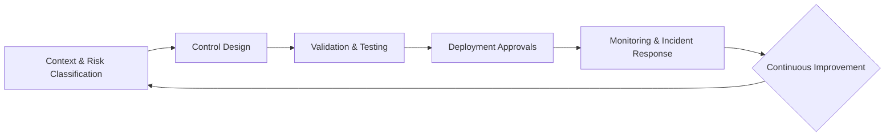

# Governance & Guardrails: Safe, Compliant AI Automation
_Embedding risk controls, approvals, and auditability into every automation decision._
**Author:** Cyber Income Innovators Editorial  |  **Date:** 2025-10-16  |  **Reading time:** ~15–18 min
**Tags:** ai automation, foundations, risk management, compliance, audit trails, guardrails

## TL;DR
- Build a governance operating model that ties automation strategy to policy, risk appetite, and control ownership across the lifecycle.
- Use a Guardrail Blueprint Framework with stages for design, validation, deployment, and monitoring to ensure automation systems meet regulatory and ethical obligations.
- Apply a worked example showing how a bank’s AI claims automation flow maps controls to NIST AI RMF functions, risk tiers, and approval gates.
- Balance trade-offs between innovation velocity and control rigor by using tiered approvals, automated evidence capture, and risk-adjusted SLAs.
- Maintain audit-ready artifacts—model cards, decision logs, incident records—to satisfy regulators, auditors, and customers.

## Introduction
Automation teams face a paradox: they must deliver transformative efficiency while protecting customers, complying with emerging AI regulations, and maintaining trust. High-profile failures—from biased credit scoring bots to data leakage in support copilots—demonstrate what happens when governance is an afterthought. This article targets automation leaders, chief risk officers, compliance heads, and product owners seeking to operationalize guardrails without stifling innovation. You will learn a reusable governance framework, practical control catalogs, a detailed worked example, and explicit trade-offs to help you scale responsibly.

## Governance Operating Model Basics
Governance starts with clear accountability and documented policies. Without alignment on decision rights, automation programs accumulate risk debt.

### Define Roles and Decision Rights
Establish a RACI chart covering automation sponsors, product owners, model risk managers, compliance officers, security, data privacy, and internal audit. Each role must understand approval thresholds, escalation paths, and evidence requirements. The NIST AI Risk Management Framework emphasizes organizational governance functions—govern, map, measure, manage—to institutionalize accountability.[^nistrmf]

### Codify Policies and Standards
Document policies for data usage, model development, testing, deployment, and monitoring. Align with applicable regulations such as the EU’s proposed AI Act, which classifies high-risk systems and mandates transparency.[^euaiact] Update policies annually or when regulations change.

### Integrate Governance with Delivery
Embed risk checkpoints into product lifecycle milestones: intake, design, build, test, deploy, operate. Link gating to PMO or product ops processes so teams cannot bypass approvals. Automate evidence collection through workflows to reduce manual overhead.

## Guardrail Blueprint Framework
Use a structured framework to design guardrails across automation lifecycle stages.

### Stage 1: Context & Risk Classification
- Identify process domain, data categories, affected stakeholders, and potential harms.
- Classify risk level (e.g., low, medium, high) using criteria from NIST AI RMF or internal risk taxonomies.
- Determine regulatory obligations (GDPR, HIPAA, SOX) and whether special approvals apply.

### Stage 2: Control Design
- Select controls from a guardrail catalog: data minimization, bias testing, explainability documentation, segregation of duties, disaster recovery.
- Map controls to responsible roles. For example, data privacy officers approve data minimization, while model validators certify performance.
- Define metrics for control effectiveness (e.g., bias delta thresholds, audit log completeness).

### Stage 3: Validation & Testing
- Execute test plans covering functional accuracy, fairness, robustness, and security. Reference NIST SP 1270 guidance on bias evaluation techniques.[^nist1270]
- Implement human-in-the-loop tests where high-risk decisions require human confirmation.
- Capture test evidence in a centralized repository with version control.

### Stage 4: Deployment Approvals
- Require sign-off from product owners, risk officers, and compliance. High-risk automations may need executive risk committee approval.
- Use conditional approvals: proceed only if compensating controls exist for known gaps.
- Document deployment decisions in a workflow tool to create audit trails.

### Stage 5: Monitoring & Incident Response
- Deploy monitoring for model drift, data drift, performance degradation, and control failures.
- Define incident severity levels and response playbooks. Ensure 24/7 escalation contacts for critical automations.
- Conduct periodic attestations and control effectiveness reviews. IBM recommends publishing AI factsheets to summarize model lineage, testing, and monitoring data.[^ibmfacts]

## Worked Example: Banking Claims Automation
A retail bank plans to automate claims adjudication for disputed card transactions using AI classification and workflow orchestration. The process touches sensitive financial data and customer outcomes, requiring rigorous guardrails.

### Risk Classification
- **Domain:** Consumer financial services.
- **Risk Tier:** High (decisions affect customer funds).
- **Regulations:** CFPB rules, OCC supervisory guidance, potential applicability of EU AI Act for EU customers.
- **Data Sensitivity:** PCI and PII data present.

### Control Mapping
| NIST AI RMF Function | Key Controls | Responsible Role | Evidence |
|----------------------|--------------|------------------|----------|
| Govern | Policy adherence checklist, role charter, model inventory registration | Automation program manager, risk governance | Signed policy attestations, inventory ID |
| Map | Data privacy impact assessment, harm analysis, stakeholder mapping | Data privacy officer, CX lead | DPIA report, stakeholder matrix |
| Measure | Bias and performance testing, scenario stress tests, explainability analysis | Model validation team | Test reports, fairness dashboards |
| Manage | Human-in-the-loop override, incident response plan, continuous monitoring dashboards | Operations lead, SRE, risk officer | Override logs, incident playbooks, monitoring alerts |

### Approval Flow
1. Intake review approves problem framing and risk classification.
2. Design review verifies control selection and testing plan.
3. Model validation signs off after passing fairness thresholds (difference in false positive rate <2%).
4. Compliance approval ensures alignment with OCC Bulletin 2021-12 on model risk management.[^occ]
5. Executive risk committee grants final approval for high-risk deployment.

### Monitoring Plan
- Daily drift analysis comparing model outputs to historical benchmarks.
- Weekly sample reviews by human adjudicators.
- Automated alerts when override rate exceeds 8% or customer complaints rise above baseline.
- Quarterly audits verifying log integrity and data retention compliance.

## Control Catalog Essentials
A practical guardrail program includes technical, procedural, and organizational controls.

### Technical Controls
- **Input Validation:** Enforce schema checks, data quality thresholds, and anomaly detection.
- **Model Explainability:** Provide LIME/SHAP explanations or rule-based surrogates for decisions.
- **Access Controls:** Implement least privilege, multi-factor authentication, and secrets management.
- **Observability:** Capture metrics, traces, and logs across automation pipelines; align with SRE practices.

### Procedural Controls
- **Segregation of Duties:** Separate development, validation, and operations to prevent conflicts of interest.
- **Change Management:** Require change tickets with risk impact analysis for model updates.
- **Third-Party Risk Reviews:** Assess vendor security posture and contractual obligations. The Financial Stability Board emphasizes robust third-party oversight for critical services.[^fsb]

### Organizational Controls
- **Training:** Provide governance training for engineers, product managers, and executives.
- **Ethics Review Boards:** Evaluate societal impact, fairness concerns, and unintended consequences.
- **Escalation Protocols:** Define communication plans for incidents affecting customers or regulators.

## Automation Guardrail Blueprint Diagram

## Trade-Offs and Optimization Strategies
Governance must balance risk mitigation with delivery velocity.

### Tiered Approval Models
High-risk automations require full committee review, while low-risk automations can use expedited approvals. Microsoft advocates tiered governance to avoid bottlenecks while respecting risk tiers.[^microsoft]

### Automation of Controls
Automate guardrails—such as policy checks, bias tests, and evidence capture—to reduce manual burden. However, automation of controls must itself be monitored to avoid blind spots.

### Innovation vs. Compliance
Excessive bureaucracy discourages experimentation; insufficient control invites regulatory penalties. Build sandboxes where teams can experiment with anonymized data under lighter governance, transitioning to full oversight as risk increases.

### When Not to Automate
Walk away when:
- Controls cannot mitigate residual risk to acceptable levels.
- Regulatory guidance is ambiguous and evolving rapidly, making compliance uncertain.
- Customer trust would be severely damaged by errors even if legally compliant.

## Comparison Table
| Guardrail Approach | Strengths | Weaknesses | Best Fit | Audit Considerations |
|--------------------|-----------|------------|----------|----------------------|
| Centralized AI Risk Committee | Consistent standards, strong oversight | Slower approvals, potential backlog | Highly regulated industries (banking, healthcare) | Requires comprehensive documentation and meeting minutes |
| Federated Risk Champions | Domain expertise, faster context gathering | Inconsistent application of controls | Large enterprises with diverse product lines | Needs centralized templates and audits |
| Automated Control Platforms | Real-time enforcement, scalable monitoring | Upfront integration cost, potential false positives | Organizations with mature DevOps/ML Ops | Must validate automation accuracy periodically |
| External Assurance Partners | Independent validation, regulatory credibility | Costly, may lack deep process knowledge | High-risk systems requiring third-party assurance | Ensure scope, evidence access, and confidentiality |

## Checklist / SOP
1. Create a governance charter outlining roles, risk tiers, and approval workflows; secure executive endorsement.
2. Build a guardrail catalog covering technical, procedural, and organizational controls mapped to risk tiers.
3. Integrate governance checkpoints into delivery workflows with automated evidence capture and ticketing.
4. Establish monitoring dashboards for performance, drift, control adherence, and incidents; define escalation thresholds.
5. Conduct quarterly governance reviews to assess control effectiveness, refresh risk assessments, and update policies.
6. Maintain an audit archive with model cards, decision logs, incident reports, and approval records.

## Benchmarks
> Time to implement: 10–14 weeks to operationalize guardrail framework across priority automations
> Expected outcome: 40–60% reduction in audit findings related to automation over 12 months
> Common pitfalls: Fragmented accountability, manual evidence gathering, outdated policies
> Rollback plan: Freeze high-risk deployments, convene emergency governance review, remediate control gaps before resuming releases

## Sources
1. NIST, "Artificial Intelligence Risk Management Framework (AI RMF 1.0)." https://nvlpubs.nist.gov/nistpubs/CSWP/NIST.AI.100-1.pdf
2. European Commission, "Europe’s Approach to Artificial Intelligence." https://digital-strategy.ec.europa.eu/en/policies/european-approach-artificial-intelligence
3. NIST, "Towards a Standard for Identifying and Managing Bias in Artificial Intelligence." https://nvlpubs.nist.gov/nistpubs/SpecialPublications/NIST.SP.1270.pdf
4. IBM Research, "AI FactSheets: Increasing Trust in AI Services." https://research.ibm.com/blog/trustworthy-ai-factsheets
5. Office of the Comptroller of the Currency, "OCC Bulletin 2021-12: Third-Party Relationships: Risk Management Guidance." https://www.occ.gov/news-issuances/bulletins/2021/bulletin-2021-12.html
6. Financial Stability Board, "Enhancing Third-Party Risk Management and Oversight." https://www.fsb.org/2022/12/enhancing-third-party-risk-management-and-oversight/
7. Microsoft, "Responsible AI Standard." https://query.prod.cms.rt.microsoft.com/cms/api/am/binary/RWMFIi
8. Federal Trade Commission, "Aiming for Truth, Fairness, and Equity in Your Company’s Use of AI." https://www.ftc.gov/business-guidance/blog/2021/04/aiming-truth-fairness-equity-your-companys-use-ai
9. FINRA, "Artificial Intelligence (AI) in the Securities Industry." https://www.finra.org/rules-guidance/key-topics/artificial-intelligence
10. International Organization for Standardization, "ISO/IEC 42001—Artificial Intelligence Management System." https://www.iso.org/standard/81230.html
11. UK Information Commissioner’s Office, "AI Auditing Framework." https://ico.org.uk/media/for-organisations/ai/2617219/ai-audit-framework-guidance.pdf
12. The White House, "Blueprint for an AI Bill of Rights." https://www.whitehouse.gov/ostp/ai-bill-of-rights/

## FAQ

### How do we keep governance lightweight for low-risk automations?
Use tiered guardrails: low-risk automations follow streamlined checklists with automated controls, while high-risk automations require committee reviews and human oversight. Continuously reassess risk tiers based on production telemetry.

### What documentation do auditors request most often?
Auditors typically ask for model inventories, change logs, testing evidence, approval records, incident reports, and monitoring dashboards. Maintain a centralized repository with immutable storage to accelerate responses.

### How do we align governance across global jurisdictions?
Start with a global baseline (e.g., NIST AI RMF) and layer region-specific requirements such as GDPR, EU AI Act provisions, or sector regulations. Assign regional compliance leads to track updates and feed them into the global policy refresh cycle.

**Call to action:** Need to harden your automation guardrails before regulators come knocking? Let’s run a governance gap assessment together.

[^nistrmf]: NIST, "Artificial Intelligence Risk Management Framework (AI RMF 1.0)."
[^euaiact]: European Commission, "Europe’s Approach to Artificial Intelligence."
[^nist1270]: NIST, "Towards a Standard for Identifying and Managing Bias in Artificial Intelligence."
[^ibmfacts]: IBM Research, "AI FactSheets: Increasing Trust in AI Services."
[^occ]: Office of the Comptroller of the Currency, "OCC Bulletin 2021-12: Third-Party Relationships: Risk Management Guidance."
[^fsb]: Financial Stability Board, "Enhancing Third-Party Risk Management and Oversight."
[^microsoft]: Microsoft, "Responsible AI Standard."
[^finra]: FINRA, "Artificial Intelligence (AI) in the Securities Industry."
[^iso]: International Organization for Standardization, "ISO/IEC 42001—Artificial Intelligence Management System."
[^ico]: UK Information Commissioner’s Office, "AI Auditing Framework."
[^ftc]: Federal Trade Commission, "Aiming for Truth, Fairness, and Equity in Your Company’s Use of AI."
[^aibill]: The White House, "Blueprint for an AI Bill of Rights."
[^wef]: World Economic Forum, "Responsible AI Leadership: A Global Framework."

## Metrics, Reporting, and Assurance
Governance programs thrive when they provide transparent, actionable metrics to executives and regulators.

### Key Risk Indicators (KRIs)
Track KRIs such as percentage of automations with up-to-date model cards, number of incidents per 1,000 automated decisions, time to resolve control breaches, and frequency of manual overrides. FINRA encourages firms to maintain metrics connecting AI usage to supervisory reviews, which can serve as KRIs for compliance teams.[^finra]

### Governance Dashboards
Develop dashboards combining delivery metrics (release cadence), risk metrics (control test pass rates), and business impact (value realized versus forecast). Automate data ingestion from ticketing, monitoring, and compliance tools to reduce manual reporting. Use traffic-light statuses to focus executive attention on high-risk automations.

### Independent Assurance
Schedule independent audits or internal audit reviews at least annually for high-risk automations. The UK Information Commissioner’s Office provides an AI auditing framework that can inform audit scopes and evidence expectations.[^ico]

## Third-Party and Vendor Oversight
Modern automation stacks rely on vendors, cloud services, and data providers.

### Due Diligence
Extend procurement processes to include AI-specific risk assessments—data usage rights, retention policies, model transparency, and incident response commitments. Require vendors to provide documentation aligned with ISO/IEC 42001 AI management system standards.[^iso]

### Contractual Controls
Include clauses covering breach notification timelines, audit access, explainability requirements, and obligations to support regulatory inquiries. Specify service levels for guardrail-related controls such as bias testing or red-team simulations.

### Continuous Monitoring
Implement continuous vendor monitoring: periodic questionnaires, evidence reviews, and integration testing. Leverage third-party risk platforms to track certifications, vulnerabilities, and geopolitical risks. FSB guidance highlights the importance of ongoing oversight beyond onboarding.[^fsb]

## Cultural Enablement and Training
Strong guardrails depend on informed teams.

### Governance Education
Provide mandatory training on AI ethics, privacy, and compliance tailored to roles (engineers, product managers, executives). Reinforce with refreshers annually and when policies change. Microsoft’s Responsible AI Standard includes training requirements as part of governance readiness.[^microsoft]

### Communities of Practice
Establish communities of practice for risk champions and engineers to share lessons, templates, and incident learnings. Encourage cross-business participation to break silos and harmonize guardrails.

### Incentives and Accountability
Tie performance objectives to governance outcomes—e.g., zero overdue control actions, timely completion of model reviews. Recognize teams who proactively raise risks or improve guardrails.

## Incident Response and Postmortems
Even with robust guardrails, incidents occur. Prepare to respond effectively.

### Incident Lifecycle
Define stages: detection, triage, containment, eradication, recovery, and lessons learned. Assign incident commanders and communication leads. Maintain contact lists for legal, PR, and regulators.

### Communication Protocols
Create communication templates for regulators, customers, and internal stakeholders. The FTC advises prompt, transparent communication when AI systems impact consumers, particularly around fairness and bias issues.[^ftc]

### Learning Reviews
Conduct blameless postmortems analyzing root causes, control gaps, and response efficacy. Update guardrail catalogs, training, and monitoring. Share sanitized learnings across the organization to prevent recurrence.

## Scaling Governance with Technology Platforms
Technology can augment manual governance processes.

### Policy-as-Code
Implement policy-as-code to enforce guardrails automatically during CI/CD pipelines. For example, prevent deployments lacking bias test results or security scans. Integrate with infrastructure-as-code to maintain consistency across environments.

### Model Lifecycle Management Tools
Adopt platforms that manage model versioning, approvals, monitoring, and documentation. Look for integrations with ticketing, alerting, and logging systems. IBM’s AI FactSheets initiative demonstrates how toolchains can standardize evidence capture across models.[^ibmfacts]

### Automation of Evidence Collection
Use bots or scripts to gather artifacts (test results, approvals) and store them in immutable repositories. Ensure audit trails include timestamps, approvers, and digital signatures.

## Expanded Trade-Off Considerations

### Compliance Depth vs. Experimentation Freedom
Enforcing exhaustive controls on early experiments can stifle innovation. Consider sandbox policies with restricted data and user cohorts to enable experimentation under lighter controls, escalating requirements as risk increases.

### Global Consistency vs. Local Flexibility
Multinational enterprises must decide how much autonomy local teams have to interpret regulations. Provide a global baseline while allowing local controls to exceed (but not fall below) standards to meet jurisdiction-specific rules.

### Manual Review vs. Automated Enforcement
Manual reviews provide context but may delay releases. Automated enforcement scales but may generate false positives. Combine both: automated checks flag issues, human reviewers adjudicate edge cases quickly.

[^iso]: International Organization for Standardization, "ISO/IEC 42001—Artificial Intelligence Management System." https://www.iso.org/standard/81230.html
[^ico]: UK Information Commissioner’s Office, "AI Auditing Framework." https://ico.org.uk/media/for-organisations/ai/2617219/ai-audit-framework-guidance.pdf
[^ftc]: Federal Trade Commission, "Aiming for Truth, Fairness, and Equity in Your Company’s Use of AI." https://www.ftc.gov/business-guidance/blog/2021/04/aiming-truth-fairness-equity-your-companys-use-ai

## Regulatory Watchlist and Future-Proofing
Regulatory landscapes are evolving rapidly; governance programs must stay ahead.

### Emerging Regulations
Track developments such as the U.S. Blueprint for an AI Bill of Rights, which outlines principles for safe and effective systems, algorithmic discrimination protections, and data privacy.[^aibill] Integrate these principles into guardrail design to anticipate formal regulation. Similarly, monitor Canada’s Artificial Intelligence and Data Act (AIDA) and sectoral guidance from agencies like the CFPB or FDA depending on domain.

### Standards Alignment
Align policies with international standards (ISO/IEC 23894 risk management, ISO/IEC 42001 management systems) to create a common language across jurisdictions. Standards accelerate vendor onboarding and audit readiness.

### Regulatory Engagement
Establish feedback loops with regulators through industry associations or direct consultations. Share lessons learned, participate in sandboxes, and invite regulators to observe governance forums. Proactive engagement builds trust and may influence future rulemaking in favor of practical approaches.

[^aibill]: The White House, "Blueprint for an AI Bill of Rights." https://www.whitehouse.gov/ostp/ai-bill-of-rights/

### Ethical Advisory Councils
Create interdisciplinary ethics councils including legal, risk, frontline employees, and external advisors. Meet quarterly to review high-impact automations, scenario plans, and societal implications. Leading responsible AI frameworks emphasize diverse perspectives to prevent blind spots.

