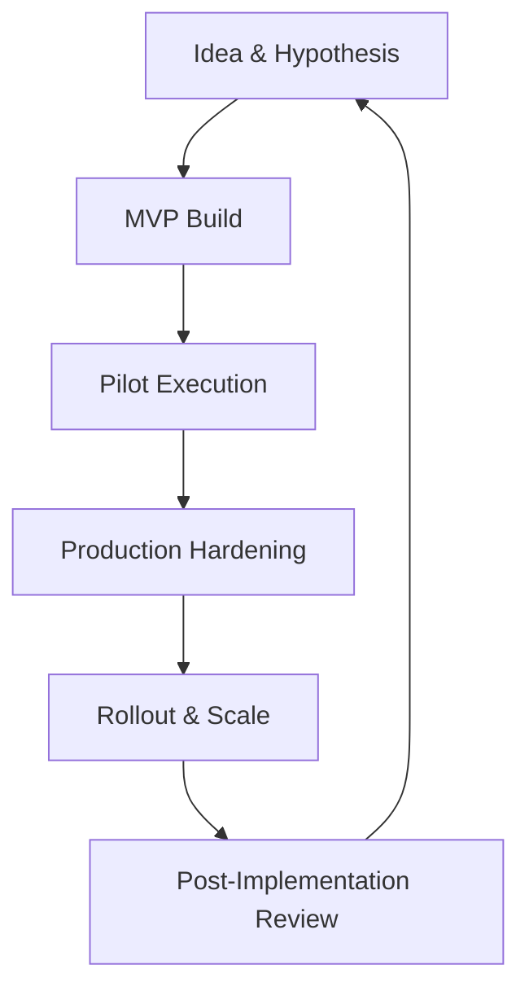

# Pilot Frameworks: From MVP to Production Rollout
_Sequencing pilots, gates, and rollouts to scale AI automation reliably._
**Author:** Cyber Income Innovators Editorial  |  **Date:** 2025-10-16  |  **Reading time:** ~15–18 min
**Tags:** ai automation, foundations, pilot design, phased rollout, acceptance criteria, change management

## TL;DR
- Use a structured MVP-to-Production Staircase Framework with defined gates, metrics, and risk checks to move from experiment to scale.
- Align pilots with business hypotheses, measurable success criteria, and clear rollback plans before writing code.
- Apply a worked rollout example for a contact-center AI copilot, including pilot cohort sizing, acceptance thresholds, and production cutover math.
- Balance trade-offs between speed and rigor by tiering pilots, investing in enablement, and sequencing change management.
- Maintain evidence—test results, adoption metrics, risk sign-offs—to satisfy governance and accelerate future rollouts.

## Introduction
Pilots are supposed to de-risk automation investments, yet many stall in "proof-of-concept purgatory" or create chaos when rushed into production. Automation leaders need a framework that marries experimentation with operational excellence. This article targets product owners, automation architects, and transformation leads tasked with moving AI-driven automations from MVP to enterprise rollout. We provide a reusable framework, gating checklists, worked calculations, and trade-offs to help you scale confidently.

## Why Pilots Fail and How to Prevent It
Common pilot pitfalls include misaligned success criteria, limited stakeholder buy-in, and insufficient production readiness.

### Undefined Success Metrics
Without quantifiable success metrics, teams debate outcomes endlessly. Harvard Business Review stresses selecting the right pilot with clear criteria and stakeholder alignment to avoid wasted effort.[^hbr]

### Technical Debt and Operational Gaps
Pilots that ignore security, observability, or support runbooks create liabilities during rollout. Gartner recommends treating pilots as production-intent initiatives, building security and compliance controls from day one.[^gartner]

### Change Management Blind Spots
Operators need training, documentation, and support to adopt automation. McKinsey found that companies integrating change management into pilots are 1.6x more likely to scale successfully.[^mckinsey]

## MVP-to-Production Staircase Framework
The Staircase Framework comprises five stages with explicit gates and deliverables.

### Stage 1: Idea & Hypothesis
- Define business problem, hypothesis, target metrics, and success thresholds.
- Identify stakeholders, impacted personas, and change risks.
- Document assumptions about data, integrations, and compliance requirements.

### Stage 2: MVP Build
- Develop minimum viable automation fulfilling critical user journeys.
- Implement baseline guardrails (authentication, logging, fallback modes).
- Create pilot playbooks and training materials.

### Stage 3: Pilot Execution
- Select pilot cohort (users, processes, geography). Limit to 5–15% of total volume to manage risk.
- Capture baseline metrics before activation.
- Run pilot for 4–8 weeks, collecting qualitative and quantitative feedback.

### Stage 4: Production Hardening
- Address pilot findings: performance tuning, UX adjustments, guardrail enhancements.
- Conduct security reviews, penetration tests, compliance validation, and resilience testing.
- Finalize support model, SLAs, and knowledge transfer to operations.

### Stage 5: Rollout & Scale
- Execute phased rollout plan (e.g., 25%-50%-100% volumes) with go/no-go checkpoints.
- Monitor adoption, performance, and incident metrics in near-real time.
- Document lessons learned and feed them into playbooks for future automations.

## Gate Criteria and Artifacts
Each gate requires artifacts demonstrating readiness.

| Gate | Key Questions | Required Artifacts |
|------|---------------|--------------------|
| G1: Idea Review | Does the hypothesis align with strategy and risk appetite? | Problem statement, success metrics, stakeholder map |
| G2: MVP Exit | Does MVP meet baseline functionality and guardrail requirements? | Test results, security checklist, playbooks |
| G3: Pilot Exit | Did pilot achieve success metrics? Are change impacts managed? | Pilot report, adoption metrics, risk assessment |
| G4: Hardening Exit | Are non-functional requirements satisfied? | Performance tests, compliance attestation, support plan |
| G5: Rollout Complete | Is automation stable at scale with governance sign-off? | Post-implementation review, monitoring dashboard, incident log |

## Worked Example: Contact-Center Copilot Rollout
A telecom provider is deploying an AI copilot to assist agents with customer interactions.

### Pilot Design
- **Hypothesis:** Copilot reduces average handle time (AHT) by 12% while maintaining customer satisfaction (CSAT) and compliance adherence.
- **Pilot Cohort:** 120 agents (10% of total) across two call centers.
- **Duration:** 6 weeks.
- **Success Metrics:** AHT reduction ≥10%, CSAT drop ≤1 point, compliance errors unchanged or improved, agent adoption ≥80%.
- **Risk Controls:** Human-in-the-loop approvals for credits >\$50, compliance monitoring of transcripts, rollback toggles.

### Pilot Results
- AHT reduced by 11.6% (baseline 7.5 minutes → 6.63 minutes).
- CSAT dipped 0.4 points (out of 5), within tolerance.
- Compliance errors dropped from 2.3% to 1.5% due to prompt reminders.
- Agent adoption 87% (measured via copilot usage per shift).

### Production Hardening Costs
- Additional training modules: \$45k.
- Monitoring and observability enhancements: \$60k.
- Security review and remediation: \$35k.
- Total hardening investment: \$140k.

### Rollout Economics
Projected annual benefit = AHT savings × call volume. Average monthly calls 2.4M; labor cost \$1.05 per minute. Annual savings ≈ 2.4M × 12 months × 7.5 minutes × 1.05 × 11.6% ≈ \$2.62M. Subtract annual run cost \$0.48M (licensing, support) ⇒ net \$2.14M. Pilot + hardening cost \$0.38M, payback ≈ 2.1 months. Rollout plan uses phased activation: 25% agents (week 1), 50% (week 3), 100% (week 6) with go/no-go reviews after each phase.

## Risk Management and Guardrails
Pilots must respect governance requirements.

### Risk Assessment Templates
Use risk matrices assessing impact vs. likelihood across operational, compliance, reputational dimensions. Align with NIST AI RMF to ensure governance coverage.[^nist]

### Guardrail Automation
Automate guardrails such as role-based access, audit logging, prompt filtering, and fallback workflows. Microsoft’s Responsible AI Standard recommends control owners monitor key risks continuously.[^microsoft]

### Rollback Strategy
Define rollback triggers (e.g., AHT increase >5%, compliance errors >3%, system latency >2 seconds). Maintain toggles or blue/green deployments for instant rollback.

## Change Management and Enablement
Pilots succeed when humans adopt the change.

### Stakeholder Engagement
Identify champions, skeptics, and impacted teams. Run readiness assessments and co-design sessions. Deloitte highlights that investing in workforce enablement during pilots improves adoption and satisfaction.[^deloitte]

### Training & Support
Provide targeted training: scenario simulations, knowledge articles, quick-reference guides. Establish support channels (chat, office hours) during rollout waves. Capture FAQs and update playbooks.

### Communications Plan
Use phased communications: announcement, pilot launch, midpoint updates, success stories, rollout readiness. Align with corporate change calendars to avoid overload.

## Monitoring and Evaluation Loops
Continuous evaluation sustains success.

### Metrics Suite
Track business metrics (AHT, CSAT), operational metrics (uptime, latency), and risk metrics (override rate, compliance incidents). Set thresholds aligned with pilot success criteria.

### Feedback Capture
Collect qualitative feedback via surveys, focus groups, and coaching sessions. Harvard Business Review recommends combining quantitative data with storytelling to align stakeholders.[^hbr]

### Continuous Improvement Cadence
Hold weekly pilot stand-ups during execution, biweekly improvement sprints during hardening, and monthly operating reviews post-rollout. Feed learnings into automation backlog and knowledge base.

## Trade-Offs and Deployment Strategies
Balancing speed and rigor requires deliberate decisions.

### Parallel vs. Sequential Pilots
Running multiple pilots in parallel accelerates learning but strains support resources. Sequential pilots provide focus but delay scale. Choose based on capacity and interdependencies.

### Big Bang vs. Phased Rollout
Big bang offers faster benefit but higher risk. Phased rollout reduces risk but extends realization. Use risk appetite, process criticality, and change capacity to decide.

### Internal Build vs. Vendor-Led Pilot
Internal builds offer flexibility but demand skilled teams. Vendor-led pilots bring expertise but may bias ROI claims. Require transparent data access and shared success metrics regardless of ownership.

### When Not to Scale
Do not progress when metrics miss thresholds without a remediation plan, when governance sign-offs are incomplete, or when support teams lack capacity. Pause, remediate, and revisit gates.

## Comparison Table
| Pilot Strategy | Strengths | Weaknesses | Best Fit | Watchouts |
|----------------|-----------|------------|----------|-----------|
| MVP-to-Production Staircase | Structured, repeatable, aligned with governance | Requires disciplined documentation, potential overhead | Enterprises managing multiple concurrent automations | Maintain executive sponsorship to enforce gates |
| Lean Experiment Loops | Fast iteration, minimal upfront investment | Limited governance, harder to scale | Early-stage exploration or innovation labs | Transition to formal framework before production |
| Vendor-Assisted Pilots | Access to accelerators, best practices | Risk of vendor lock-in, biased metrics | Organizations lacking internal expertise | Insist on joint governance and transparent data |
| Shadow Deployment | Real-world data without impacting users | Complex to maintain, limited change validation | High-risk processes needing extensive validation | Ensure production parity and monitoring |

## Diagram (Mermaid)

## Checklist / SOP
1. Document pilot hypothesis, success metrics, risk assessment, and stakeholder map; secure approval to proceed.
2. Build MVP with baseline guardrails, logging, and support documentation; complete security/privacy checklists.
3. Launch pilot with defined cohort and duration; capture baseline metrics and qualitative feedback.
4. Evaluate pilot results against success criteria; address gaps via hardening backlog with owners and timelines.
5. Complete production readiness reviews (security, compliance, performance, support); update runbooks and training.
6. Execute phased rollout with monitoring dashboards, go/no-go checkpoints, and documented lessons learned.

## Benchmarks
> Time to implement: 8–12 weeks from MVP build to full rollout for a medium-complexity automation
> Expected outcome: 10–20% faster automation scale-up with 30% fewer post-launch incidents
> Common pitfalls: Unclear success metrics, insufficient hardening, underinvested change management
> Rollback plan: Maintain feature toggles, revert to previous workflow, communicate rollback rationale, and schedule remediation sprint

## Sources
1. Harvard Business Review, "Don’t Let AI Projects Fail—Start with the Right Pilot." https://hbr.org/2020/04/dont-let-ai-projects-fail-start-with-the-right-pilot
2. Gartner, "Treat Automation Pilots as Production Intent." https://www.gartner.com/en/documents/4002125/treat-automation-pilots-as-production-intent
3. McKinsey & Company, "Unlocking Success in Digital Transformations." https://www.mckinsey.com/capabilities/people-and-organizational-performance/our-insights/unlocking-success-in-digital-transformations
4. NIST, "Artificial Intelligence Risk Management Framework (AI RMF 1.0)." https://nvlpubs.nist.gov/nistpubs/CSWP/NIST.AI.100-1.pdf
5. Microsoft, "Responsible AI Standard." https://query.prod.cms.rt.microsoft.com/cms/api/am/binary/RWMFIi
6. Deloitte, "Human-Centered Change for Digital Transformation." https://www2.deloitte.com/us/en/insights/topics/digital-transformation/human-centered-transformation.html
7. Accenture, "Scaling AI Effectively." https://www.accenture.com/us-en/insights/artificial-intelligence/scaling-ai
8. Google Cloud, "Site Reliability Engineering Workbook." https://sre.google/workbook/

## FAQ

### How large should a pilot cohort be?
Aim for 5–15% of the target population. Large enough to capture variance, small enough to manage risk. Adjust based on criticality and support capacity.

### What if the pilot succeeds on metrics but stakeholders still resist?
Diagnose root causes—training gaps, incentive misalignment, UX issues. Extend pilot or run targeted enablement before scaling. Success metrics alone do not guarantee adoption.

### How often should gates be revisited?
Review gates at least quarterly or when major changes occur (new regulations, architecture shifts). Continuous improvement of gate criteria keeps the framework relevant.

**Call to action:** Ready to move beyond proof-of-concept purgatory? Let’s architect your next automation rollout together.

[^hbr]: Harvard Business Review, "Don’t Let AI Projects Fail—Start with the Right Pilot."
[^gartner]: Gartner, "Treat Automation Pilots as Production Intent."
[^mckinsey]: McKinsey & Company, "Unlocking Success in Digital Transformations."
[^nist]: NIST, "Artificial Intelligence Risk Management Framework (AI RMF 1.0)."
[^microsoft]: Microsoft, "Responsible AI Standard."
[^deloitte]: Deloitte, "Human-Centered Change for Digital Transformation."
[^accenture]: Accenture, "Scaling AI Effectively."

## Resource and Budget Planning
Pilots require disciplined resource management.

### Capacity Planning
Estimate hours for engineering, design, QA, risk review, and change management per stage. Build capacity buffers (10–15%) for unexpected rework. Assign dedicated pilot leads to coordinate across functions.

### Budget Structure
Separate budgets for MVP build, pilot execution, hardening, and rollout. Include change management, enablement, and monitoring costs. Accenture notes that allocating 15–20% of automation budgets to adoption and monitoring increases long-term success.[^accenture]

### Vendor and Procurement Alignment
If vendors are involved, align contract milestones with gate criteria. Ensure statements of work include pilot exit criteria, data handling requirements, and knowledge transfer obligations.

## Pilot Data Strategy
Data readiness can make or break pilots.

### Data Acquisition and Labeling
Identify data sources, required features, and labeling needs early. Secure approvals for PII usage and anonymize where possible. Schedule data ingestion and labeling timelines within the pilot plan.

### Sandbox Environments
Use isolated environments mirroring production integrations to reduce deployment risk. Implement synthetic or masked data for testing while validating with limited real data under strict controls.

### Data Monitoring During Pilot
Monitor data drift, latency, and quality throughout the pilot. If metrics degrade, pause the pilot and remediate before resuming to avoid misleading conclusions.

## Stakeholder Governance and Communication
Engage stakeholders consistently across the staircase stages.

### Steering Committee
Establish a steering committee with executive sponsors, product owners, risk, and operations. Meet biweekly during pilots to review progress, risks, and decisions. Document minutes and action items.

### Pilot Playbooks
Create detailed playbooks covering user personas, workflows, guardrails, troubleshooting, and escalation. Update after pilot learnings to support rollout teams.

### Communication Cadence
Use structured updates: weekly status emails, biweekly demos, and monthly executive briefings. Provide transparent metrics and decision logs to maintain trust.

## Advanced Metrics and Evaluation Techniques
Move beyond simple success metrics to capture holistic outcomes.

### Leading and Lagging Indicators
Track leading indicators (feature usage, model confidence, training completion) alongside lagging indicators (financial impact, CSAT). Leading indicators provide early signals to adjust pilots before major issues occur.

### Control Groups and A/B Testing
When feasible, run control groups to compare against pilot cohorts. Measure statistical significance of improvements. Google’s SRE guidance advocates controlled rollouts to reduce risk and quantify impact.[^googleSRE]

### Qualitative Insights
Collect narrative insights via structured interviews and observation. Document friction points, workarounds, and emotional responses. Combine with quantitative data to create a comprehensive evaluation report.

## Risk Scenario Simulations
Simulate adverse scenarios before rollout.

### Tabletop Exercises
Conduct tabletop exercises with cross-functional teams simulating incidents like model failure, data breach, or regulatory inquiry. Evaluate response readiness and adjust plans.

### Chaos Testing
Introduce controlled failures (latency spikes, API errors) during pilot or hardening to test resilience. Ensure rollback mechanisms operate as expected.

### Compliance Stress Tests
Review compliance posture under worst-case scenarios (e.g., mass customer complaints). Verify documentation and escalation workflows meet regulatory expectations.

## Scaling Playbooks and Knowledge Management
Document learnings to accelerate future pilots.

### Playbook Library
Store templates for hypotheses, test plans, gate checklists, and communication materials in a central repository. Tag by automation domain and risk level.

### Communities of Practice
Create pilot guilds or chapters to share lessons, metrics, and tooling across teams. Host quarterly showcases to celebrate successes and surface challenges.

### Retrospectives and Continuous Improvement
Hold retrospectives after each stage (MVP exit, pilot exit, rollout). Document action items, owners, and deadlines. Update the staircase framework based on feedback.

## Sector-Specific Pilot Considerations
Different industries impose unique requirements.

### Healthcare
Ensure pilots align with HIPAA and clinical validation requirements. Include clinical governance boards and patient safety reviews in gate decisions.

### Financial Services
Coordinate with model risk management, compliance, and audit. Apply heightened monitoring for bias, explainability, and record retention.

### Manufacturing
Incorporate OT (operational technology) teams to address equipment integration, safety protocols, and maintenance windows. Run pilots during controlled production shifts.

### Retail and E-commerce
Plan for peak season moratoriums; avoid rollouts during critical sales periods. Align with marketing and customer service to manage messaging and support.

## International Rollout Considerations
Global organizations face regional differences.

### Localization
Adapt automations for language, regulatory, and cultural nuances. Localize training materials, prompts, and guardrails.

### Data Residency
Ensure pilot environments comply with regional data residency laws. Coordinate with data teams to provision regional infrastructure where required.

### Regulatory Alignment
Map local regulatory requirements (e.g., EU AI Act, Singapore’s AI Verify) to gate criteria. Engage local compliance leads early.

## Extended Worked Example: Scaling the Copilot
Following a successful rollout, the telecom provider plans expansion to additional regions.

### Regional Adaptation
- Translate prompts into Spanish and French with localized compliance checks.
- Update knowledge base content to reflect regional offers and regulations.
- Train 80 new supervisors as adoption coaches.

### Metrics During Scale
- Track adoption by region; require ≥85% usage within four weeks.
- Monitor regulatory compliance incidents; target zero high-severity findings.
- Measure employee NPS before and after rollout; aim for +10 improvement.

### Financial Outlook
Expansion covers 600 additional agents. Expected incremental savings = \$2.62M × (600/1200) ≈ \$1.31M annually after adjusting for currency and labor rates. Additional enablement cost \$220k; monitoring upgrades \$90k. Payback remains under four months.

## Trade-Off Deep Dive

### Rapid Iteration vs. Enterprise Stability
Small teams may push for continuous releases; enterprises require scheduled gates. Use feature flags and progressive delivery to reconcile speed with control.

### Pilot Depth vs. Breadth
Deep pilots validate complex scenarios but delay learning across domains. Breadth pilots surface more opportunities but risk shallow insights. Balance by running one deep pilot and several lightweight probes per quarter.

### Automation Scope Creep
Guard against scope creep by freezing requirements at each gate. Evaluate change requests through a formal process assessing impact on timeline, budget, and risk.

## Alignment with Organizational Strategy
Ensure pilots reinforce strategic objectives.

### Portfolio Integration
Map pilot outcomes to strategic themes (customer experience, risk reduction, growth). Present contributions in executive portfolio reviews.

### Funding Models
Adopt stage-gated funding: release budgets as pilots meet gate criteria. Finance teams appreciate transparency and can reallocate funds quickly when pilots underperform.

### Talent Development
Use pilots to upskill teams in AI, automation platforms, and change management. Document competencies gained and integrate into career paths.

[^googleSRE]: Google, "Site Reliability Engineering Workbook." https://sre.google/workbook/
