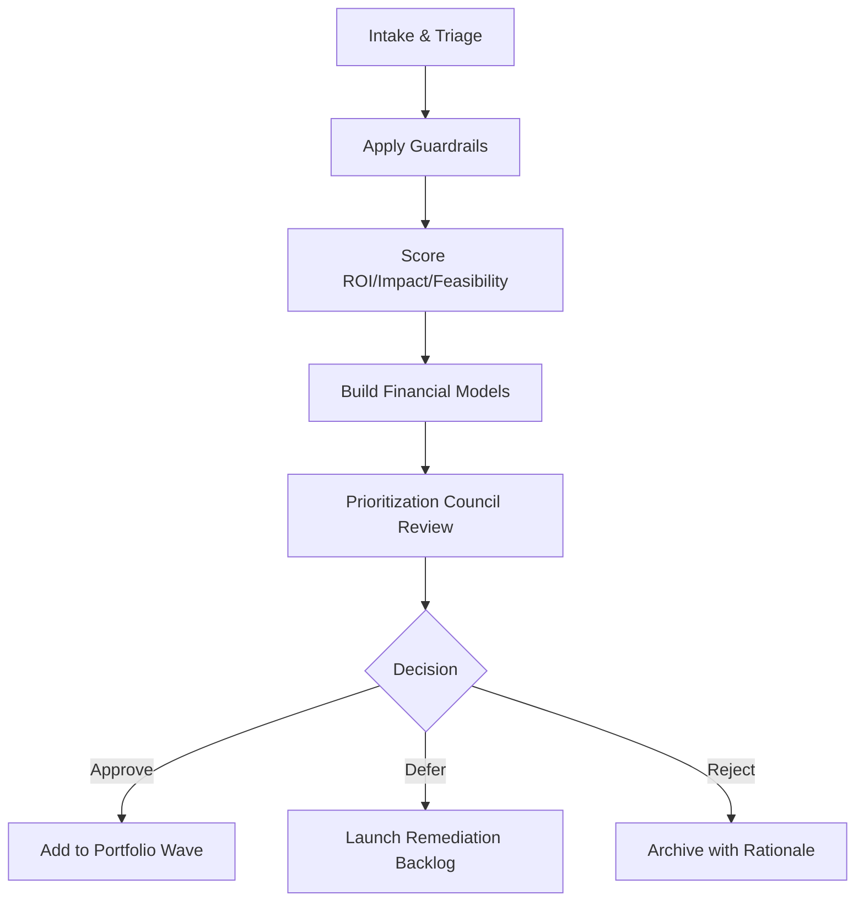

# Selecting Automation Use Cases: ROI, Impact & Feasibility That Hold Up
_Critical filters to pick automation bets that deliver resilient returns._
**Author:** Cyber Income Innovators Editorial  |  **Date:** 2025-10-16  |  **Reading time:** ~15–18 min
**Tags:** ai automation, foundations, automation roi, feasibility scoring, portfolio prioritization, payback models

## TL;DR
- Anchor use-case selection in a structured ROI-Impact-Feasibility Framework that quantifies value, delivery effort, and risk exposure with transparent assumptions.
- Combine economic modeling (NPV, payback, sensitivity) with qualitative guardrails (ethics, compliance, change readiness) before green-lighting automation investments.
- Apply a worked scoring example to test numbers for a multi-process intake program, illustrating probability-weighted returns and capital allocation thresholds.
- Use data readiness, stakeholder appetite, and technical dependencies as feasibility multipliers rather than binary go/no-go gates.
- Recognize trade-offs between quick wins and platform investments, automation vs. augmentation, and central vs. local prioritization councils.

## Introduction
Successful automation portfolios depend on disciplined use-case selection. Leaders often face hundreds of candidate processes pitched by business units, vendors, or innovation labs. Without a repeatable framework, teams end up chasing "shiny object" pilots with weak economics or high-risk exposure. This article equips automation strategists, product owners, and finance partners with a robust toolkit to evaluate, rank, and approve AI automation use cases. We cover a reusable scoring framework, economic modeling techniques, feasibility diagnostics, and hard trade-offs. Expect to leave with templates, calculations, and governance guidance to avoid sunk-cost traps.

## Establishing Evaluation Guardrails
Before scoring individual candidates, define enterprise guardrails. These guardrails shape decision rights and screen out misaligned opportunities early.

### Strategic Alignment Criteria
Clarify which corporate objectives the automation program supports—customer experience, cost optimization, revenue growth, risk mitigation. McKinsey found that automation at scale succeeds when it targets a handful of value pools aligned with leadership priorities rather than scattershot experiments.[^mckinseyautomation]

### Risk and Compliance Filters
Use risk appetite statements to flag processes that require elevated scrutiny. Any use case touching personal data, regulated decisions, or safety-critical operations should include mandatory human oversight and model validation. The NIST AI Risk Management Framework recommends mapping contextual risks before deploying AI-enabled automation.[^nist]

### Change Capacity and Sponsorship
Assess the readiness of business owners to absorb change. Deloitte advises establishing sponsorship coalitions to ensure adoption before committing development resources.[^deloitteops] If the target function lacks bandwidth for training and process redesign, downgrade the use case despite attractive economics.

## ROI-Impact-Feasibility Scoring Framework
The ROI-Impact-Feasibility Framework blends quantitative and qualitative signals into a comparable score for each candidate.

### Step 1: Define Evaluation Dimensions
Use five primary dimensions:
1. **Financial ROI** – annual recurring benefit (cost reduction, revenue, avoidance) minus run costs.
2. **Impact Quality** – effect on customer satisfaction, compliance quality, and strategic differentiation.
3. **Feasibility** – data readiness, process stability, technology availability, integration complexity.
4. **Risk Exposure** – operational, ethical, and regulatory risks; availability of guardrails.
5. **Change Readiness** – stakeholder sponsorship, workforce acceptance, change capacity.

Each dimension receives a 1–5 score. Weight Financial ROI and Feasibility at 25% each, Impact Quality and Risk Exposure at 20% each, and Change Readiness at 10%. Adjust weights to reflect enterprise strategy.

### Step 2: Quantify Financial Value
Estimate baseline volumes, current unit costs, error rates, and revenue impacts. Use conservative assumptions: apply a 0.7 multiplier to projected savings until automation performance is proven. Reference Forrester’s Total Economic Impact methodology to capture benefits, costs, flexibility, and risk adjustments.[^forrester]

### Step 3: Assess Feasibility Multipliers
Score data quality (complete, timely, structured), process standardization, and technical dependencies. Feasibility is calculated as the product of sub-scores normalized to 1–5. If any sub-score is below 2, flag as high risk requiring remediation.

### Step 4: Evaluate Risk Exposure and Guardrails
Use checklists from NIST SP 1270 to assess bias, explainability, and accountability requirements.[^nist1270] Identify mandatory controls such as human-in-the-loop, audit logging, or model monitoring.

### Step 5: Gauge Change Readiness
Survey stakeholders for appetite, map training needs, and estimate change management effort. Bain research shows automation programs with integrated change plans are twice as likely to hit adoption targets.[^bain]

### Step 6: Calculate Composite Score and Prioritize
Composite Score = Σ(weight × dimension score). Establish thresholds: prioritize use cases scoring ≥3.5, subject to capacity and sequencing constraints. Maintain a heatmap to visualize the portfolio across value and feasibility.

## Worked Example: Multi-Process Intake Prioritization
A business process outsourcing (BPO) firm wants to automate four intake processes within a healthcare client portfolio: eligibility verification, prior authorization triage, claims intake, and provider onboarding. The goal is to reduce cycle time and rework costs while preserving compliance.

### Assumptions
- Baseline volumes per month: Eligibility (45k), Prior Authorization (18k), Claims Intake (60k), Provider Onboarding (8k).
- Current unit cost: Eligibility \$4.60, Prior Authorization \$7.80, Claims Intake \$3.90, Provider Onboarding \$12.40.
- Automation target: 50% touch reduction for Eligibility and Claims, 35% for Prior Authorization, 25% for Provider Onboarding.
- Automation build cost: Eligibility \$0.8M, Prior Authorization \$1.2M, Claims Intake \$1.1M, Provider Onboarding \$0.5M.
- Annual run cost: 20% of build cost.
- Benefit probability adjustment: Eligibility 0.8, Prior Authorization 0.6, Claims 0.75, Provider Onboarding 0.65 due to data variation.

### Financial Modeling
Annual benefit (without risk adjustment) = volume × unit cost × touch reduction × 12 months. For Eligibility: 45,000 × 4.60 × 0.5 × 12 ≈ \$1.242M. Apply probability (0.8) to get \$0.994M. Net annualized benefit subtracting run cost (0.16M) equals \$0.834M. Calculate payback: build cost \$0.8M ÷ \$0.834M ≈ 0.96 years.

Repeat:
- Prior Authorization: benefit 18,000 × 7.80 × 0.35 × 12 = \$0.589M; probability 0.6 ⇒ \$0.353M; net after run cost (0.24M) = \$0.113M; payback ≈ 10.6 years.
- Claims Intake: benefit 60,000 × 3.90 × 0.5 × 12 = \$1.404M; probability 0.75 ⇒ \$1.053M; net after run cost (0.22M) = \$0.833M; payback ≈ 1.32 years.
- Provider Onboarding: benefit 8,000 × 12.40 × 0.25 × 12 = \$0.297M; probability 0.65 ⇒ \$0.193M; net after run cost (0.10M) = \$0.093M; payback ≈ 5.38 years.

### Scoring Summary
| Process | Financial ROI (1-5) | Impact Quality (1-5) | Feasibility (1-5) | Risk Exposure (1-5)* | Change Readiness (1-5) | Weighted Score |
|---------|---------------------|----------------------|-------------------|----------------------|------------------------|----------------|
| Eligibility Verification | 4.5 | 4 | 3.5 | 3 | 4 | 3.95 |
| Prior Authorization | 2 | 3.5 | 2.5 | 2.5 | 2.5 | 2.45 |
| Claims Intake | 4 | 4.5 | 3 | 3.5 | 3.5 | 3.70 |
| Provider Onboarding | 2.5 | 3 | 2 | 3 | 3 | 2.75 |

\*Risk Exposure score inverted (5 = low risk, 1 = high risk) and weighted accordingly.

The firm selects Eligibility and Claims Intake for Wave 1. Prior Authorization is deferred pending data cleanup and guardrail design; Provider Onboarding becomes a low-priority exploratory effort. Finance sets capital allocation thresholds: minimum net annual benefit of \$0.5M and payback under 24 months, aligning with corporate hurdle rates.

## Feasibility Diagnostics and Data Readiness
Feasibility is often misunderstood as a binary decision. Treat it as a set of multipliers that either accelerate or drag value realization.

### Data Health Checklist
- **Completeness:** Are required fields populated ≥95% of the time? If not, invest in data remediation before automation.
- **Timeliness:** Are source systems delivering data within latency tolerances? For real-time routing, even minutes matter.
- **Accessibility:** Are APIs or data feeds available with appropriate authentication and privacy controls? If not, add integration work to the scope.
- **Quality Monitoring:** Plan for ongoing quality checks; MIT Sloan stresses that AI programs need continuous data quality monitoring to maintain ROI.[^mitsloan]

### Process Stability Assessment
Use process mining or manual time studies to confirm variance and exceptions. High variance processes often require reengineering prior to automation. Document standard operating procedures and exception paths.

### Technical Dependencies
Identify required platforms—OCR, workflow engines, RPA, LLMs, integration hubs. Verify licensing, capacity, and support. IBM advises validating architecture compatibility early to avoid rework during build.[^ibm]

## Sensitivity Analysis and Scenario Planning
Economic models must hold under different assumptions.

### Tornado Analysis
Create a tornado chart showing the impact of changes in volume, accuracy improvements, benefit probability, and run cost. For example, if Claims Intake benefit probability drops from 0.75 to 0.5, net annual benefit decreases to \$0.562M, extending payback to 1.96 years. Decide whether the use case still meets hurdle rates.

### Monte Carlo Simulation
Run Monte Carlo scenarios with 1,000 iterations varying key inputs within defined ranges. Capture the distribution of NPV and identify the 5th percentile to gauge downside risk. Gartner recommends scenario analysis for automation portfolios to inform budgeting and guardrail decisions.[^gartner]

### Portfolio Balance
Ensure the pipeline balances quick wins with strategic platform investments. Accenture notes that blending efficiency plays with revenue-generating automations increases long-term ROI by diversifying benefits.[^accenture]

## Governance and Decision Rights
Transparent governance prevents lobbying and maintains trust in prioritization outcomes.

### Prioritization Council
Form a council with representation from business units, technology, risk, finance, and change management. Set meeting cadences (monthly tactical, quarterly strategic). Require pre-read dossiers summarizing ROI, feasibility, and guardrail plans.

### Evidence Repository
Maintain a repository of scoring sheets, economic models, and approval decisions. This audit trail supports future reviews and meets regulatory expectations for explainability.[^nist]

### Kill-or-Scale Triggers
Define leading indicators (data quality degradation, adoption drop, risk incidents) that trigger re-evaluation. Use red-yellow-green status to communicate whether to continue, pause, or sunset a use case.

## Trade-Offs and When to Walk Away
Recognize situations where even promising economics should not drive deployment.

### Quick Wins vs. Platform Bets
Quick wins deliver fast ROI but may offer limited scalability. Platform bets demand larger upfront investment but unlock multiple use cases. Balance by allocating 60% of capacity to quick wins and 40% to enablers, revisiting quarterly.

### Automation vs. Augmentation
Not every process warrants full automation. Some benefit more from human augmentation (e.g., AI copilots). Bain suggests using augmentation when processes require nuanced judgment and customer empathy.[^bain]

### Central vs. Local Prioritization
Central governance ensures consistency, but local teams understand domain context. Hybrid models assign final approval to a central council while allowing business units to propose and co-score use cases. Walk away if stakeholders refuse to engage in shared decision making or if data ownership disputes remain unresolved.

### When Not to Automate
Decline use cases when:
- Data privacy or ethical risks exceed acceptable thresholds.
- Expected ROI fails sensitivity tests under conservative scenarios.
- Change capacity is already saturated due to concurrent transformations.
- Process redesign could deliver similar benefits at lower cost.

## Comparison Table
| Framework | Core Focus | Strengths | Weaknesses | Best Use Case |
|-----------|------------|-----------|------------|---------------|
| ROI-Impact-Feasibility (this article) | Balanced financial, qualitative, risk factors | Transparent weights, integrates change readiness, adaptable | Requires data collection effort, subjective scoring possible | Enterprise portfolio intake across multiple domains |
| Lean Six Sigma Prioritization Matrix | Defects and process variation | Strong for manufacturing/operations, data-driven | Less emphasis on strategic differentiation or ethics | Processes with rich defect metrics |
| Forrester TEI | Economic impact (benefits, costs, flexibility, risk) | Financial rigor, widely accepted by CFOs | Limited guidance on feasibility or change management | Vendor-backed business cases, major capital approvals |
| Gartner Value Assessment | Business value and complexity | Provides market benchmarks, aligns with hyperautomation roadmap | Access may require subscription, may underweight qualitative change factors | Organizations seeking industry comparisons |

## Diagram (Mermaid)

## Checklist / SOP
1. Define enterprise guardrails: strategic objectives, risk appetite statements, change capacity constraints.
2. Collect baseline data for each candidate: volumes, unit costs, error rates, revenue impact, data quality metrics.
3. Score candidates using the ROI-Impact-Feasibility Framework with agreed weights and documented assumptions.
4. Build financial models (NPV, payback, sensitivity) incorporating probability adjustments and run costs.
5. Convene the prioritization council to review scores, guardrail plans, and sensitivity outcomes; document decisions.
6. Update the portfolio roadmap and remediation backlog; communicate outcomes and rationale to stakeholders.

## Benchmarks
> Time to implement: 4–6 weeks to stand up scoring framework and evaluate initial pipeline
> Expected outcome: 20–30% improvement in automation ROI capture versus ad hoc selection
> Common pitfalls: Incomplete data, stakeholder bias in scoring, ignoring change capacity
> Rollback plan: Pause approvals, refresh data baselines, retrain scorers, and rerun sensitivity analyses before resuming decisions

## Sources
1. McKinsey & Company, "Automation at Scale: The Prize and the Pitfalls." https://www.mckinsey.com/capabilities/operations/our-insights/automation-at-scale-the-prize-and-the-pitfalls
2. NIST, "Artificial Intelligence Risk Management Framework (AI RMF 1.0)." https://nvlpubs.nist.gov/nistpubs/CSWP/NIST.AI.100-1.pdf
3. Deloitte, "Automation with Intelligence: Reimagining the Future of Work." https://www2.deloitte.com/us/en/insights/focus/cognitive-technologies/intelligent-automation-operations.html
4. Forrester, "The Total Economic Impact™ Methodology." https://www.forrester.com/blogs/the_total_economic_impact_teiof_software_and_technology_investments/
5. Bain & Company, "Getting Automation Right in Service Operations." https://www.bain.com/insights/getting-automation-right-in-service-operations/
6. MIT Sloan Management Review, "Measuring the Business Impact of AI." https://sloanreview.mit.edu/article/measuring-the-business-impact-of-ai/
7. IBM, "IBM Cloud Pak for Business Automation Architecture Considerations." https://www.ibm.com/docs/en/cloud-paks/cp-biz-automation/21.0.3?topic=overview-architecture
8. Gartner, "Use Scenario Planning to Prioritize Hyperautomation Opportunities." https://www.gartner.com/en/documents/4001112/use-scenario-planning-to-prioritize-hyperautomation-oppor
9. Accenture, "The Automation Advantage." https://www.accenture.com/us-en/insights/technology/intelligent-automation
10. Gartner, "Establish a Value Realization Office to Ensure Digital Investments Deliver Results." https://www.gartner.com/en/documents/4001803/establish-a-value-realization-office-to-ensure-digital
11. Princeton University Press, "Investment Under Uncertainty." https://press.princeton.edu/books/paperback/9780691034102/investment-under-uncertainty

## FAQ

### How often should we refresh use-case scores?
Refresh quarterly or whenever material changes occur (e.g., process redesign, regulatory changes, new data availability). Ensure historical scores remain accessible for audit purposes.

### What if the business disagrees with the scoring outcome?
Invite stakeholders to provide additional evidence or challenge assumptions, but require documented data before adjusting scores. Maintain an escalation path to the prioritization council chair.

### How do we handle vendor-proposed ROI claims?
Independently validate vendor claims using internal data and the same framework. Adjust benefits with conservative probability multipliers until production performance proves the assumptions.

**Call to action:** Want a defensible automation investment backlog? Book a portfolio scoring workshop with our team.

[^mckinseyautomation]: McKinsey & Company, "Automation at Scale: The Prize and the Pitfalls."
[^nist]: NIST, "Artificial Intelligence Risk Management Framework (AI RMF 1.0)."
[^deloitteops]: Deloitte, "Automation with Intelligence: Reimagining the Future of Work."
[^forrester]: Forrester, "The Total Economic Impact™ Methodology."
[^nist1270]: NIST, "Towards a Standard for Identifying and Managing Bias in Artificial Intelligence."
[^bain]: Bain & Company, "Getting Automation Right in Service Operations."
[^mitsloan]: MIT Sloan Management Review, "Measuring the Business Impact of AI."
[^ibm]: IBM, "IBM Cloud Pak for Business Automation Architecture Considerations."
[^gartner]: Gartner, "Use Scenario Planning to Prioritize Hyperautomation Opportunities."
[^accenture]: Accenture, "The Automation Advantage."
[^gartnervalue]: Gartner, "Establish a Value Realization Office to Ensure Digital Investments Deliver Results."
[^realoptions]: Princeton University Press, "Investment Under Uncertainty."

## Advanced ROI Modeling Techniques
Quantitative rigor separates credible business cases from optimistic wish lists. Go beyond basic payback calculations to capture risk and optionality.

### Real Options Thinking
View automation initiatives as staged investments. Initial discovery and MVP work buy the right—but not the obligation—to invest in full deployment. Use real options logic to assign value to learning. For example, a \$300k discovery phase that reduces uncertainty on a \$4M transformation can justify itself if the probability of success improves by even 10–15%.[^realoptions] Finance teams familiar with capital budgeting appreciate explicit option valuation, making automation proposals more competitive against other investments.

### Cost-to-Serve Decomposition
Disaggregate benefits into cost-to-serve components: labor, rework, technology spend, and leakage (e.g., revenue lost due to errors). Mapping benefits to specific cost lines makes it easier for finance to validate numbers and reconcile with financial statements. MIT Sloan recommends linking AI initiatives to P&L line items to secure executive trust.[^mitsloan]

### Scenario-Weighted NPV
Build discounted cash flow models using multiple scenarios—optimistic, base, pessimistic. Assign probabilities and compute expected NPV. Include residual value for platform investments that enable future use cases. Document assumptions transparently to simplify audits and retrospective learning.

## Stakeholder Alignment and Governance
Scoring frameworks fail without aligned stakeholders willing to act on outcomes.

### Cross-Functional Workshops
Run alignment workshops with business owners, finance, risk, and IT to review scoring criteria, weights, and definitions. Use anonymized historical use cases to calibrate scoring consistency. Record decisions and rationales to reduce future disputes.

### Transparency and Communication
Publish prioritization results in a shared dashboard including rationale, expected value, and next steps. Provide channels for feedback and appeals with data-driven requirements. Transparent communication builds trust and reduces backdoor lobbying.

### Capability Building
Train evaluators on economics, risk assessment, and bias mitigation. Rotate evaluators periodically to avoid capture by any single function. Establish a "prioritization guild" responsible for evolving the framework based on lessons learned and regulatory updates.

## Integration with Delivery and Change Management
Selection is only half the battle; execution teams need context and support.

### Discovery-to-Delivery Handover
Create handover packets summarizing scoring results, assumptions, risk mitigations, and stakeholder expectations. Include data readiness assessments and change management plans. This ensures delivery teams understand the business case they must protect.

### Change Impact Forecasting
Model change impacts alongside financial benefits. Estimate training hours, communications events, and support staffing. Deloitte advocates integrating change budgets into business cases so investments are realistic.[^deloitteops]

### Retrospective Learning
After deployment, compare actual results with predicted benefits and feasibility scores. Capture deltas in a knowledge base; adjust scoring weights or guardrails accordingly. Over time, this closed loop increases predictive accuracy and accountability.

## Sector-Specific Considerations
Different industries require tailored scoring nuances.

### Financial Services
Add risk weighting for regulatory scrutiny, model risk, and reputational impact. Align with OCC or ECB guidelines. Consider capital adequacy implications when automation affects credit or liquidity processes.

### Healthcare and Life Sciences
Prioritize patient safety, HIPAA compliance, and clinical validation. Incorporate clinical risk assessments and evidence thresholds before approving use cases.

### Manufacturing and Supply Chain
Factor in physical automation dependencies, safety compliance, and downtime costs. Include maintenance schedules and asset lifecycle impacts within feasibility scoring.

### Public Sector
Include policy mandates, equity impacts, and transparency requirements. Engage ethics boards early and incorporate citizen experience metrics into impact scoring.

## Continuous Portfolio Optimization
Prioritization is dynamic; treat the pipeline like a living portfolio.

### Rolling Wave Planning
Reassess portfolio every quarter. Introduce new use cases, retire outdated ones, and re-score based on new data. Maintain capacity buffers for emergent opportunities with high strategic value.

### Value Realization Tracking
Pair selection with post-implementation value tracking dashboards. Gartner’s value realization office concept ensures benefits remain visible and informs future prioritization.[^gartnervalue]

### Governance Escalation
Define escalation paths when a high-priority use case stalls due to data issues or resource conflicts. Senior sponsors should reallocate resources or adjust scope quickly to preserve momentum.

[^realoptions]: Avinash K. Dixit and Robert S. Pindyck, "Investment Under Uncertainty." Princeton University Press.
