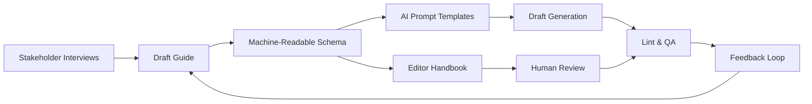

TL;DR
- Document brand voice, structure, and sourcing rules in machine-readable formats for AI assistants and human editors.
- Encode compliance requirements—disclosures, accessibility, legal phrasing—so AI outputs stay within policy.
- Continuously audit AI-generated drafts against the guide, updating patterns as markets and regulations evolve.

## Establish Brand Voice Guidelines
Interview stakeholders to define tone, persona, vocabulary, and taboo phrases. Provide positive and negative examples. Encode rules in JSON or YAML so AI prompt templates can enforce them. For each content type (guides, emails, scripts), specify expected structure and CTA style.

### Source Attribution Standards
Clarify acceptable sources, citation formats, and minimum number of references. Include policies on primary vs secondary sources and when to request SME validation. Require AI drafts to include placeholder citations that editors verify.

## Compliance and Accessibility
List regulatory requirements: FTC disclosures for affiliates, GDPR consent language, ADA accessibility guidelines. Provide copy blocks and macros that AI should use when relevant. Include instructions for alt text, heading hierarchy, and inclusive language.

### Machine-Readable Delivery
Host the style guide in a repository accessible via API or CDN. Provide versioning and changelog entries. Offer SDK snippets for prompting frameworks (PromptLayer, LangChain) so orchestrators can fetch the latest rules automatically.

## Enforcement and QA
Build automated checklists using linting tools (Vale, alex.js) to flag deviations. Run checks during drafting and pre-publication. Track compliance metrics—percent drafts requiring major edits, number of policy violations. Share dashboards with content leadership.

### Continuous Improvement
Collect feedback from editors on recurring AI mistakes. Update rules, add new examples, and refine prompts. Align updates with the automation governance council to ensure cross-functional buy-in.

## Comparison Table
| Section | What It Covers | Format | Owner | Update Cadence |
| --- | --- | --- | --- | --- |
| Voice & Tone | Persona, vocabulary | JSON/YAML | Editorial lead | Quarterly |
| Structure Templates | Outlines, CTAs | MDX snippets | Content ops | Monthly |
| Compliance Blocks | Legal disclosures, policies | Markdown, macros | Legal/Compliance | As needed |
| QA Rules | Linting patterns | Vale config | QA lead | Monthly |

## Diagram

## Checklist
- [ ] Capture brand voice, tone, and taboo phrases with examples.
- [ ] Define sourcing, citation, and SME review requirements.
- [ ] Document compliance and accessibility mandates with reusable blocks.
- [ ] Publish machine-readable schemas and integrate with AI prompting frameworks.
- [ ] Run automated linting and collect feedback to update the guide.

> **Benchmarks**
> - Time to implement: 2 weeks to codify the style guide and integrate linting. [Estimate]
> - Expected outcome: 60% reduction in editorial revision time on AI-assisted drafts. [Estimate]

## Internal Links
- [Use the content brief generator to embed style rules into briefs automatically.](../content-factory-distribution/content-brief-generator.mdx)
- [Coordinate compliance blocks with the affiliate offers article.](../monetization-analytics/affiliate-offers-that-fit.mdx)
- [Align governance updates with the automation governance operating model.](../ai-automation-foundations/automation-governance-operating-models.mdx)
- [Share linting workflows with the CI guide for content repos.](../devops-for-creators/ci-for-content-repos.mdx)

## Sources
- [APA style guidelines](https://apastyle.apa.org/style-grammar-guidelines)
- [OpenAI usage policies](https://openai.com/policies/usage-policies)
