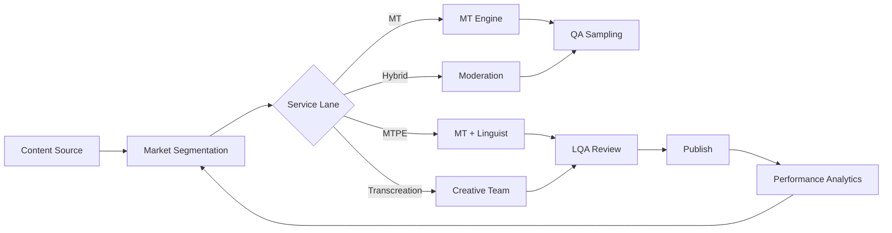

TL;DR
- Triage content by market impact and complexity to decide between machine translation, post-editing, or full transcreation.
- Build localization kits with terminology, tone guidance, and cultural notes to keep voice consistent.
- Track quality metrics—LQA scores, turnaround time, conversion impact—to optimize vendors and AI models.

## Market Prioritization
Segment markets by revenue potential, regulatory complexity, and localization maturity. Map content types (product pages, support docs, campaigns) to service levels. High-value markets may require full transcreation, while low-volume markets can rely on MT plus light review.

### Localization Kits
Create kits containing glossaries, forbidden terms, brand voice samples, and sample translations. Include locale-specific formatting rules (date, currency, honorifics). Host kits in a central repository accessible to agencies, freelancers, and AI prompt templates.

## Workflow Design
Design a multi-lane workflow: machine translation (MT-only), MT with post-editing (MTPE), and human transcreation. Use AI to pre-translate content and route to linguists for review based on SLA. For user-generated content, integrate moderation steps before translation.

### Tooling Integration
Connect your CMS, translation management system (TMS), and automation platforms via APIs. Automate content export/import, status updates, and quality checks. Use n8n workflows to trigger translation jobs when new content is published.

## Quality Assurance
Implement localization quality assurance (LQA) scoring using frameworks like MQM. Track error categories (terminology, grammar, style) and feed insights back to translators and AI models. Use evaluation loops to compare AI drafts against human references.

### Performance Measurement
Monitor localization ROI by tracking localized page traffic, conversions, and support ticket deflection. Compare results to markets using English-only content. Adjust service levels if ROI doesn't justify cost.

## Comparison Table
| Service Lane | Use Case | Turnaround | Cost | QA Level |
| --- | --- | --- | --- | --- |
| MT-only | Low-risk support FAQs | Hours | Low | Automated spot checks |
| MTPE | Mid-tier product updates | 1–2 days | Medium | Linguist review |
| Transcreation | Campaign headlines | 3–5 days | High | Full LQA + stakeholder sign-off |
| Hybrid | User-generated content | Near real-time | Medium | Moderation + sampling |

## Diagram

## Checklist
- [ ] Prioritize markets and assign service levels based on impact and complexity.
- [ ] Build localization kits with glossaries, formatting rules, and cultural notes.
- [ ] Integrate CMS, TMS, and automation workflows for seamless job routing.
- [ ] Implement LQA scoring and feedback loops for translators and AI models.
- [ ] Measure localization ROI and adjust service lanes accordingly.

> **Benchmarks**
> - Time to implement: 4 weeks to stand up localization kits, workflows, and LQA tracking. [Estimate]
> - Expected outcome: 3x faster localization cycles with consistent brand voice across priority markets. [Estimate]

## Internal Links
- [Use the AI editorial style guide to align tone across locales.](../content-factory-distribution/ai-editorial-style-guide.mdx)
- [Feed localized briefs from the content brief generator.](../content-factory-distribution/content-brief-generator.mdx)
- [Sync translation triggers through the n8n queue with Redis workflow.](../n8n-workflows-integrations/n8n-queues-with-redis-webhooks.mdx)
- [Report localization ROI alongside attribution dashboards.](../monetization-analytics/attribution-for-creators.mdx)

## Sources
- [W3C internationalization authoring techniques](https://www.w3.org/International/techniques/authoring-html)
- [Phrase on localization quality assurance](https://phrase.com/blog/posts/localization-quality-assurance/)
