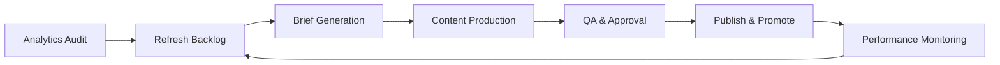

TL;DR
- Use analytics and search console data to identify declining evergreen pages and map refresh priorities.
- Generate AI-assisted update briefs that capture SERP intent changes, competitor gaps, and internal link opportunities.
- Relaunch refreshed content with QA, structured data checks, and distribution tactics to regain momentum.

## Build the Refresh Inventory
Pull traffic, conversions, and ranking data across the last 12 months. Flag URLs with declining clicks, increased bounce, or outdated CTAs. Segment by content type (guides, landing pages, templates) and assign business value scores. Use the programmatic topic hubs taxonomy to cluster related assets for batch refreshes.

### Intent Gap Analysis
Review current SERPs for each target keyword. Note new formats (videos, FAQs), emerging competitors, or intent shifts. Update primary keyword targets and secondary entities. Capture user questions from People Also Ask and forums to inform new sections.

## Craft the Refresh Brief
Use your content brief generator to produce structured briefs with updated outline, sources, and CTA guidance. Add AI-assisted summaries of competitor differentiators. Include technical requirements like schema markup, Core Web Vitals targets, and internal link placements.

### Production Workflow
Assign writers or editors, providing them with revision guidelines and previous performance benchmarks. Use collaboration tools to track revisions and approvals. Encourage subject matter experts to validate new insights or data points.

## QA and Publishing
Run automated QA—link checkers, accessibility scans, fact verification. Ensure structured data validates in Google's Rich Results test. Update publish dates if material changes occurred and annotate changelog entries in your CMS or documentation.

### Distribution Relaunch
Promote refreshed content via newsletters, social snippets, and partner channels. Update programmatic topic hubs to link the refreshed piece prominently. Monitor rankings and conversions post-launch to confirm impact.

## Comparison Table
| Step | Goal | Owner | Tools | KPI |
| --- | --- | --- | --- | --- |
| Inventory Audit | Identify candidates | SEO analyst | Looker, GSC | URLs flagged |
| Brief Creation | Align updates | Content strategist | AI brief generator | Brief approval rate |
| Production | Execute refresh | Writer/editor | CMS, docs | Time to publish |
| Distribution | Relaunch | Growth marketer | Email, social tools | Traffic rebound |

## Diagram

## Checklist
- [ ] Audit analytics and search console data to prioritize refresh candidates.
- [ ] Produce AI-assisted refresh briefs capturing SERP changes and CTA updates.
- [ ] Execute revisions with SME review and technical QA.
- [ ] Relaunch content with updated internal links and distribution campaigns.
- [ ] Monitor post-refresh metrics and document learnings for the next cycle.

> **Benchmarks**
> - Time to implement: 1 week to audit and brief a batch of 10 priority URLs. [Estimate]
> - Expected outcome: 25% traffic uplift on refreshed evergreen pages within 60 days. [Estimate]

## Internal Links
- [Leverage the content brief generator to streamline refresh briefs.](../content-factory-distribution/content-brief-generator.mdx)
- [Coordinate monetization updates with the affiliate offers guide.](../monetization-analytics/affiliate-offers-that-fit.mdx)
- [Align refresh cadence with the automation backlog prioritization framework.](../ai-automation-foundations/automation-backlog-prioritization-framework.mdx)
- [Sync distribution with the newsletter automation blueprint.](../content-factory-distribution/newsletter-automation-blueprint.mdx)

## Sources
- [Google helpful content update guidance](https://developers.google.com/search/blog/2022/08/helpful-content-update)
- [Moz on content refresh strategy](https://moz.com/learn/seo/content-refresh)
