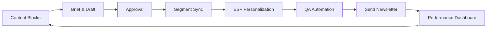

TL;DR
- Build modular content blocks tied to personas and lifecycle stages, updating them via AI-assisted briefs.
- Automate segmentation and personalization using customer data platforms or spreadsheets synced through n8n.
- Enforce deliverability and compliance with automated QA: link checks, spam tests, rendering previews.

## Content Modularization
Design your newsletter as a collection of blocks—hero story, product spotlight, community highlight, CTA. Map each block to audience personas and lifecycle goals. Store blocks in a CMS or Airtable with metadata for topic, tone, and expiry dates. Use the content refresh playbook to keep blocks current.

### Briefing and Production
Generate briefs for each block using the content brief generator, including audience notes and CTA. Produce AI-assisted drafts, then have editors polish and ensure alignment with the AI editorial style guide. Version content with change logs and approval workflows.

## Segmentation Automation
Pull subscriber data from your CRM or CDP. Segment by engagement, product usage, or persona. Use n8n workflows to sync segments to your ESP, tagging subscribers and triggering content assembly jobs. Include logic for exclusions (recent purchasers, unsubscribed users) to maintain list health.

### Personalization Logic
Within your ESP, build rules that swap blocks based on segment tags. For example, engaged product users receive feature tutorials, while new subscribers get onboarding tips. Use fallback content when data is missing.

## QA and Deliverability
Automate pre-send QA: link validation, image alt text checks, spam score analysis, and rendering previews across clients. Use tools like Litmus or Email on Acid. Ensure CAN-SPAM and GDPR compliance with dynamic footer content. Log QA results in your CI pipeline for traceability.

### Performance Measurement
Track open rate, click-to-open rate, revenue per send, and unsubscribes. Compare segment performance and adjust content or cadence. Feed insights into the attribution playbook and monetization dashboards.

## Comparison Table
| Component | Purpose | Owner | Tooling | KPI |
| --- | --- | --- | --- | --- |
| Modular Blocks | Reusable content | Content ops | CMS, Airtable | Block freshness |
| Segmentation | Target audiences | CRM ops | CDP, n8n | Segment coverage |
| Personalization | Tailored experiences | Marketing automation | ESP rules | CTR uplift |
| QA & Deliverability | Protect reputation | Marketing ops | Litmus, CI checks | Spam score, bounce rate |

## Diagram

## Checklist
- [ ] Build modular content blocks with metadata and expiry rules.
- [ ] Generate AI-assisted briefs and route drafts through editorial QA.
- [ ] Automate segment syncing and personalization rules via n8n or ESP features.
- [ ] Run automated QA for links, rendering, and compliance before each send.
- [ ] Measure performance and feed insights into attribution and refresh cadences.

> **Benchmarks**
> - Time to implement: 3 weeks to modularize content, automate segments, and build QA workflows. [Estimate]
> - Expected outcome: 30% faster production cycles with improved CTR from targeted content. [Estimate]

## Internal Links
- [Reuse blocks created with the content refresh playbook for ongoing value.](../content-factory-distribution/content-refresh-playbook.mdx)
- [Sync segmentation workflows with the n8n Redis queue tutorial.](../n8n-workflows-integrations/n8n-queues-with-redis-webhooks.mdx)
- [Align compliance messaging with the affiliate offers disclosure guidance.](../monetization-analytics/affiliate-offers-that-fit.mdx)
- [Feed performance signals into the attribution playbook.](../monetization-analytics/attribution-for-creators.mdx)

## Sources
- [Litmus on email personalization](https://www.litmus.com/blog/email-personalization)
- [Validity on deliverability best practices](https://www.validity.com/resource-center/blog/email-deliverability-best-practices/)
