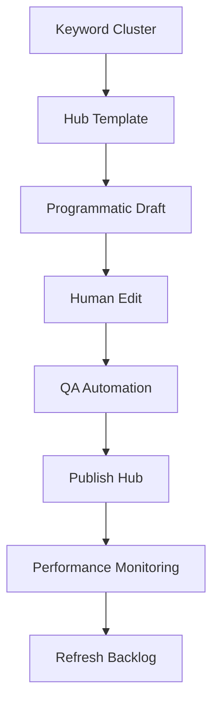

TL;DR
- Start with an intent map and schema that groups related queries into a single navigable hub.
- Combine modular sections—FAQ, comparison tables, CTA panels—so each hub answers the full journey from research to action.
- Automate generation while keeping human review for freshness, accuracy, and conversion copy.

## Define the Hub Strategy
Identify the parent topic and break it into subtopics that align with search intent stages (informational, comparison, transactional). Use keyword clustering tools or manual SERP analysis to validate the groupings. Document the user journey: what question leads them in, what options they compare, and what conversion they expect. Align stakeholders on the primary conversion (newsletter signup, trial, affiliate click) before producing copy.

### Build the Schema
Design a JSON or spreadsheet template containing slug, title, meta description, intro, sections, and CTA copy. Include structured data markers like `ItemList` for the list of subpages. Capture internal link targets for each subtopic to ensure cross-linking. Store source references and review status so editors can prioritize updates.

## Content Assembly Workflow
Use the template to generate draft sections programmatically—intro paragraphs, bullet summaries, comparison modules. Feed drafts into human review to add nuance, brand tone, and examples. Ensure each subtopic section links to deeper resources, whether your own articles or authoritative references. Add conversion modules (forms, affiliate offers) sparingly and keep them contextually relevant.

### Internal Link Strategy
Plan hub-to-spoke and spoke-to-hub links. Each subtopic should link back to the hub using descriptive anchors, and the hub should feature callouts to cornerstone guides, case studies, and offers. Monitor internal link health with periodic crawls to catch broken anchors. Use breadcrumbs or inline navigation to reduce pogo-sticking.

## QA and Launch
Run automated QA: spell-checks, structured data validation, lighthouse checks for performance. Set up a governance calendar to review top hubs quarterly. Track engagement metrics—scroll depth, CTA clicks, conversions—and feed insights back into your automation pipeline for copy refreshes.

## Comparison Table
| Component | Purpose | Owner | Automation Opportunity | Review Cadence |
| --- | --- | --- | --- | --- |
| Intent Map | Align hub scope | SEO Strategist | Keyword clustering scripts | Quarterly |
| Content Template | Ensure consistency | Content Ops | Programmatic generation | Per iteration |
| Internal Links | Navigation & SEO equity | Technical SEO | Graph analysis tooling | Monthly |
| Conversion Module | Drive action | Growth Marketing | Dynamic personalization | Bi-weekly |
| QA Checklist | Quality gate | Editors | Automated linting | Each publish |

## Diagram

## Checklist
- [ ] Document hub intent map with primary conversion goals.
- [ ] Populate the topic hub template with sections, schema, and link targets.
- [ ] Generate drafts programmatically and schedule human review.
- [ ] Validate internal links, structured data, and page performance pre-launch.
- [ ] Add hubs to a refresh calendar tied to performance metrics.

> **Benchmarks**
> - Time to implement: 1 week to launch the first programmatic hub with human QA. [Estimate]
> - Expected outcome: Achieve 20% lift in organic clicks to related offers within two months. [Estimate]

## Internal Links
- [Use the content brief generator to supply accurate outlines for each hub section.](../content-factory-distribution/content-brief-generator.mdx)
- [Coordinate monetized CTAs with the affiliate offer selection framework.](../monetization-analytics/affiliate-offers-that-fit.mdx)

## Sources
- [Google guidance on creating helpful, reliable content](https://developers.google.com/search/docs/fundamentals/creating-helpful-content)
- [Schema.org ItemList specification](https://schema.org/ItemList)
