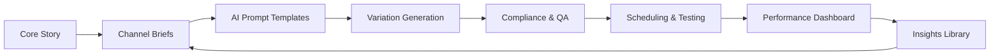

TL;DR
- Start with a core story, then generate channel-specific briefs capturing audience, tone, and CTA for each platform.
- Use AI prompts and templates to spin controlled variations, then test headlines, hooks, and creative pairings.
- Govern outputs with style guides, compliance checks, and performance dashboards to scale without losing brand equity.

## Core Story Intake
Identify the flagship asset—article, webinar, product launch—and document key messages, proof points, and target personas. Define campaign goals (awareness, engagement, conversion) and map to channel objectives. Store the story in a shared workspace accessible to writers and automation workflows.

### Channel Briefs
Create mini-briefs for each channel (LinkedIn, X, Instagram, TikTok). Capture audience insights, preferred tone, character limits, and formatting rules (hashtags, emojis). Reference the AI editorial style guide to align voice. Use the content brief generator to automate these briefs when possible.

## AI-Assisted Variation Generation
Craft prompt templates for each channel that specify tone, CTA, and structural elements (hook, insight, CTA). Generate multiple variations and categorize them by angle (statistic-led, narrative, objection handling). Use automation to push drafts into collaboration tools for review.

### Testing Framework
Deploy variations via controlled experiments. On platforms supporting A/B testing, rotate copy while holding creative constant. Track metrics—click-through rate, engagement, saves—per variation. Feed results into an offer testing framework or analytics dashboard.

## Governance and QA
Run automated checks for banned phrases, compliance requirements, and link accuracy. Ensure affiliate disclosures appear where required. Use the CI pipeline to lint copy for tone and readability. Provide human review for high-stakes campaigns.

### Distribution Rhythm
Schedule publishing cadences per channel, considering time zones and algorithm preferences. Build a content calendar that reuses top-performing variations, adjusting CTA or hooks for subsequent waves. Document learnings in retrospectives.

## Comparison Table
| Channel | Core Goal | Key Constraints | Tone | Measurement |
| --- | --- | --- | --- | --- |
| LinkedIn | Thought leadership | 3000 char limit | Professional + personable | CTR, comments |
| X (Twitter) | Real-time engagement | 280 char limit | Punchy, concise | Engagement rate |
| Instagram | Visual storytelling | Caption + hashtags | Conversational | Saves, shares |
| TikTok | Short-form video | Script <60s | Energetic | Watch time, follows |

## Diagram

## Checklist
- [ ] Document core campaign story with target personas and outcomes.
- [ ] Build channel-specific briefs with tone, format, and compliance rules.
- [ ] Generate AI-assisted variations and categorize by angle.
- [ ] Test variations, monitor performance, and promote winners.
- [ ] Capture learnings in an insights library to inform future campaigns.

> **Benchmarks**
> - Time to implement: 1 week to set up prompts, QA automation, and dashboards. [Estimate]
> - Expected outcome: 2x increase in social testing velocity with 20% uplift in engagement rate. [Estimate]

## Internal Links
- [Reinforce voice consistency with the AI editorial style guide.](../content-factory-distribution/ai-editorial-style-guide.mdx)
- [Pipeline creative briefs from the content brief generator.](../content-factory-distribution/content-brief-generator.mdx)
- [Feed performance metrics into the offer testing framework for monetized campaigns.](../monetization-analytics/offer-testing-framework.mdx)
- [Coordinate launch timing with the video repurposing SOP for visual assets.](../content-factory-distribution/video-to-carousels-and-shorts.mdx)

## Sources
- [Twitter/X creative best practices](https://business.twitter.com/en/blog/twitter-creative-best-practices.html)
- [LinkedIn marketing best practices](https://www.linkedin.com/business/marketing/blog/best-practices)
