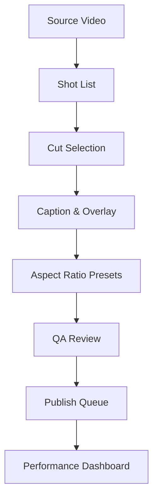

TL;DR
- Break the master video into story beats and select segments tailored for swipeable carousels and vertical shorts.
- Automate transcription and captioning but retain human QC for brand tone and compliance.
- Standardize export presets and publish checklists so every derivative asset meets platform specs.

## Define the Input Specification
Document the source video details: resolution, aspect ratio, speaker metadata, and release rights. Create a shot list with timestamps and key talking points. Tag sections as educational, testimonial, or promotional so you can map them to appropriate derivatives. Capture must-include CTAs and disclosures to ensure they carry through to derivatives.

### Identify Cut Points
Review analytics to prioritize moments with spikes in watch time or strong statements. Use transcript tools to surface quotes. Mark start/end times for each derivative asset and note visual overlays needed (stats, product shots). Keep cuts between 15–60 seconds for shorts and 5–8 frames for carousel slides.

## Captioning and Overlays
Run automated transcription via tools like YouTube's auto captions or Descript, then edit for accuracy and on-screen readability. Design caption styles: placement, font, contrast ratios. Add overlays for key data points or CTAs—use brand-approved colors and accessibility guidelines. Provide a style guide so editors maintain consistency across batches.

### Aspect Ratio Presets
Export shorts in 9:16 at 1080 × 1920 with 30 or 60 fps. For carousels, prepare 1080 × 1080 or 1080 × 1350 slides. Use templates in Adobe Premiere, CapCut, or FFmpeg scripts to automate resizing while protecting safe zones. Ensure audio levels are normalized to -14 LUFS for shorts per YouTube recommendations.

## Quality Control and Publish
Before publishing, run platform-specific QA: check text safe areas, verify captions sync, and ensure CTAs comply with policies (e.g., Instagram's branded content rules). Schedule posts with platform-native tools or APIs, staggering release times to test engagement windows. Track performance metrics and store them in a dashboard for iteration.

## Comparison Table
| Asset Type | Duration | Aspect Ratio | Key Elements | Platform Tips |
| --- | --- | --- | --- | --- |
| Vertical Short | 15–60 sec | 9:16 | Hook, captions, CTA end card | Keep under 60 sec for YouTube Shorts |
| Carousel Slide | 5–8 frames | 1:1 or 4:5 | Headline, supporting visual, CTA | Use consistent cover slide per Instagram |
| Teaser GIF | 6–10 sec | 1:1 | Loopable action | Optimize for under 5MB |
| Transcript Blog | N/A | Responsive | Highlights, quotes, links | Embed video for SEO dwell time |
| Email Snippet | 30–45 sec | 16:9 crop | Animated GIF + CTA | Test load time under 1MB |

## Diagram

## Checklist
- [ ] Capture source video metadata, rights, and CTAs in the intake form.
- [ ] Mark cut points with timestamps and desired overlays.
- [ ] Generate and edit captions to meet accessibility standards.
- [ ] Export assets using platform-specific aspect ratio templates.
- [ ] Complete QA for safe zones, sync, disclosures, and schedule releases.

> **Benchmarks**
> - Time to implement: 6–8 hours to build the full repurposing pipeline for one long-form video. [Estimate]
> - Expected outcome: Produce 8–10 derivative assets that lift total video impressions by 35% within the campaign window. [Estimate]

## Internal Links
- [Use the content brief generator to align scripts and overlays with message hierarchy.](../content-factory-distribution/content-brief-generator.mdx)
- [Trigger automation workflows via the n8n webhook guide to route finished assets into publishing tools.](../n8n-workflows-integrations/n8n-triggers-webhooks-foundation.mdx)

## Sources
- [Instagram carousel and branded content policies](https://help.instagram.com/1631821640426723)
- [YouTube Shorts creation guidelines](https://support.google.com/youtube/answer/6375112)
