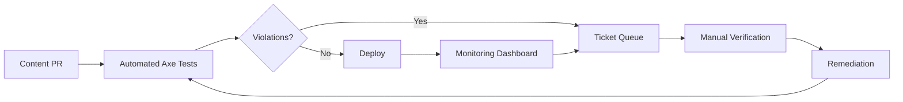

TL;DR
- Integrate accessibility linting and testing into content pipelines to catch issues before deploy.
- Pair automated audits with manual checks focusing on screen reader flows and keyboard navigation.
- Track accessibility debt and close the loop with content teams via dashboards and training.

## Automated Testing Pipeline
Add accessibility linters (axe-core, pa11y) to CI workflows. Test MDX-rendered pages in headless browsers to catch color contrast, ARIA roles, and landmark issues. Fail builds on high-severity violations and create actionable reports for editors.

### Visual Regression and Contrast Checks
Use tools like Percy or Chromatic with accessibility add-ons to detect contrast issues, focus states, and layout regressions. Automate screenshot comparison across breakpoints.

## Manual Audit Cadence
Schedule quarterly manual audits covering high-traffic pages. Use screen readers (NVDA, VoiceOver) and keyboard-only navigation to validate flows. Capture findings in tickets with reproduction steps and remediation priority.

### Content Author Training
Provide editors with accessibility checklists—alt text, heading hierarchy, link text clarity. Integrate training into the AI editorial style guide and content brief generator. Offer office hours for Q&A.

## Monitoring and Reporting
Build dashboards tracking automated violation counts, manual audit findings, and time-to-fix. Tie metrics to SLAs (e.g., resolve high severity within 7 days). Share reports with leadership and incorporate into retrospectives.

### Continuous Improvement
Update test suites as WCAG evolves. Incorporate user feedback from assistive technology users. Align with the automation governance council to prioritize accessibility improvements.

## Comparison Table
| Activity | Tooling | Frequency | Owner | KPI |
| --- | --- | --- | --- | --- |
| Automated Lint | axe-core, pa11y | Every PR | DevOps | Violations per PR |
| Visual Checks | Percy, Chromatic | Weekly | Front-end | Contrast compliance |
| Manual Audits | Screen readers | Quarterly | Accessibility lead | Issues resolved |
| Training | Workshops, docs | Biannual | Content ops | Completion rate |

## Diagram

## Checklist
- [ ] Add accessibility linters to CI pipelines with severity gating.
- [ ] Implement visual regression tests covering contrast and focus states.
- [ ] Conduct manual audits with assistive technologies on a defined cadence.
- [ ] Train content authors on accessibility best practices and update guides.
- [ ] Track metrics and remediation SLAs via dashboards and retrospectives.

> **Benchmarks**
> - Time to implement: 3 weeks to configure automated tests, dashboards, and training workflows. [Estimate]
> - Expected outcome: 80% reduction in accessibility regressions reaching production. [Estimate]

## Internal Links
- [Integrate training materials with the AI editorial style guide.](../content-factory-distribution/ai-editorial-style-guide.mdx)
- [Capture issues via the CI guardrails pipeline.](../devops-for-creators/ci-for-content-repos.mdx)
- [Monitor performance impacts through the CWV tuning playbook.](../devops-for-creators/cwv-tuning-for-mdx-sites.mdx)
- [Align governance with the automation governance operating model.](../ai-automation-foundations/automation-governance-operating-models.mdx)

## Sources
- [WCAG 2.1 guidelines](https://www.w3.org/TR/WCAG21/)
- [Deque on accessibility monitoring](https://dequeuniversity.com/assets/pdf/axe-monitoring-whitepaper.pdf)
