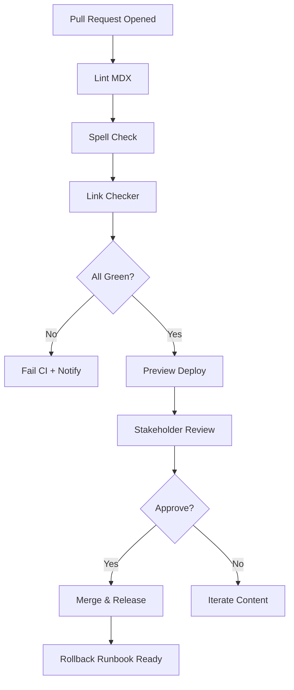

TL;DR
- Treat content like code by running MDX linting, spell checks, and link validation on every pull request.
- Cache dependencies and run checks in parallel to keep CI times short enough that editors will use them.
- Surface preview builds and rollback playbooks so stakeholders can approve changes confidently.

## Linting Foundation
Select a linting toolchain such as `remark-lint` for Markdown/MDX and `cspell` for terminology. Configure shared dictionaries so industry terms do not cause noise. Store configs in the repo and expose npm scripts (`lint:content`, `lint:spelling`). Enforce consistent frontmatter by adding custom rules or using JSON schema validation.

### Link Checking
Broken links erode trust and SEO. Integrate a link checker like Lychee in your CI workflow. Configure it to ignore staging domains or intentionally blocked URLs. Run internal anchor checks by parsing headings and verifying hashed links. For large repos, split checks into internal vs external to keep runtimes manageable.

## Preview Builds and Reviews
Set up previews using platforms like Vercel or Netlify; when a pull request opens, deploy the MDX content to a staging URL. Share the link with editors for visual review. Capture screenshot diffs if you maintain templated layouts. Ensure secrets for preview builds are scoped and rotated regularly.

### Rollback SOP
Document steps to revert problematic content: `git revert` the offending commit, redeploy previews, and communicate via release notes. Store the SOP in your repo's `docs/` or `runbooks/` folder. Practice rollbacks quarterly to maintain muscle memory.

## Comparison Table
| Stage | Tooling | Purpose | Frequency | Owner |
| --- | --- | --- | --- | --- |
| Linting | remark-lint, eslint-mdx | Enforce syntax & style | Every PR | Content Platform |
| Spelling | cspell | Catch typos | Every PR | Editors |
| Link Check | Lychee | Validate URLs & anchors | Every PR / nightly | QA |
| Preview Deploy | Vercel/Netlify | Visual QA | Every PR | DevOps |
| Rollback | Git revert + runbook | Rapid recovery | As needed | Release Manager |

## Diagram

## Checklist
- [ ] Configure MDX linting and spelling scripts with shared dictionaries.
- [ ] Add link checker workflow with allow/deny lists for domains.
- [ ] Enable preview deployments tied to pull requests.
- [ ] Document rollback steps and store them with runbooks.
- [ ] Monitor CI runtime and optimize caching to keep under 5 minutes.

> **Benchmarks**
> - Time to implement: 1 day to wire linting, link checks, and preview deployments in GitHub Actions. [Estimate]
> - Expected outcome: Reduce broken-link incidents to <1 per quarter while keeping CI runs under 5 minutes. [Estimate]

## Internal Links
- [Review the Vercel preview and caching playbook for deployment specifics.](../devops-for-creators/vercel-content-sites-previews-edge-caching.mdx)
- [Trigger publishing automation from n8n webhooks once CI checks pass.](../n8n-workflows-integrations/n8n-triggers-webhooks-foundation.mdx)

## Sources
- [GitHub Actions workflow fundamentals](https://docs.github.com/actions/using-workflows/about-workflows)
- [Lychee link checker documentation](https://github.com/lycheeverse/lychee)
