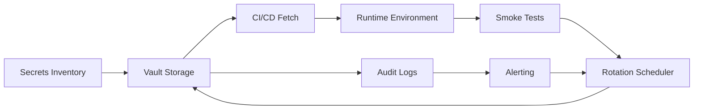

TL;DR
- Centralize secrets (API keys, tokens) in managed vaults and inject them into builds instead of committing to repos.
- Rotate secrets on a defined cadence with automation, validation, and fallback plans.
- Audit access logs and enforce least privilege to reduce exposure when contributors change.

## Secrets Inventory
Catalog secrets used across content workflows—CMS tokens, analytics keys, automation credentials. Note owners, usage, and environment scope (preview, production). Store in a shared register with rotation schedules.

### Vault Integration
Adopt a secrets manager (HashiCorp Vault, AWS Secrets Manager, Doppler). Configure dynamic secrets where available to reduce manual rotation. Use short-lived tokens when running automation (n8n, CI pipelines). Document access policies and provide tooling (CLI, API) for contributors.

## CI/CD Injection
Integrate vault lookups into CI pipelines. Use GitHub Actions OIDC or similar to fetch secrets at runtime. Ensure environment variables are masked in logs. For local development, issue short-lived developer tokens via CLI wrappers instead of static `.env` files checked into git.

### Rotation Workflows
Set rotation cadence based on risk—monthly for high-risk, quarterly for lower risk. Automate rotation scripts that update secrets in vault, trigger downstream service updates, and run smoke tests. Notify stakeholders and confirm successful deployments before revoking old secrets.

## Monitoring and Auditing
Enable audit logs in the vault and review access patterns. Set alerts for unusual activity, such as access outside business hours or from new IPs. Tie logs into your observability stack for centralized monitoring.

### Incident Response
Prepare runbooks for leaked secrets: revoke tokens, rotate keys, invalidate sessions, and communicate to partners. Use the automation governance operating model to coordinate response across teams.

## Comparison Table
| Area | Goal | Tooling | Owner | Cadence |
| --- | --- | --- | --- | --- |
| Inventory | Understand secret usage | Shared register | Security lead | Quarterly review |
| Vault | Secure storage & access | Vault, AWS Secrets Manager | Platform engineering | Continuous |
| Rotation | Update secrets | Scripts, CI jobs | DevOps | Monthly/Quarterly |
| Auditing | Detect anomalies | SIEM, vault logs | Security | Weekly |

## Diagram

## Checklist
- [ ] Catalog all secrets with owners, purpose, and rotation frequency.
- [ ] Integrate a secrets manager with CI/CD and local development tooling.
- [ ] Automate rotation scripts with validation and communication steps.
- [ ] Monitor audit logs and set anomaly alerts.
- [ ] Maintain incident runbooks for secret compromise scenarios.

> **Benchmarks**
> - Time to implement: 2 weeks to integrate vault tooling and automate rotations for priority secrets. [Estimate]
> - Expected outcome: Reduced credential leakage risk and faster recovery when secrets change. [Estimate]

## Internal Links
- [Coordinate rotation runbooks with the CI guardrails article.](../devops-for-creators/ci-for-content-repos.mdx)
- [Align governance approvals using the automation governance operating model.](../ai-automation-foundations/automation-governance-operating-models.mdx)
- [Ensure webhook credentials stay protected as described in the n8n security guide.](../n8n-workflows-integrations/n8n-webhook-security-zero-trust.mdx)
- [Feed rotation schedules into the content refresh playbook to update metadata.](../content-factory-distribution/content-refresh-playbook.mdx)

## Sources
- [HashiCorp Vault documentation](https://developer.hashicorp.com/vault/docs)
- [Azure Key Vault rotation guidance](https://learn.microsoft.com/azure/security/fundamentals/key-vault-rotation)
