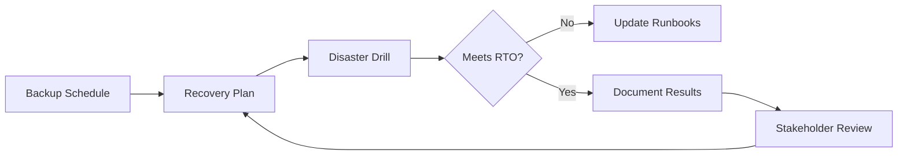

TL;DR
- Maintain automated backups and versioned artifacts for content and configuration.
- Define RTO/RPO targets and rehearse rollback drills so teams can restore quickly.
- Monitor rollback effectiveness and update runbooks with lessons from real incidents.

## Define Recovery Objectives
Set recovery time objective (RTO) and recovery point objective (RPO) based on business impact. For marketing campaigns, RTO may be 15 minutes; for knowledge bases, 1 hour. Document objectives in your automation governance charter.

### Backup Strategy
Implement backups for MDX content, CMS data, and assets. Use git history, object storage snapshots, and database backups. Automate backups daily with verification checks. Store backups in multiple regions where possible.

## Rollback Mechanisms
For static site hosting (Vercel, Netlify), use deployment history to instantly promote previous builds. Maintain CLI scripts or API calls to trigger rollbacks. For CMS-driven content, implement versioning and publish/unpublish workflows. Document dependencies—feature flags, environment variables—that must change during rollback.

### Disaster Recovery Drills
Schedule quarterly game days simulating outages: corrupted content, CDN misconfiguration, database failure. Practice restoring from backups, promoting previous deployments, and communicating status to stakeholders. Measure drill performance against RTO/RPO.

## Monitoring and Verification
After a rollback, verify site health—link checks, synthetic tests, analytics data. Ensure Core Web Vitals remain within targets. Log incident timeline and create postmortems capturing root cause and improvements.

### Continuous Improvement
Update runbooks based on drills and incidents. Align with the automation pilot-to-scale playbook so new automations include recovery plans. Communicate changes to all stakeholders and ensure training materials stay current.

## Comparison Table
| Component | Purpose | Tooling | Owner | Cadence |
| --- | --- | --- | --- | --- |
| Backups | Protect content state | Git, object storage, DB snapshots | DevOps | Daily |
| Rollback Scripts | Rapid restore | Vercel CLI, Netlify CLI | Platform | Quarterly tests |
| Drills | Validate readiness | Game days, incident tooling | SRE | Quarterly |
| Postmortems | Improve process | Notion, Jira | Program manager | After incident |

## Diagram

## Checklist
- [ ] Establish RTO/RPO targets and document them in governance records.
- [ ] Automate backups for content, CMS data, and configuration.
- [ ] Create rollback scripts for hosting platforms and CMS workflows.
- [ ] Run disaster recovery drills and measure performance.
- [ ] Produce postmortems and update runbooks after drills or incidents.

> **Benchmarks**
> - Time to implement: 4 weeks to configure backups, scripts, and first game day. [Estimate]
> - Expected outcome: Ability to restore critical content within 15 minutes and reduce incident impact. [Estimate]

## Internal Links
- [Reference the Vercel previews and caching guide for rollback context.](../devops-for-creators/vercel-content-sites-previews-edge-caching.mdx)
- [Align drill schedules with the automation pilot-to-scale playbook.](../ai-automation-foundations/automation-pilot-to-scale-playbook.mdx)
- [Capture observability signals from the MDX observability stack article.](../devops-for-creators/mdx-site-observability-stack.mdx)
- [Integrate QA checks with the CI guardrails for content repos.](../devops-for-creators/ci-for-content-repos.mdx)

## Sources
- [Google SRE workbook on disaster recovery testing](https://sre.google/workbook/disaster-recovery-testing/)
- [Vercel documentation on rollbacks](https://vercel.com/docs/insights/rollback)
