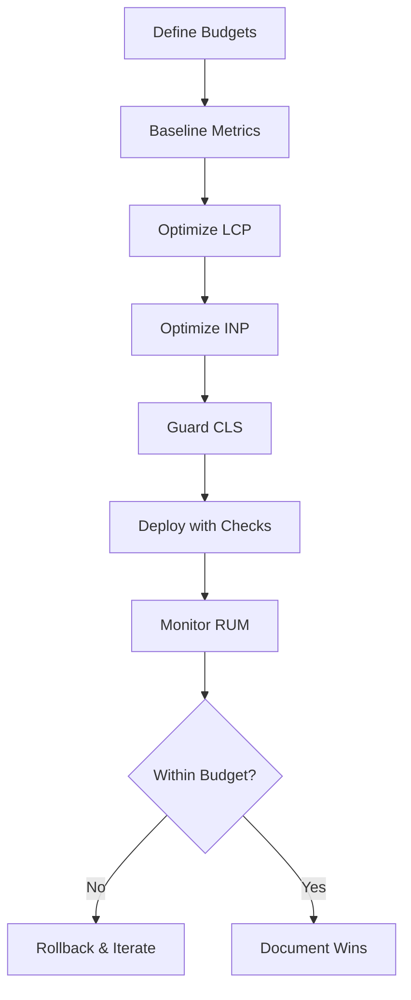

TL;DR
- Define performance budgets for LCP, INP, and CLS specifically for content-heavy MDX pages.
- Optimize hero media, scripts, and layout shifts by combining build-time tooling with runtime safeguards.
- Monitor real-user data and integrate alerts into deployment workflows so regressions are caught quickly.

## Set Budgets and Measurement Plan
Start by establishing budgets: LCP under 2.5s, INP under 200ms, CLS under 0.1. Use lab tools (Lighthouse, WebPageTest) to baseline, but prioritize field data from Chrome UX Report or Real User Monitoring (RUM). Segment metrics by template type (article, hub, landing page) since MDX content can vary widely. Document budgets in your repo so developers and editors know the targets.

### Optimize Largest Contentful Paint
Audit hero images and above-the-fold components. Preload the hero image and use responsive formats (AVIF/WebP) with width descriptors. Inline critical CSS for typography and layout. For MDX components, lazy-load heavy interactive modules. Ensure your CDN caches HTML and assets with proper cache-control headers.

## Improve Interaction to Next Paint
INP often suffers when scripts block the main thread. Defer non-critical scripts, use `requestIdleCallback` for analytics, and consider server-side rendering for interactive widgets. Limit client-side hydration to essentials. Profile event handlers and split long tasks using `setTimeout` chunks. Where possible, use web workers for expensive computations triggered by MDX components.

### Guard Cumulative Layout Shift
Reserve space for embeds, images, and ads with explicit width/height. For MDX shortcodes that inject dynamic content, set aspect ratio boxes. Avoid injecting fonts late; use `font-display: optional` or preloading. Monitor sticky headers or newsletter bars that animate—use CSS transforms rather than height changes.

## Monitoring and Alerting
Integrate RUM tools (e.g., Google Analytics 4, SpeedCurve) to stream Core Web Vitals by page path. Configure alerts when metrics cross thresholds. Include performance checks in CI/CD pipelines—run Lighthouse CI on pull requests and block merges if budgets are exceeded. Document a rollback plan if production metrics degrade.

## Comparison Table
| Metric | Budget | Primary Fixes | Tooling | Owner |
| --- | --- | --- | --- | --- |
| LCP | ≤ 2.5s | Optimize hero media, critical CSS | Lighthouse CI, WebPageTest | Frontend Eng |
| INP | ≤ 200ms | Reduce JS payloads, async handlers | RUM dashboards, Chrome DevTools | Performance Eng |
| CLS | ≤ 0.1 | Reserve layout space, stable fonts | Layout audits, CSS tooling | UX Engineer |
| TTFB | ≤ 0.8s | Edge caching, server tuning | CDN logs | DevOps |
| FID (legacy) | ≤ 100ms | Same as INP mitigations | Field data fallback | Performance Eng |

## Diagram

## Checklist
- [ ] Document Core Web Vitals budgets per template.
- [ ] Preload hero media, inline critical CSS, and cache assets effectively.
- [ ] Defer non-critical scripts and break up long tasks for INP.
- [ ] Reserve layout space for all MDX embeds and typography.
- [ ] Automate Lighthouse/RUM monitoring with alerts and rollback steps.

> **Benchmarks**
> - Time to implement: 1–2 sprints to audit, optimize, and automate monitoring for an MDX site. [Estimate]
> - Expected outcome: Improve 75th percentile LCP to 2.1s, INP to 150ms, and CLS to 0.05 within a quarter. [Estimate]

## Internal Links
- [Coordinate deployment and caching changes with the Vercel playbook.](../devops-for-creators/vercel-content-sites-previews-edge-caching.mdx)
- [Align content automation goals with the automation blueprint for prioritization.](../ai-automation-foundations/practical-blueprint-first-win.mdx)

## Sources
- [Core Web Vitals overview](https://web.dev/vitals/)
- [Interaction to Next Paint guidance](https://web.dev/inp/)
