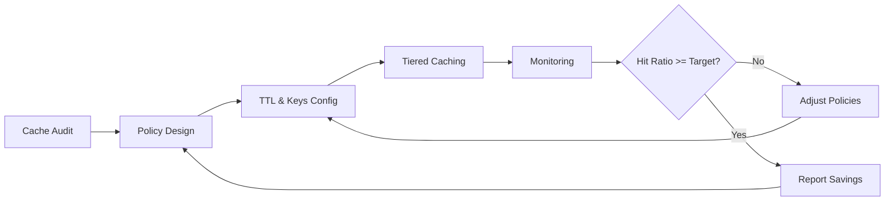

TL;DR
- Audit cache hit ratios and egress fees to identify optimization opportunities.
- Adjust TTLs, cache keys, and revalidation strategies to reduce redundant origin fetches.
- Monitor cost savings while ensuring Core Web Vitals remain within targets.

## Baseline Analysis
Review CDN billing data and observability dashboards. Track cache hit ratio, egress volume, and cost per region. Identify routes with low hit rates or high dynamic content usage. Tag pages by template and traffic profile.

### Cache Strategy Design
Segment content by freshness requirement. For evergreen pages, extend TTL and leverage stale-while-revalidate. For frequently updated sections, use short TTLs with background regeneration. Configure cache keys to include relevant parameters (locale, device) while avoiding fragmentation.

## Tiered and Regional Caching
Enable tiered caching (Cloudflare Tiered Cache, Vercel Edge Network) to reduce origin load in distant regions. Route traffic through regional caches and use shield POPs near origin. Evaluate trade-offs between latency and egress cost.

### Compression and Payload Optimization
Compress HTML, JSON, and images to reduce egress. Use brotli for text and AVIF/WebP for images. Remove unused scripts and leverage edge functions to strip tracking parameters when not needed.

## Monitoring and Governance
Build dashboards tracking cache hit ratio, origin requests, and egress cost over time. Set alerts when hit ratio drops below thresholds or when cost per 1k requests spikes. Review with finance and product monthly.

### Testing and Iteration
Run experiments adjusting TTLs or cache policies and measure impact on latency and cost. Ensure Core Web Vitals remain within budgets using the CWV tuning playbook. Document changes in runbooks and share outcomes with stakeholders.

## Comparison Table
| Lever | Impact on Cost | Impact on Performance | Tooling | Notes |
| --- | --- | --- | --- | --- |
| Longer TTL | High savings | Risk of stale content | Cache-Control headers | Pair with SWR |
| Cache Key Optimization | Medium savings | Improves hit ratio | Edge functions | Avoid over-personalization |
| Tiered Cache | Medium savings | Lower latency remote regions | CDN config | Requires enterprise plan |
| Compression | Medium savings | Faster downloads | CDN, build pipeline | Monitor CPU usage |

## Diagram

## Checklist
- [ ] Audit CDN metrics and costs to identify low hit ratios.
- [ ] Classify content by freshness needs and design TTL/keys accordingly.
- [ ] Enable tiered caching and regional shields where beneficial.
- [ ] Optimize payloads with compression and script reduction.
- [ ] Monitor cost and performance, iterating based on experiments.

> **Benchmarks**
> - Time to implement: 3 weeks to redesign cache policies, enable tiered caching, and build dashboards. [Estimate]
> - Expected outcome: 25% reduction in CDN egress costs while maintaining Core Web Vitals targets. [Estimate]

## Internal Links
- [Reference the Vercel edge guide for deployment details.](../devops-for-creators/vercel-content-sites-previews-edge-caching.mdx)
- [Monitor results with the MDX observability stack playbook.](../devops-for-creators/mdx-site-observability-stack.mdx)
- [Align with the agent cost and latency optimization article for shared metrics.](../multi-agent-orchestration/agent-cost-latency-optimization.mdx)
- [Coordinate with the landing page instrumentation guide to ensure analytics remain accurate.](../monetization-analytics/landing-page-conversion-instrumentation.mdx)

## Sources
- [Cloudflare cache-control guidance](https://developers.cloudflare.com/cache/about/cache-control/)
- [Vercel edge caching documentation](https://vercel.com/docs/concepts/edge-network/caching)
