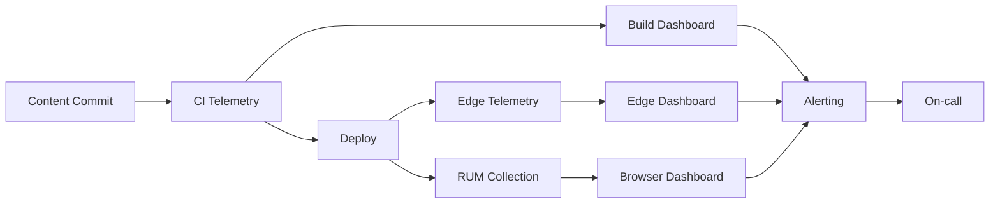

TL;DR
- Collect telemetry across build pipelines, edge rendering, and browser performance to detect regressions quickly.
- Use OpenTelemetry and hosted platforms to centralize logs, metrics, and traces for MDX sites.
- Automate alerting and dashboards tied to Core Web Vitals and business KPIs.

## Build Pipeline Monitoring
Instrument CI pipelines with logs and metrics: build duration, cache hit rate, lint failures. Send data to a monitoring platform (Datadog, New Relic) using OpenTelemetry exporters. Correlate build failures with recent content merges to isolate problematic markdown or MDX components.

### Edge and Serverless Observability
For deployments on Vercel or similar, enable edge function logging and request tracing. Capture cache hit ratios, cold starts, and response times. Use custom headers or tracing IDs to follow requests from edge to origin services. Monitor ISR regeneration times to ensure freshness.

## Browser Performance Tracking
Implement Real User Monitoring (RUM) capturing Core Web Vitals (LCP, INP, CLS). Use tools like Vercel Analytics, SpeedCurve, or Calibre. Segment by device, geography, and page template. Integrate with the CWV tuning playbook for remediation.

### Error Tracking
Deploy JavaScript error tracking (Sentry, Rollbar) with source maps. Classify errors by severity and frequency. Link to content metadata (slug, author) so editors can replicate issues.

## Dashboarding and Alerting
Create dashboards combining build metrics, edge performance, and RUM data. Set alerts for build duration spikes, cache hit drops, or Core Web Vitals regressions. Align thresholds with business SLAs—newsletter send times, campaign launches.

### Continuous Improvement
Run monthly observability reviews. Document incidents, time to detect, and remediation actions. Update runbooks and instrumentation as new features roll out.

## Comparison Table
| Layer | Key Metrics | Tooling | Alert Threshold | Owner |
| --- | --- | --- | --- | --- |
| Build | Duration, failure rate | GitHub Actions, Datadog | >95th percentile duration | DevOps |
| Edge | Cache hit ratio, latency | Vercel Analytics, OpenTelemetry | Cache hit <85% | Platform |
| Browser | LCP, INP, CLS | SpeedCurve, RUM | LCP >2.5s p75 | Web perf |
| Errors | JS exceptions | Sentry, Rollbar | Error rate >1% sessions | Engineering |

## Diagram

## Checklist
- [ ] Instrument CI pipelines with logs and metrics sent to centralized monitoring.
- [ ] Enable edge tracing and cache metrics for deployments.
- [ ] Deploy RUM for Core Web Vitals segmented by device and geography.
- [ ] Configure error tracking with source maps and content metadata tags.
- [ ] Build dashboards and alerts across build, edge, and browser layers.

> **Benchmarks**
> - Time to implement: 3 weeks to deploy telemetry pipelines and dashboards across build, edge, and browser. [Estimate]
> - Expected outcome: 50% faster incident detection and improved Core Web Vitals compliance. [Estimate]

## Internal Links
- [Use the Vercel edge and caching guide to contextualize observability metrics.](../devops-for-creators/vercel-content-sites-previews-edge-caching.mdx)
- [Coordinate CI instrumentation with the content repo guardrails.](../devops-for-creators/ci-for-content-repos.mdx)
- [Feed RUM insights into the Core Web Vitals tuning playbook.](../devops-for-creators/cwv-tuning-for-mdx-sites.mdx)
- [Align alerting cadences with the agent cost and latency optimization guide.](../multi-agent-orchestration/agent-cost-latency-optimization.mdx)

## Sources
- [OpenTelemetry documentation](https://opentelemetry.io/docs/)
- [Vercel observability analytics](https://vercel.com/docs/observability/analytics)
