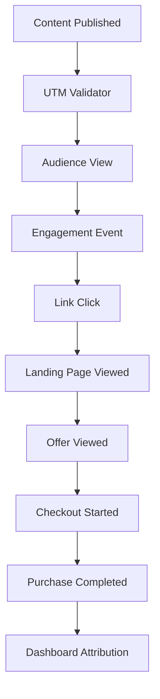

TL;DR
- Build a UTM schema that names campaigns, content, and offers consistently so analysis tools can group performance data.
- Map the event lifecycle—from view to conversion—across web, email, and social to avoid attribution blind spots.
- Automate QA with link validators and analytics alerts to catch tagging breaks before they cost revenue.

## Establish UTM Naming Conventions
Start with a governance doc that defines each UTM parameter: source, medium, campaign, content, term. For creators, add `utm_content` variations to distinguish asset formats (video, carousel, newsletter). Use lowercase, hyphenated values and reserve `utm_medium` for channel families (`social`, `email`, `paid-social`). Maintain a master spreadsheet or JSON registry listing approved tags and responsible owners.

### Build the Event Map
List the key touchpoints: content view, engagement (like, comment, share), click-through, landing page view, offer view, checkout start, purchase. For each, define the event name, properties, and triggering systems (web app, email platform). Use Segment or similar CDP specs to align property naming (`product_id`, `offer_tier`). Include offline conversions (webinars, DM sales) by syncing CRM events.

## Dashboard Design
Create a model in your BI tool that ties UTMs and events together. One common approach is to use `utm_campaign` + `offer_id` as the join key between acquisition and monetization tables. Build dashboards showing funnel progression and revenue per channel. Add filters for creator, campaign, and content type so stakeholders can slice data easily.

### QA and Alerting
Implement automated checks that validate UTMs before publishing: scripts that crawl scheduled posts, or browser extensions for manual QA. Set up analytics alerts for sudden drops in tagged traffic or conversions. Monitor tracking blockers and server-side tagging options to maintain data quality as privacy restrictions evolve.

## Comparison Table
| Stage | Event Name | Required Properties | System of Record | Owner |
| --- | --- | --- | --- | --- |
| Awareness | `Content Viewed` | `content_id`, `utm_source`, `utm_campaign` | Web/App Analytics | Content Ops |
| Engagement | `Content Engaged` | `interaction_type`, `platform` | Social Analytics | Social Lead |
| Click-Through | `Link Clicked` | `destination_url`, `utm_content` | Link Shortener/CDP | Growth |
| Consideration | `Offer Viewed` | `offer_id`, `offer_category` | Landing Page | Product Marketing |
| Conversion | `Purchase Completed` | `order_value`, `currency`, `utm_campaign` | Commerce/CRM | Revenue Ops |

## Diagram

## Checklist
- [ ] Document canonical UTM values and share them with all channel owners.
- [ ] Implement standardized event names and properties across platforms.
- [ ] Build dashboards linking UTMs to revenue events.
- [ ] Automate link validation and analytics alerts for tag health.
- [ ] Review attribution accuracy monthly with cross-functional stakeholders.

> **Benchmarks**
> - Time to implement: 2 weeks to roll out naming conventions, tracking plan, and dashboards. [Estimate]
> - Expected outcome: Increase attributed revenue accuracy by 25% and reduce untagged links to under 5%. [Estimate]

## Internal Links
- [Pair attribution data with the affiliate offer selection guide for better merchandising.](../monetization-analytics/affiliate-offers-that-fit.mdx)
- [Coordinate tracking with deployment practices in the Vercel preview and caching playbook.](../devops-for-creators/vercel-content-sites-previews-edge-caching.mdx)

## Sources
- [Google Analytics campaign tagging best practices](https://support.google.com/analytics/answer/1033863)
- [Segment spec for analytics events](https://segment.com/docs/connections/spec/)
