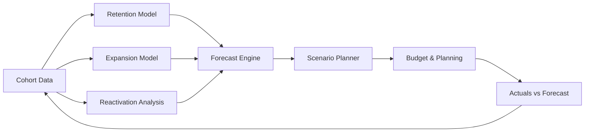

TL;DR
- Segment customers into cohorts based on acquisition date, channel, or product to understand retention and revenue behavior.
- Build models projecting churn, reactivation, and expansion, then stress test with scenarios.
- Integrate forecasts with budgeting, pricing, and offer testing decisions for alignment across teams.

## Cohort Definition
Choose cohort dimensions relevant to your business—signup month, acquisition channel, plan type. Ensure data capture aligns with your attribution framework. Create baseline tables showing active users, revenue, and churn per cohort over time.

### Data Preparation
Pull data from your analytics stack, ensuring consistency in metrics definitions. Adjust for anomalies like billing errors or migrations. Normalize revenue to per-user or per-account metrics when comparing cohorts of different sizes.

## Forecast Model Construction
Use survival analysis or exponential decay to model churn. Incorporate expansion revenue by modeling upgrade rates and add-on purchases. For reactivation, analyze historical dormant user behavior. Combine components into a forecast that outputs MRR and cash collections.

### Scenario Planning
Build best, base, and worst-case scenarios adjusting acquisition volume, churn rates, and pricing changes. Use data from the subscription pricing playbook to inform pricing impacts. Evaluate sensitivity to macro factors and capacity constraints.

## Operationalizing Forecasts
Embed forecasts into finance and marketing cadences. Align with budgeting cycles, content production planning, and offer launches. Monitor actual vs forecast monthly and adjust models using evaluation loops.

### Communication
Visualize forecasts with waterfall charts or retention curves. Share narratives explaining drivers: improved retention from new onboarding, churn spikes due to pricing changes. Document assumptions and owners for transparency.

## Comparison Table
| Component | Purpose | Data Source | Owner | Cadence |
| --- | --- | --- | --- | --- |
| Retention Model | Predict churn | Analytics warehouse | Finance analyst | Monthly |
| Expansion Model | Estimate upsell revenue | Billing, CRM | Revenue ops | Monthly |
| Acquisition Forecast | Project new customers | Marketing pipeline | Growth lead | Monthly |
| Scenario Planner | Stress test assumptions | Spreadsheet/modeling tool | Finance lead | Quarterly |

## Diagram

## Checklist
- [ ] Define cohorts by acquisition, channel, or product attributes.
- [ ] Prepare clean cohort tables with revenue, churn, and expansion metrics.
- [ ] Build retention, expansion, and reactivation models feeding into a forecast engine.
- [ ] Run scenario planning for best/base/worst cases and align with pricing insights.
- [ ] Review forecasts regularly and update assumptions based on actuals.

> **Benchmarks**
> - Time to implement: 5 weeks to build cohort tables, forecasting models, and dashboards. [Estimate]
> - Expected outcome: Forecast accuracy within ±8% and faster alignment between finance and growth teams. [Estimate]

## Internal Links
- [Leverage the creator analytics stack to source reliable cohort data.](../monetization-analytics/creator-analytics-stack-blueprint.mdx)
- [Integrate pricing scenarios from the subscription analytics playbook.](../monetization-analytics/subscription-pricing-analytics-playbook.mdx)
- [Coordinate campaign planning via the newsletter automation blueprint.](../content-factory-distribution/newsletter-automation-blueprint.mdx)
- [Use evaluation loops to validate forecast outputs against agent simulations.](../multi-agent-orchestration/agent-simulation-test-harness.mdx)

## Sources
- [Sequoia on financial modeling](https://www.sequoiacap.com/article/financial-modeling/)
- [Amplitude on cohort analysis](https://amplitude.com/blog/cohort-analysis)
