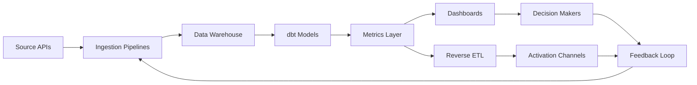

TL;DR
- Centralize data from content platforms, ESPs, payment processors, and attribution tools into a governed warehouse.
- Model monetization metrics—RPM, EPC, NRR—using dbt or similar transformation layers for consistent reporting.
- Deliver insights via dashboards and alerts that drive decisions on offers, content refresh, and automation investments.

## Data Collection Layer
Inventory all sources: website analytics, social platforms, ESP, e-commerce, affiliate networks. Use ETL tools (Fivetran, Airbyte) or n8n workflows to ingest data into a staging area. Implement data contracts defining schemas and SLAs.

### Storage and Governance
Select a cloud warehouse (Snowflake, BigQuery, Redshift) based on scale and budget. Configure access controls, encryption, and cost monitoring. Document lineage and ownership in a data catalog.

## Transformation and Modeling
Use dbt to build models that calculate RPM, EPC, LTV, and attribution metrics. Implement tests for nulls, uniqueness, and referential integrity. Align model definitions with the attribution playbook and offer testing framework.

### Metrics Layer and Semantic Models
Create a metrics layer using tools like dbt metrics, LookML, or Transform to standardize definitions. Publish documentation accessible to marketing, product, and finance teams. Version metrics to capture changes over time.

## Visualization and Activation
Build dashboards in Looker, Power BI, or Metabase showing funnel stages, offer performance, and content ROI. Set alerts for anomaly detection using tools like Metabase Pulses or Looker alerts. Activate insights by pushing segments to ESPs or ad platforms via reverse ETL (Hightouch, Census).

### Operations and Maintenance
Schedule data freshness checks and monitoring alerts. Conduct monthly reviews with stakeholders to assess metric relevance. Continuously update models as new monetization channels emerge.

## Comparison Table
| Stack Layer | Purpose | Example Tools | Owner | KPIs |
| --- | --- | --- | --- | --- |
| Ingestion | Collect source data | Fivetran, n8n, Airbyte | Data engineer | Data freshness |
| Warehouse | Store & secure data | BigQuery, Snowflake | Data platform | Cost per query |
| Transformation | Build models | dbt, Dataform | Analytics engineer | Test pass rate |
| Activation | Deliver insights | Looker, Hightouch | Rev ops | Dashboard adoption |

## Diagram

## Checklist
- [ ] Inventory data sources and define ingestion pipelines with contracts.
- [ ] Secure warehouse environment with access controls and cost monitoring.
- [ ] Build dbt models for monetization metrics and ensure testing coverage.
- [ ] Publish dashboards and alerts for key stakeholders and activation teams.
- [ ] Review stack performance monthly and iterate on models and metrics.

> **Benchmarks**
> - Time to implement: 8 weeks to deploy ingestion, warehouse, dbt models, and dashboards. [Estimate]
> - Expected outcome: Unified reporting that reduces manual spreadsheet work by 70%. [Estimate]

## Internal Links
- [Align metric definitions with the attribution playbook.](../monetization-analytics/attribution-for-creators.mdx)
- [Feed offer insights into the offer testing framework.](../monetization-analytics/offer-testing-framework.mdx)
- [Support content decisions alongside the programmatic topic hubs playbook.](../content-factory-distribution/programmatic-topic-hubs.mdx)
- [Inform automation investments with the automation backlog prioritization framework.](../ai-automation-foundations/automation-backlog-prioritization-framework.mdx)

## Sources
- [dbt documentation](https://docs.getdbt.com/docs/introduction)
- [Looker for marketing analytics](https://looker.com/solutions/digital-marketing)
