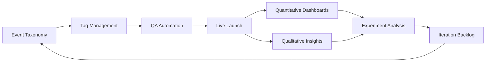

TL;DR
- Define a consistent event taxonomy before launching experiments so every CTA, field, and scroll depth is measured.
- Implement tag management with QA automation to prevent double-counting or missing events.
- Pair quantitative data with qualitative tools—session replay, heatmaps—to diagnose friction quickly.

## Event Taxonomy
List all conversion actions: form submissions, button clicks, video plays, scroll depth thresholds. Assign standardized event names, parameters, and user properties. Document the taxonomy alongside your attribution playbook to maintain consistency across teams.

### Tag Management Setup
Use Google Tag Manager or Segment to deploy tracking code. Configure triggers and variables for each event. Use dataLayer pushes with meaningful metadata (plan type, persona). Version control your tag configurations and enforce change approvals.

## QA and Validation
Before going live, test events using browser debug tools (GA4 DebugView, GTM Preview). Build automated QA scripts (Selenium, Cypress) that simulate conversions and validate payloads. Monitor real-time dashboards to ensure data arrives as expected during rollout.

### Qualitative Insights
Layer heatmaps, scroll maps, and session replays to observe behavior. Analyze drop-off points and correlate with quantitative metrics. Collect voice-of-customer feedback via on-page surveys tied to event triggers.

## Experiment Readiness
Ensure sample size calculations (from the offer testing framework) match your event tracking. Configure A/B testing platforms to use the instrumented events as primary goals. Set guardrails for minimum detectable effect and test duration.

### Reporting and Governance
Build dashboards combining conversion rate, bounce rate, average order value, and micro-conversions. Schedule weekly reviews with product, marketing, and analytics stakeholders. Document experiment outcomes and instrumentation changes.

## Comparison Table
| Instrumentation Area | Purpose | Tooling | QA Method | Owner |
| --- | --- | --- | --- | --- |
| Event Tracking | Capture conversions | GTM, Segment | DebugView, Cypress | Analytics engineer |
| Heatmaps | Visualize engagement | Hotjar, Contentsquare | Manual review | UX researcher |
| Session Replay | Diagnose issues | FullStory, LogRocket | Playback QA | Product manager |
| Surveys | Capture sentiment | Typeform, Sprig | Response quality checks | CX lead |

## Diagram

## Checklist
- [ ] Document event taxonomy with names, parameters, and owners.
- [ ] Configure tag management and dataLayer pushes for key interactions.
- [ ] Automate QA scripts to validate tracking before and after launch.
- [ ] Collect qualitative insights via heatmaps and session replays.
- [ ] Align experiments with reliable conversion tracking and reporting.

> **Benchmarks**
> - Time to implement: 2 weeks to document taxonomy, deploy tags, and set up QA automation. [Estimate]
> - Expected outcome: 20% faster experiment cycles with confident conversion analytics. [Estimate]

## Internal Links
- [Use the attribution playbook to connect landing page events to campaign performance.](../monetization-analytics/attribution-for-creators.mdx)
- [Feed experiment design into the offer testing framework.](../monetization-analytics/offer-testing-framework.mdx)
- [Coordinate page performance improvements with the Core Web Vitals tuning playbook.](../devops-for-creators/cwv-tuning-for-mdx-sites.mdx)
- [Sync copy updates with the social copy variations factory.](../content-factory-distribution/social-copy-variations-factory.mdx)

## Sources
- [gtag.js reference](https://developers.google.com/tag-platform/gtagjs/reference)
- [Contentsquare heatmap analysis guide](https://contentsquare.com/blog/heatmap-analysis/)
