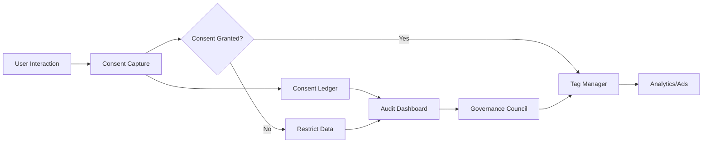

TL;DR
- Map data flows and ensure explicit consent before collecting or sharing data for monetization.
- Implement minimization, retention limits, and data subject rights workflows across platforms.
- Audit consent signals regularly and align teams on compliant campaign execution.

## Data Inventory and Mapping
Document all data sources feeding monetization: CRM, analytics, ad networks, affiliate platforms. Map data categories (PII, behavioral, financial) and purposes. Identify processors and subprocessors. Visualize flows using data lineage tools and align with automation governance documentation.

### Consent Capture
Implement consent collection across touchpoints—web forms, checkout, email sign-ups. Use clear language specifying purposes (analytics, personalization, advertising). Store consent records with timestamps, versioned policies, and source channels. Provide granular options (e.g., analytics yes, ads no).

## Enforcement Mechanisms
Integrate consent with tag managers and ESPs. Only fire tracking tags when consent exists. Sync consent states to downstream systems via APIs or event streams. For ad tech, support IAB TCF strings or regional frameworks. Implement minimization by masking or aggregating data when consent is absent.

### Data Subject Rights
Create workflows for access, deletion, and portability requests. Automate intake via forms or help desk systems. Track SLA compliance and document responses. Train support teams on escalation paths.

## Auditing and Monitoring
Schedule quarterly audits of consent logs, data retention, and processor compliance. Use automated checks to detect events sent without consent flags. Conduct tabletop exercises simulating regulatory inquiries.

### Cross-Team Collaboration
Partner with legal, marketing, and engineering. Maintain a consent governance council reviewing changes to tracking, partnerships, or offers. Communicate updates to content and automation teams so messaging reflects consent choices.

## Comparison Table
| Area | Goal | Owner | Tooling | Cadence |
| --- | --- | --- | --- | --- |
| Consent Capture | Obtain lawful basis | Growth ops | CMP, ESP | Continuous |
| Enforcement | Block unauthorized data flows | Engineering | Tag manager, API | Real-time |
| Data Rights | Fulfill user requests | Support/legal | Ticketing, automation | SLA-based |
| Auditing | Validate compliance | Privacy officer | Logs, dashboards | Quarterly |

## Diagram

## Checklist
- [ ] Map data flows and categorize data used in monetization programs.
- [ ] Implement granular consent capture with storage and versioning.
- [ ] Enforce consent across tags, ESPs, and partner APIs.
- [ ] Operationalize data subject rights with automation and SLAs.
- [ ] Conduct regular audits and governance council reviews.

> **Benchmarks**
> - Time to implement: 6 weeks to document flows, deploy consent tooling, and automate enforcement. [Estimate]
> - Expected outcome: Compliance-ready monetization stack with reduced regulatory risk and higher customer trust. [Estimate]

## Internal Links
- [Align consent policies with the affiliate offers disclosure requirements.](../monetization-analytics/affiliate-offers-that-fit.mdx)
- [Sync tracking enforcement with the landing page instrumentation guide.](../monetization-analytics/landing-page-conversion-instrumentation.mdx)
- [Integrate governance workflows with the automation governance operating model.](../ai-automation-foundations/automation-governance-operating-models.mdx)
- [Communicate consent-driven messaging via the newsletter automation blueprint.](../content-factory-distribution/newsletter-automation-blueprint.mdx)

## Sources
- [GDPR official text](https://gdpr-info.eu/)
- [FTC privacy guidance](https://www.ftc.gov/business-guidance/privacy-security)
