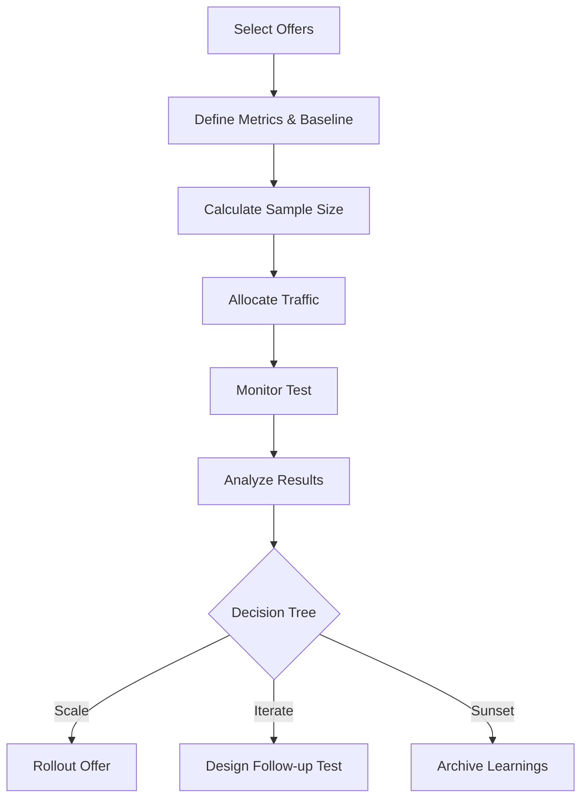

TL;DR
- Define success with a balanced scorecard: win rate for conversion quality, EPC for partner payouts, and RPM for content monetization.
- Calculate sample sizes upfront and stick to fixed test windows to avoid peeking bias.
- Package insights into a decision tree so teams know when to scale, iterate, or sunset offers.

## Metric Foundations
**Win rate** measures the percentage of clicks that convert. **Earnings per click (EPC)** equals total commission divided by number of clicks. **Revenue per mille (RPM)** calculates revenue per 1,000 sessions, highlighting content efficiency. Capture baseline values before testing so you can quantify lift. Ensure tracking pixels or postback URLs are firing correctly for each affiliate network.

### Test Design
Choose a hypothesis—e.g., "Offer B with a free trial will increase win rate by 20%." Determine the required sample size using baseline win rate, desired lift, and statistical power (80% is typical). Use tools or spreadsheets to compute the number of clicks per variant. Randomize traffic either via on-site experiments (Google Optimize alternatives) or sequential newsletter sends while controlling for send time.

## Execution and Governance
Set a fixed testing period (e.g., two weeks) and avoid stopping early unless there is a significant negative impact. Monitor data quality daily: ensure UTM tags persist, affiliate networks report conversions, and refunds are accounted for. Document any anomalies in a test log.

### Analysis and Interpretation
After the test window, calculate win rate, EPC, RPM, and confidence intervals. Compare relative lift and evaluate margin impact—some offers pay higher EPC but hurt RPM if they reduce content engagement. Cross-check with qualitative feedback from your audience (replies, comments) to ensure offers remain trustworthy.

## Decision Tree and Rollout
Use a decision tree to codify next steps. For example, if Offer B improves RPM by >15% and maintains win rate within ±5% of control, graduate it to always-on campaigns. If metrics are mixed, design a follow-up test (e.g., new landing page). If results underperform, sunset the variant and document learnings for future partners.

## Comparison Table
| Metric | Formula | Primary Question | Watch Outs | Owner |
| --- | --- | --- | --- | --- |
| Win Rate | Conversions / Clicks | Are clicks converting? | Attribution gaps, delayed approvals | Growth Ops |
| EPC | Commission / Clicks | How much is each click worth? | Refunds, tiered payouts | Partnership Lead |
| RPM | Revenue / Sessions × 1000 | How efficient is content? | Session inflation, ad blockers | Content Strategy |
| AOV | Revenue / Orders | Are buyers upselling? | Coupon stacking | Ecommerce |
| Refund Rate | Refunds / Orders | Are buyers happy? | Fraud spikes | Finance |

## Diagram

## Checklist
- [ ] Document baseline win rate, EPC, RPM for control offers.
- [ ] Calculate sample size and set fixed test duration with guardrails.
- [ ] Ensure tracking integrity across affiliate networks and analytics.
- [ ] Analyze results with statistical significance and margin impact.
- [ ] Update decision tree and communicate rollout or rollback steps.

> **Benchmarks**
> - Time to implement: 3–5 days to design, launch, and QA an initial offer experiment. [Estimate]
> - Expected outcome: Identify offers that improve RPM by at least 15% without compromising audience trust metrics. [Estimate]

## Internal Links
- [Align offer testing with the affiliate fit checklist to protect trust.](../monetization-analytics/affiliate-offers-that-fit.mdx)
- [Tie automation governance back to the automation blueprint for stakeholder alignment.](../ai-automation-foundations/practical-blueprint-first-win.mdx)

## Sources
- [Affiliate EPC definition from Awin](https://help.a.win/pages/viewpage.action?pageId=33325013)
- [Google Analytics experiment methodology for sample sizing](https://support.google.com/analytics/answer/2844870)
