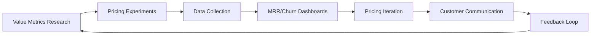

TL;DR
- Define value metrics and segments before testing price points so you measure willingness to pay accurately.
- Monitor churn, expansion, and cohort health to adjust pricing and packaging iteratively.
- Align pricing experiments with attribution and analytics infrastructure for trustworthy insights.

## Understand Customer Value
Interview customers and analyze usage data to identify value metrics (seats, projects, revenue influenced). Segment customers by persona, company size, and use case. Map value metrics to pricing levers—tier thresholds, usage-based overages, or add-ons.

### Willingness-to-Pay Research
Use surveys (Van Westendorp, Gabor-Granger) and qualitative interviews. Combine with behavioral data like feature adoption and support tickets. Build price sensitivity curves for each segment. Document findings in a pricing playbook accessible to sales and finance.

## Experiment Design
Plan pricing experiments: landing page tests, offer sequencing, or in-app paywalls. Coordinate with product and marketing to ensure messaging aligns. Use control vs variant cohorts and holdout groups to avoid cross-contamination. Track metrics such as ARPU, conversion rate, churn, and customer satisfaction.

### Packaging Strategy
Align feature packaging with perceived value. Consider bundling high-retention features in higher tiers while offering entry-level tiers with clear upgrade paths. Use the offer testing framework to validate packaging decisions.

## Monitoring and Iteration
Build dashboards showing MRR, churn, net revenue retention (NRR), and expansion revenue. Analyze by cohort, segment, and experiment variant. Trigger alerts when churn exceeds thresholds or when expansion stalls. Feed learnings back into backlog prioritization for new monetization features.

### Governance and Communication
Involve finance, legal, and customer success before major price changes. Prepare communication templates, FAQ, and training for support teams. Monitor sentiment via surveys and social listening after rollout.

## Comparison Table
| Metric | Definition | Data Source | Owner | Action |
| --- | --- | --- | --- | --- |
| MRR | Monthly recurring revenue | Billing system | Finance | Track growth |
| NRR | (Expansion + Retention - Churn) / Starting MRR | BI dashboards | Revenue ops | Prioritize upsell programs |
| Churn Rate | Lost customers / starting customers | CRM | Customer success | Trigger retention campaigns |
| ARPU | Revenue / active users | Analytics warehouse | Product | Evaluate packaging |

## Diagram

## Checklist
- [ ] Define value metrics and customer segments with qualitative and quantitative inputs.
- [ ] Conduct willingness-to-pay research and document sensitivity curves.
- [ ] Launch controlled pricing experiments with holdout cohorts.
- [ ] Monitor MRR, churn, and NRR dashboards during and after tests.
- [ ] Communicate pricing changes with trained support and sales teams.

> **Benchmarks**
> - Time to implement: 6 weeks to collect research, launch experiments, and analyze initial results. [Estimate]
> - Expected outcome: 15% uplift in ARPU and improved net revenue retention within one quarter. [Estimate]

## Internal Links
- [Feed pricing experiments into the offer testing framework for statistical rigor.](../monetization-analytics/offer-testing-framework.mdx)
- [Align messaging with refreshed content from the content refresh playbook.](../content-factory-distribution/content-refresh-playbook.mdx)
- [Coordinate data instrumentation with the attribution playbook.](../monetization-analytics/attribution-for-creators.mdx)
- [Incorporate automation ROI insights when pricing AI-powered features.](../ai-automation-foundations/automation-roi-calculator-simple-model.mdx)

## Sources
- [ProfitWell pricing research](https://www.priceintelligently.com/blog)
- [Kalzumeus on pricing strategy](https://www.kalzumeus.com/2012/12/28/dont-just-raise-prices/)
